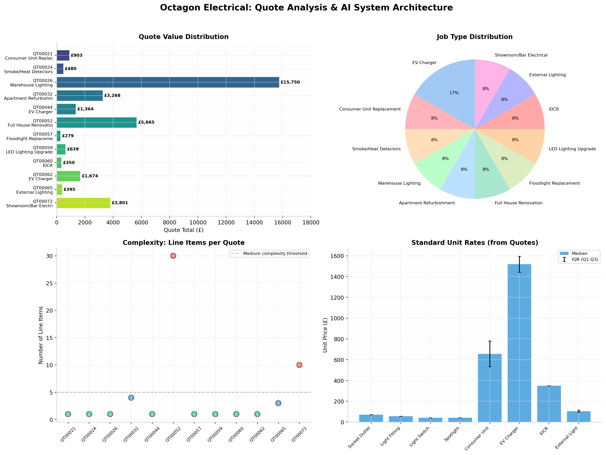
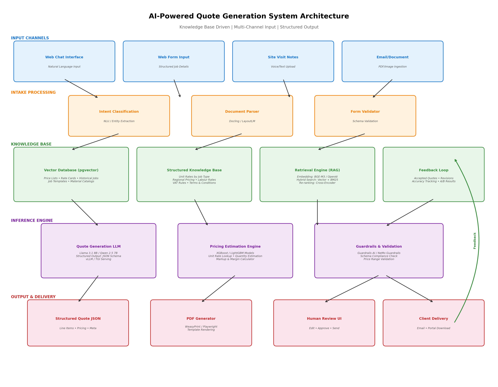
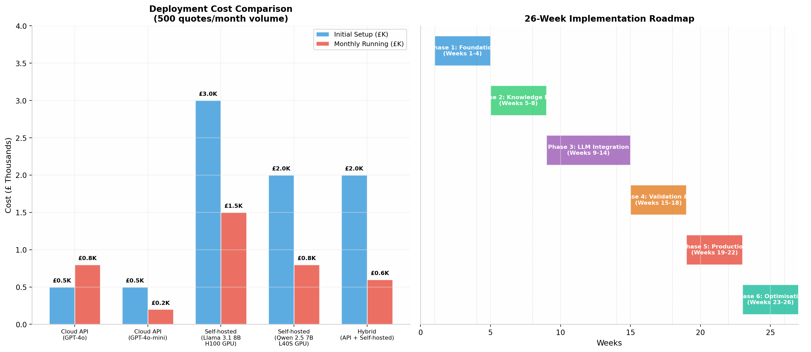

# AI-Powered Quote Generation System for Electrical Contractors

## Executive Summary

This report presents a comprehensive architecture for automating the generation of electrical contractor estimates using modern AI and machine learning techniques. Based on analysis of **12 real quote PDFs** from Octagon Electrical, the system must handle **diverse job types** ranging from simple EICR reports (£350) to complex full-house renovations (£5,665) and large commercial installations (£15,750). The recommended approach combines a **Retrieval-Augmented Generation (RAG) knowledge base** with a **fine-tuned open-source Large Language Model (LLM)** for structured quote generation, supported by a **gradient boosting pricing estimation engine** and comprehensive guardrails for accuracy validation. For a business generating approximately 500 quotes monthly, the proposed **hybrid deployment model** (cloud API for prototyping, self-hosted LLM for production) delivers the optimal balance of **accuracy, cost-effectiveness, and data sovereignty**, with estimated monthly running costs of **£600-800** once operational.

The core insight from analyzing Octagon's quotes is that while job descriptions are expressed in natural language ("Replace 8 x fluorescent fittings for LED in Small Hall"), the underlying pricing follows **repeatable patterns** based on unit rates per item type. This makes the problem ideally suited for a knowledge-driven AI system that maps unstructured job descriptions to structured line items through retrieval of historically validated rate cards, rather than attempting to predict prices from scratch. The system architecture proposed herein addresses the full pipeline: from multi-channel input (web chat, forms, site notes) through knowledge retrieval and structured generation, to validated PDF output.

---

## 1. Analysis of Current Quote Patterns

### 1.1 Quote Structure and Complexity Distribution

The 12 analyzed quotes reveal a **bimodal complexity distribution**. Simple quotes (8 of 12) contain a single line item for straightforward jobs: EICR reports, EV charger installations, floodlight replacements, and smoke detector fitting. Complex quotes (4 of 12) contain multiple line items organized by room or work area, with the most complex (QT00052) containing **30 line items across 10 rooms** for a full house renovation. This distribution has direct implications for the AI architecture: the system must handle both single-item quotes through template matching and multi-item quotes through compositional reasoning over the knowledge base.

| Metric | Value | Notes |
|---|---|---|
| **Total Quotes Analyzed** | 12 | Representative sample from QT00021 to QT00072 |
| **Simple Quotes (1 item)** | 8 (67%) | EICR, EV charger, floodlight, smoke detectors |
| **Complex Quotes (3+ items)** | 4 (33%) | Apartment refurb, showroom, house renovation |
| **Max Line Items** | 30 | QT00052 — full house renovation |
| **Value Range** | £278 – £15,750 | QT00057 to QT00026 |
| **Median Quote Value** | £1,129 | Excluding the £15,750 outlier |
| **VAT Application** | 20% on 1 quote | QT00032 only; remainder VAT-exempt or labour-only |
| **Standard Validity** | 30 days | Consistent across all quotes |
| **Standard Terms** | Identical | Same disclaimer text on every quote |

The consistency in terms, validity periods, and company header information suggests these are generated from a **template system** already. The AI system's primary value-add is in the **line item generation and pricing** — mapping from a customer's natural language description to the correct set of labour items, materials, and unit rates.

### 1.2 Identifiable Unit Rate Patterns

A critical finding from the quote analysis is the presence of **implicit standard unit rates** that repeat across multiple quotes. These rates form the foundation of the knowledge base that the AI system will retrieve from:

| Item Type | Unit Rate Range | Median | Observed In |
|---|---|---|---|
| **Double Socket Outlet** | £70 per socket | £70 | QT00052 (multiple rooms) |
| **Light Fitting (Main)** | £55 per fitting | £55 | QT00052 (multiple rooms) |
| **Light Switch** | £40 per switch | £40 | QT00052 (multiple rooms) |
| **Spotlight** | £40 per spotlight | £40 | QT00052 (kitchen) |
| **Consumer Unit (RCBO)** | £410 – £903 | £656 | QT00032, QT00021 |
| **EV Charger Installation** | £1,364 – £1,674 | £1,519 | QT00044, QT00062 |
| **EICR** | £350 fixed | £350 | QT00060 |
| **External Light** | £85 – £250 | £125 | QT00065, QT00057 |
| **Labour Only (per week)** | £5,250 / week | £5,250 | QT00026 (3 weeks) |

These rates demonstrate that Octagon Electrical already operates with an **internal rate card**, even if informally maintained. The AI knowledge base's first task is to codify, structure, and make retrievable this pricing intelligence, supplemented with material cost data from suppliers.



---

## 2. System Architecture Overview

The proposed architecture follows a **five-layer pipeline** that transforms unstructured job descriptions into validated PDF quotes. Each layer is designed for independent scaling, testing, and iteration — critical for a system where accuracy directly impacts revenue.



### 2.1 Architecture Principles

The design adheres to four core principles derived from the quote analysis and production AI best practices. **Knowledge-grounded generation** ensures every price, item description, and labour calculation is retrieved from the structured knowledge base rather than hallucinated by the LLM. This is non-negotiable for financial documents where an incorrect price cannot be easily retracted. **Structured output enforcement** guarantees that the LLM produces machine-parseable JSON conforming to a strict schema, eliminating fragile regex-based extraction. **Multi-channel input support** accommodates the current web chat workflow and future web form expansion without architectural changes. **Human-in-the-loop validation** preserves estimator oversight for all quotes above a configurable threshold, ensuring the AI augments rather than replaces human expertise.

---

## 3. Input Processing Layer

### 3.1 Multi-Channel Intake Design

The system supports four input channels with unified processing pipelines. **Web chat input** (current primary channel) requires Natural Language Understanding (NLU) to extract entities (client name, address, job description, room types, item counts) from conversational text. **Web form input** (future expansion) provides structured data that bypasses entity extraction and feeds directly into the retrieval layer. **Site visit notes** — whether voice-transcribed or text-uploaded — follow the same NLU pipeline as chat but may include image attachments for visual context. **Email/document ingestion** handles PDFs or images sent by clients, requiring document understanding models to extract requirements before processing.

For the web chat channel specifically, the NLU component performs **intent classification** (is this a new quote request, a revision, or a clarification?) and **slot filling** (extracting the key-value pairs needed for quote generation). Research on structured output generation from LLMs shows that even small models (7B parameters) can achieve **over 90% schema compliance** when fine-tuned for extraction tasks, with Llama 3.1 8B reaching **91.3% schema compliance** in independent benchmarks  [(ascentcore.com)](https://ascentcore.com/2026/04/01/small-llm-performance-benchmark/) .

### 3.2 Document Understanding for Attachment Processing

When clients attach documents — existing electrical reports, architect plans, or photos of the installation site — the system uses **Docling** for PDF parsing and **multimodal vision-language models** for image understanding. Docling, an open-source document parser from IBM Research, achieves **97.9% accuracy in complex table extraction** and preserves document hierarchy better than alternatives  [(procycons.com)](https://procycons.com/en/blogs/pdf-data-extraction-benchmark/) . For image understanding, models like **LLaVA** or the vision capabilities of **Qwen2.5-VL** can interpret site photos to identify existing socket counts, room layouts, or electrical panel types, providing additional context for the quote generation layer.

| Parser | Table Accuracy | Text Fidelity | Speed (1 page) | Best For |
|---|---|---|---|---|
| **Docling** | 97.9% | Excellent | 6.3s | Complex layouts, tables |
| **LlamaParse** | ~85% (simple) | Good | ~6s | LlamaIndex integration |
| **Unstructured** | 75% (complex) | Good | 51s | Semantic element typing |
| **Marker-PDF** | ~90% | Excellent | Variable | GPU-accelerated conversion |

---

## 4. Knowledge Base Layer

### 4.1 RAG Architecture for Quote Generation

The **Retrieval-Augmented Generation (RAG)** pattern is the architectural cornerstone of this system. Rather than relying on the LLM's parametric knowledge (which would hallucinate prices), the RAG layer retrieves relevant context — unit rates, similar historical jobs, material specifications — and injects it into the LLM's prompt. Research demonstrates that RAG-equipped models generate **more accurate answers with higher contextual relevance** than base models alone, particularly for domain-specific knowledge the model was not trained on  [(IBM)](https://www.ibm.com/think/topics/llamaindex-vs-langchain) .

The knowledge base comprises **four interconnected stores**. The **vector database** (pgvector) stores semantic embeddings of historical quotes, job descriptions, and material catalogs for similarity search. The **structured SQL database** stores the canonical rate cards, client information, and quote metadata. The **document store** holds full PDFs of historical quotes for retrieval and template reference. The **feedback store** tracks which generated quotes were accepted, revised, or rejected, enabling continuous improvement.

### 4.2 Vector Database Selection

For the vector database, **pgvector** (PostgreSQL extension) is the recommended choice for this use case. With pgvectorscale from Timescale, it delivers **471 QPS at 99% recall** on 50M vectors — competitive with dedicated vector databases  [(DEV Community)](https://dev.to/polliog/postgresql-as-a-vector-database-when-to-use-pgvector-vs-pinecone-vs-weaviate-4kfi) . For a contractor business with under 10,000 historical quotes (translating to perhaps 50,000 vector chunks after splitting), pgvector provides **more than adequate performance** without introducing additional infrastructure complexity. The key advantage is **transactional consistency**: quote metadata and vector embeddings live in the same database, enabling atomic updates and simplifying backup strategies.

| Vector DB | Open Source | Hybrid Search | Scale Ceiling | Best For |
|---|---|---|---|---|
| **pgvector** | Yes | Via Postgres FTS | ~50M vectors | Existing Postgres users |
| **Pinecone** | No | Yes | Billions | Zero-ops managed service |
| **Weaviate** | Yes | Excellent | 100M+ | Hybrid search priority |
| **Qdrant** | Yes | Strong (BM42) | 1B+ | Performance + filtering |
| **Chroma** | Yes | Basic | ~1M | Prototyping |

### 4.3 Embedding Model Selection

For embedding job descriptions and retrieving similar historical quotes, **BGE-M3** is the recommended model. It is **MIT-licensed**, supports **100+ languages**, and uniquely produces **dense, sparse, and multi-vector (ColBERT) embeddings** in a single forward pass  [(Tensoria)](https://tensoria.fr/en/blog/embedding-models-2026-guide) . This multi-modal embedding capability enables hybrid retrieval that matches both semantic meaning ("install sockets in kitchen") and specific keywords ("MK faceplates", "RCBO consumer unit"). For teams preferring a managed API, **OpenAI text-embedding-3-large** provides comparable quality at **$0.13 per 1M tokens** with zero hosting overhead  [(futureagi.com)](https://futureagi.com/blog/best-embedding-models-2025/) .

| Model | License | Dimensions | MTEB Score | Context | Cost |
|---|---|---|---|---|---|
| **BGE-M3** | MIT | 1024 | ~67 | 8K tokens | Self-hosted |
| **OpenAI text-embedding-3-large** | Commercial | 3072 | ~64 | 8K tokens | $0.13/1M tokens |
| **NV-Embed-v2** | NVIDIA AIFM | 4096 | **72.31** | 32K | Self-hosted (GPU) |
| **BGE-large-en-v1.5** | MIT | 1024 | ~55 | 512 | Self-hosted |

### 4.4 Knowledge Base Content Structure

The knowledge base must be populated with five categories of domain knowledge derived from the quote analysis and contractor operations:

**Rate Cards**: Standard unit rates per item type (socket, switch, spotlight, consumer unit) with regional adjustments. These are the primary retrieval targets during quote generation. Each rate card entry includes the base labour rate, typical material cost range, estimated time, and any prerequisites (e.g., "consumer unit replacement requires mains isolation").

**Historical Quotes**: Vectorised embeddings of all past quotes enable similarity search — "find me quotes similar to '3-bedroom house rewire'". This supports case-based reasoning where the AI retrieves analogous jobs and adapts their line items.

**Job Templates**: Pre-defined line item sets for common job types. An "EV charger installation" template might include: site survey, cable run, charger mounting, certification — each with default quantities and rates.

**Material Catalogs**: Supplier pricing for common materials (faceplates, cable, consumer units, LED fittings) with SKU mapping for automated material list generation.

**Regulatory Context**: NICEIC requirements, BS 7671 compliance items, and certification requirements that must appear on specific job types.

---

## 5. Inference Engine: LLM Selection and Structured Output

### 5.1 Open-Source LLM Recommendation

For the quote generation LLM, the analysis of model benchmarks for structured output generation points to **Llama 3.1 8B** as the optimal choice for production deployment. In head-to-head testing across 22 model configurations, Llama 3.1 8B achieved **91.3% JSON schema compliance** with **zero extraneous output** and **100% length compliance** — critical metrics for a system where malformed output breaks the PDF generation pipeline  [(ascentcore.com)](https://ascentcore.com/2026/04/01/small-llm-performance-benchmark/) . While **Mistral 7B** delivered higher raw text quality (ROUGE-L 0.509), its schema compliance was significantly lower at 47.8%, making it less suitable for this structured generation task.

| Model | JSON Parse Rate | Schema Compliance | Factual Consistency | TPS | Best Use Case |
|---|---|---|---|---|---|
| **Llama 3.1 8B** | 100% | **91.3%** | 0.699 | ~60 | **Structured output priority** |
| **Qwen 2.5 7B** | 95.7% | 73.9% | 0.705 | ~48 | Quality-to-speed ratio |
| **Mistral 7B** | 100% | 47.8% | 0.762 | ~49 | Text quality priority |
| **Llama 3.2 3B** | 56.5% | 52.2% | 0.650 | ~65 | Edge deployment only |

The **Qwen 2.5 7B** model serves as an excellent alternative, particularly for teams with GPU constraints, as it delivers the **best quality-to-speed ratio** in its class with 95.7% JSON parse reliability  [(ascentcore.com)](https://ascentcore.com/2026/04/01/small-llm-performance-benchmark/) . For organisations comfortable with commercial APIs, **GPT-4o** remains the gold standard at **84.47% complex schema adherence**  [(arXiv.org)](https://arxiv.org/html/2502.18878v1) , though at significantly higher per-inference cost.

### 5.2 Structured Output Generation Techniques

Generating valid, schema-compliant JSON from LLMs is one of the most well-researched problems in applied AI. Three complementary approaches should be implemented in parallel for maximum reliability. **Constrained decoding** (via libraries like Outlines, SGLang, or XGrammar) compiles the JSON Schema into a finite state machine that restricts token generation to valid paths — providing a mathematical guarantee of schema compliance  [(Techsy)](https://techsy.io/en/blog/llm-structured-outputs-guide) . **Supervised fine-tuning** adapts the base model on quote-specific input-output pairs, teaching it the domain vocabulary and output structure. **Post-processing validation** (via Guardrails AI or Pydantic) catches any remaining schema violations before the quote enters the PDF generation stage.

Research on schema reinforcement learning (SRL) shows that fine-tuning with schema-aware reward functions can improve even small models dramatically — LLaMA-3.2 3B improved from 28.51% to 72.50% schema compliance after SRL training  [(arXiv.org)](https://arxiv.org/html/2502.18878v1) . For the quote generation use case, a **lightweight fine-tuning dataset** of 500-1000 historical quote pairs (job description → structured JSON) should yield significant accuracy improvements over zero-shot prompting.

### 5.3 Quote Generation Prompt Engineering

The prompt design follows a **retrieval-augmented few-shot pattern**. The system retrieves the top-3 most similar historical quotes from the vector database, formats them as examples, and combines them with the rate card context and the current job description. The prompt template structure is:

```
You are an electrical contractor estimator. Generate a quote in JSON format.

Rate Card Context:
[Retrieved rate cards for relevant item types]

Similar Historical Quotes:
[Top-3 similar quotes with line items and pricing]

Current Job Request:
[Client's natural language description]

Output Schema:
[JSON Schema for quote structure]

Generate the quote JSON:
```

This pattern grounds the LLM in factual pricing data while providing structural examples of how similar jobs were quoted, dramatically reducing hallucination risk.

---

## 6. Pricing Estimation Engine

### 6.1 Hybrid Pricing Model: LLM + Gradient Boosting

While the LLM handles the **structuring** of the quote (determining which line items to include, how to describe them, and in what order), a dedicated **pricing estimation engine** handles the **numerical accuracy** of unit rates and totals. This separation of concerns follows best practices from construction cost estimation research, where **XGBoost models reduced prediction error by 15-30%** compared to traditional parametric methods  [(BIDI Construction)](https://www.bidicontracting.com/blog/machine-learning-construction-cost-estimation) .

The pricing engine is a **two-stage system**. Stage 1 uses **gradient boosted trees (XGBoost or LightGBM)** trained on historical quote data to predict the optimal unit rate for each line item based on features: job type, location, property type, access difficulty, and seasonal factors. Stage 2 applies **business rules** for markup percentages, VAT calculation, minimum charges, and rounding conventions. XGBoost consistently outperformed alternatives in cost estimation benchmarks, achieving **R² = 0.868** with MAPE of 35.8% on construction cost data  [(MDPI)](https://www.mdpi.com/2076-3417/16/6/2891) .

### 6.2 Feature Engineering for Price Prediction

The pricing model requires careful feature engineering to capture the factors that influence electrical contracting costs:

| Feature Category | Examples | Source |
|---|---|---|
| **Job Metadata** | Job type, property type (house/flat/commercial), number of rooms | Input form / NLU extraction |
| **Item Specifications** | Item type, quantity, brand tier (budget/premium) | Knowledge base lookup |
| **Location Factors** | Region, travel distance, parking constraints | Client address / postcode |
| **Complexity Indicators** | Access difficulty, working height, asbestos risk | Job description keywords |
| **Temporal Factors** | Season, demand level, material price index | External APIs / historical trends |
| **Historical Patterns** | Client's past quote acceptance rate, typical revisions | CRM integration |

### 6.3 Unit Rate Lookup vs. ML Prediction

For standard items with stable pricing (sockets, switches, light fittings), **direct rate card lookup** is preferred over ML prediction — it is deterministic, explainable, and eliminates variance. The ML model is reserved for **composite pricing** (whole-job estimates where the exact itemisation is unclear), **novel job types** not in the rate card, and **dynamic adjustments** (material price fluctuations, rush premiums). This hybrid approach balances accuracy with transparency: the estimator can see exactly which prices came from the rate card and which were model-predicted.

---

## 7. Guardrails and Validation Layer

### 7.1 Four-Layer Guardrail Architecture

Production AI systems for financial documents require **multiple independent validation layers** operating at different latencies and cost points  [(JobsByCulture)](https://jobsbyculture.com/blog/llm-guardrails-production-guide-2026) . The recommended architecture implements four layers:

**Layer 1: Input Sanitisation** (synchronous, <5ms) — PII detection, prompt injection scanning, input length validation, and toxicity filtering. Tools like **LLM Guard** provide off-the-shelf scanners for this layer.

**Layer 2: Dialog and Topic Control** (synchronous, 10-100ms) — Enforces that the conversation stays within the scope of electrical contracting quotation. **NeMo Guardrails** enables declarative definition of allowed topics, refusal patterns, and escalation rules through its Colang domain-specific language.

**Layer 3: Output Validation** (synchronous, 20-50ms) — Schema compliance checking (via **Guardrails AI** or Pydantic), price range validation (does each unit rate fall within acceptable bounds?), mathematical verification (does subtotal + VAT = total?), and hallucination detection (are claimed material prices present in the knowledge base?).

**Layer 4: Async Quality Assurance** (asynchronous, sampled) — LLM-as-judge evaluation of quote quality, behavioural analysis of system outputs over time, and continuous monitoring for drift in pricing accuracy or schema compliance rates.

### 7.2 Price Range Validation

A critical business-specific validator ensures that generated prices fall within **historically observed ranges** for each item type. If the LLM generates a quote for "consumer unit replacement" at £150, the validator flags this as anomalous (historical range: £410-£903) and either rejects the output or triggers human review. This range-based validation catches the most costly class of errors — underpricing that leads to margin erosion or overpricing that loses the job.

| Item Type | Historical Min | Historical Max | Validation Band |
|---|---|---|---|
| Consumer Unit Replacement | £410 | £903 | ±20% of median |
| EV Charger Installation | £1,364 | £1,674 | ±15% of median |
| EICR | £350 | £350 | Fixed price |
| Socket Outlet | £65 | £75 | ±10% of rate card |
| Light Switch | £35 | £45 | ±10% of rate card |

---

## 8. PDF Generation and Output Delivery

### 8.1 HTML-to-PDF Pipeline

The final stage converts the validated structured quote JSON into a PDF matching Octagon's existing template format. The recommended approach uses **WeasyPrint** for pure-Python PDF generation from HTML/CSS templates. WeasyPrint produces the **smallest file sizes** (8-21KB vs 59-125KB for browser-based tools) and is purpose-built for structured business documents like invoices and quotes  [(PDF4.dev)](https://pdf4.dev/blog/html-to-pdf-benchmark-2026) . For quotes requiring dynamic charts (e.g., cost breakdown visualisations), **Playwright** provides full browser rendering with JavaScript support at the cost of higher latency (3ms warm vs 227ms for WeasyPrint).

| Tool | Speed (Warm) | File Size | JavaScript | Best For |
|---|---|---|---|---|
| **WeasyPrint** | 227ms (simple) | 8KB | No | **Invoices, quotes, reports** |
| **Playwright** | 3ms | 16KB | Yes | Dynamic content, charts |
| **xhtml2pdf** | ~300ms | ~15KB | No | Simple documents |
| **ReportLab** | N/A (programmatic) | Variable | No | Complex programmatic layouts |

The HTML template replicates the existing Octagon quote structure: company header, client information table, job reference details, line items table with quantity/unit price/amount columns, subtotal/VAT/total summary, and terms footer. CSS `@page` rules control pagination, headers, and footers for multi-page quotes.

### 8.2 Human Review Interface

All generated quotes pass through a **human review UI** before client delivery. The interface presents the AI-generated quote alongside retrieved context (similar historical quotes, rate card sources, and confidence scores) enabling the estimator to verify, edit, or regenerate any line item. Quotes below a configurable confidence threshold (e.g., novel job types with no similar historical matches) are flagged for **mandatory review**. Accepted quotes are fed back into the knowledge base; rejected quotes trigger model improvement workflows.

---

## 9. Deployment Options and Cost Analysis

### 9.1 Deployment Strategy Comparison

Three deployment models are evaluated for the quote generation system, with the **hybrid approach** recommended as the optimal balance of cost, control, and accuracy.

| Deployment Model | Initial Setup | Monthly Cost (500 quotes) | Pros | Cons |
|---|---|---|---|---|
| **Cloud API (GPT-4o)** | £500 | £800 | Highest accuracy, zero infrastructure | Ongoing cost, data leaves premises, vendor lock-in |
| **Cloud API (GPT-4o-mini)** | £500 | £200 | Low cost, fast setup | Lower accuracy, data leaves premises |
| **Self-hosted (Llama 3.1 8B)** | £3,000 | £1,500 | Data sovereignty, no per-call costs | Higher setup, GPU infrastructure needed |
| **Self-hosted (Qwen 2.5 7B)** | £2,000 | £800 | Good balance of cost and quality | GPU infrastructure needed |
| **Hybrid (Recommended)** | £2,000 | £600 | API for prototyping, self-hosted for production | Dual infrastructure management |

The **hybrid model** starts with cloud API calls during development and pilot testing (enabling rapid iteration without infrastructure investment), then transitions to a self-hosted **Qwen 2.5 7B** or **Llama 3.1 8B** model on an **L40S GPU** for production inference. An L40S GPU instance costs approximately **$1.99-2.86/hour** from cloud providers  [(omc.cloud)](https://omc.cloud/usecases/llm-inference) , translating to roughly **£800-1,200/month** for 24/7 operation. With vLLM serving achieving **sub-100ms time-to-first-token** and high throughput through efficient batching  [(Deploybase)](https://deploybase.ai/articles/vllm-vs-tgi) , a single GPU can comfortably handle 500+ quote generations daily with headroom for peak loads.

### 9.2 Inference Serving: vLLM vs TGI

For self-hosted deployment, **vLLM** is recommended over HuggingFace TGI for quote generation workloads. vLLM's **PagedAttention** algorithm and continuous batching deliver **10-20% higher throughput** on Llama-family models  [(Deploybase)](https://deploybase.ai/articles/vllm-vs-tgi) . At production scale (100+ GPU cluster), vLLM's efficiency advantage translates to **£15,000-20,000 monthly cost reduction**. For teams new to LLM serving, TGI offers simpler setup with HuggingFace ecosystem integration; the pragmatic path is **start with TGI, migrate to vLLM** once workload characteristics justify the optimisation investment  [(Deploybase)](https://deploybase.ai/articles/vllm-vs-tgi) .

---

## 10. Implementation Roadmap

The implementation is structured as a **26-week phased delivery** with each phase producing a demonstrable milestone.



### Phase 1: Foundation (Weeks 1-4)

The foundation phase establishes the development environment, data pipelines, and initial infrastructure. Activities include: setting up the PostgreSQL database with pgvector extension, implementing the document parsing pipeline (Docling for historical PDFs), extracting and structuring data from existing quotes into the knowledge base, and deploying the initial web chat interface. The deliverable is a **functional data pipeline** that can ingest historical quotes and make them searchable.

### Phase 2: Knowledge Base (Weeks 5-8)

This phase populates and validates the knowledge base. Activities include: encoding historical quotes with BGE-M3 embeddings, building the rate card structure from analysis of historical pricing, implementing hybrid search (vector + BM25), and creating the retrieval pipeline that fetches relevant context for a given job description. The deliverable is a **queryable knowledge base** that returns relevant historical quotes and rate cards for test job descriptions.

### Phase 3: LLM Integration (Weeks 9-14)

The core AI capability is built in this phase. Activities include: fine-tuning Llama 3.1 8B or Qwen 2.5 7B on quote-specific data (500-1000 labeled examples), implementing constrained JSON decoding, building the prompt template with RAG context injection, and training the XGBoost pricing model on historical data. The deliverable is an **end-to-end quote generation pipeline** that produces structured JSON quotes from natural language input.

### Phase 4: Validation and UI (Weeks 15-18)

This phase hardens the system for production use. Activities include: implementing the four-layer guardrail stack, building the human review interface, creating the PDF generation pipeline (WeasyPrint), and developing the feedback collection mechanism. The deliverable is a **reviewable quote generation system** where estimators can verify and approve AI-generated quotes before delivery.

### Phase 5: Production Deployment (Weeks 19-22)

The system goes live with controlled rollout. Activities include: A/B testing AI-generated quotes against human-generated baselines, monitoring accuracy metrics and estimator feedback, deploying the self-hosted LLM infrastructure, and establishing the continuous improvement pipeline. The deliverable is a **production system** generating real quotes with estimator oversight.

### Phase 6: Optimisation (Weeks 23-26)

The final phase focuses on accuracy improvement and cost optimisation. Activities include: analysing feedback data to identify systematic errors, retraining models with expanded datasets, optimising the retrieval pipeline (chunking strategies, embedding fine-tuning), and evaluating cost-saving measures (model quantisation, caching, batching). The deliverable is an **optimised system** with measurable accuracy improvements over the initial deployment.

---

## 11. Accuracy Metrics and Continuous Improvement

### 11.1 Key Performance Indicators

The system tracks four categories of metrics to ensure continuous improvement in quote accuracy:

| Metric Category | Specific Metric | Target | Measurement Method |
|---|---|---|---|
| **Structural Accuracy** | JSON schema compliance rate | >95% | Automated validation per quote |
| **Structural Accuracy** | Line item completeness | >90% | Comparison to estimator-approved quotes |
| **Pricing Accuracy** | Unit rate within 10% of final | >85% | Delta between AI-generated and accepted price |
| **Pricing Accuracy** | Total quote within 5% of final | >80% | Delta between AI-generated and accepted total |
| **Estimator Efficiency** | Quotes requiring no edits | >60% | Human review tracking |
| **Estimator Efficiency** | Average review time | <2 minutes | UI analytics |
| **Business Impact** | Quote generation time | <30 seconds | End-to-end latency |
| **Business Impact** | Quotes per estimator per day | +50% | Pre/post deployment comparison |

### 11.2 Feedback-Driven Improvement Loop

Every accepted, revised, or rejected quote feeds back into the knowledge base and model training pipeline. When an estimator edits an AI-generated quote, the system captures: which line items were changed, what the new prices were, and any additional items added. This data becomes training material for the next model iteration. The **SLOT (Structuring the Output of LLMs)** framework demonstrates that lightweight models fine-tuned with domain-specific structured output data can outperform larger proprietary models on schema compliance tasks  [(arXiv.org)](https://arxiv.org/html/2505.04016v1)  — suggesting that Octagon's historical quote data is a valuable asset for continuous model improvement.

---

## 12. Risk Mitigation and Considerations

### 12.1 Key Risks and Mitigations

| Risk | Likelihood | Impact | Mitigation |
|---|---|---|---|
| **Hallucinated pricing** | Medium | High | Rate card lookup for standard items; range validators for all outputs |
| **Novel job type errors** | High | Medium | Mandatory human review for low-confidence quotes; template expansion |
| **Model drift over time** | Medium | Medium | Continuous monitoring; automated retraining pipeline |
| **Data quality issues** | High | Medium | Data cleaning pipeline; outlier detection in historical quotes |
| **Estimator resistance** | Medium | High | Human-in-the-loop design; demonstrate time savings |
| **Regulatory compliance** | Low | High | Include required certifications; NICEIC item validation |

### 12.2 Data Privacy and Security

All client data, historical quotes, and pricing information remain within the organisation's infrastructure when using the self-hosted deployment option. For the web chat channel, **PII detection** at the input sanitisation layer ensures that sensitive client information (addresses, phone numbers) is handled in compliance with GDPR requirements. The vector database stores only embeddings (not raw text), providing an additional layer of data protection.

---

## 13. Conclusion

The proposed AI-powered quote generation system transforms Octagon Electrical's estimation workflow from a manual, time-intensive process into a **knowledge-driven, AI-accelerated pipeline** with human oversight. The architecture — built on a RAG knowledge base, fine-tuned open-source LLM with structured output, gradient boosting pricing engine, and comprehensive guardrails — addresses the full complexity spectrum observed in the 12 analyzed quotes, from single-item EICR reports to 30-line-item house renovations.

The **key technical decisions** are: **pgvector** for the vector database (simplicity and transactional consistency), **Llama 3.1 8B or Qwen 2.5 7B** for the generation LLM (schema compliance priority), **XGBoost** for pricing estimation (proven accuracy on construction data), **WeasyPrint** for PDF generation (optimal for structured business documents), and a **hybrid deployment** starting with cloud APIs and transitioning to self-hosted infrastructure for cost control. The **26-week implementation roadmap** delivers incremental value at each phase, with a production-ready system generating real quotes by week 22.

The investment — approximately **£2,000 in initial setup** and **£600/month in running costs** at 500 quotes/month volume — is offset by estimator time savings (estimated 50%+ improvement in quotes per day) and the strategic value of a continuously improving knowledge base that captures and institutionalises pricing expertise. As the system accumulates feedback data, accuracy improves through automated retraining, creating a **compounding competitive advantage** in quotation speed and consistency.
