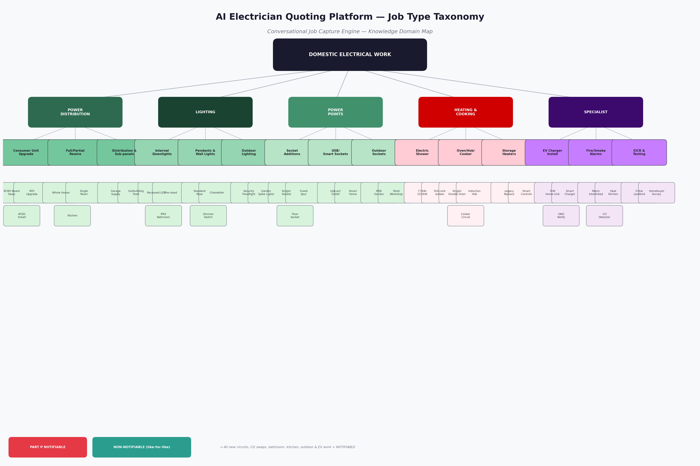
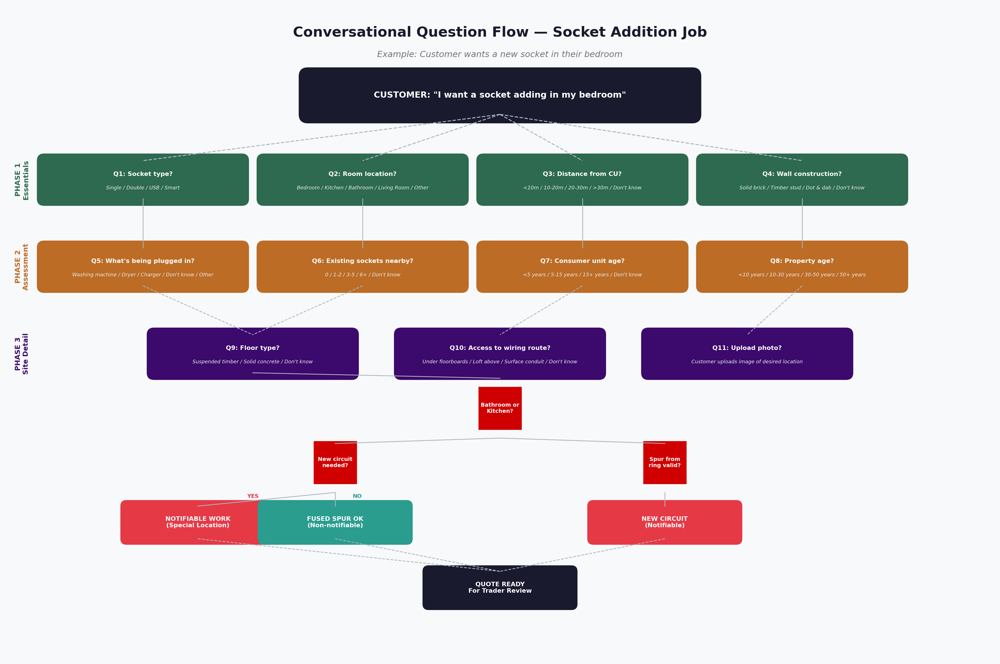
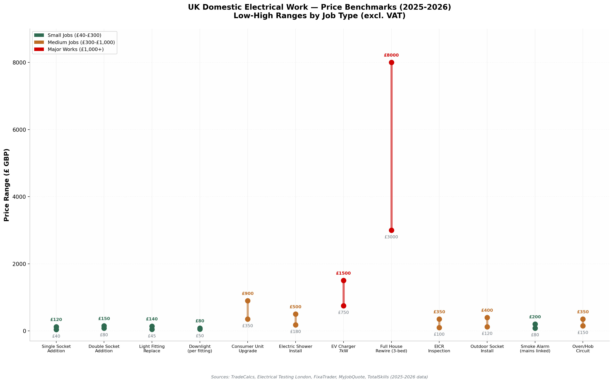
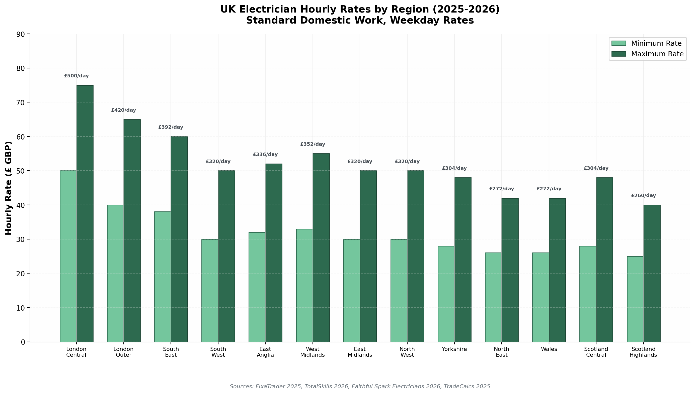

# AI Electrician Quoting Platform: Conversational Job Capture Engine — Research & Data Model

**TL;DR:** This document delivers a complete domain-knowledge data model to arm an LLM with the expertise needed to conduct guided, conversational requirement capture for domestic electrical work. It covers **5 job categories** (Power Distribution, Lighting, Power Points, Heating & Cooking, Specialist), **16 job types**, **86 structured questions**, compliance decision logic (Part P notifiability), regional pricing benchmarks (2025-2026 UK rates), cable sizing rules, and conversational design patterns. The deliverable includes a production-ready JSON schema (`job_capture_data_model.json`) and four visualisations that map the knowledge domain.

---

## 1. Executive Summary: The Knowledge Challenge

The core challenge in building an AI quoting platform for electrical work is that **customers don't know what electricians need to know**. A homeowner who says "I want a socket in my bedroom" has no awareness of ring final circuits, Part P notifiability, cable derating factors, or whether their spur will overload the existing circuit. The LLM must translate a vague intent into a structured, quotable specification — and do so through a conversation that feels natural, not like a form-filling exercise.

This research arms the LLM with a **three-layer knowledge architecture**:

| Layer | Purpose | Content |
|-------|---------|---------|
| **Universal Context** | Asked for every job | Property type, age, floor, CU location, supply age, parking, timeline |
| **Job-Specific Requirements** | Varies by job category | Socket type, kW rating, IP rating, distance from CU, load calculation |
| **Decision Logic** | Determines compliance & pricing | Part P triggers, cable sizing, pricing adjustments, compliance flags |

The document is structured to be immediately actionable for engineering teams: the JSON schema in Section 7 can be ingested directly into a prompt pipeline, the visualisations in Section 8 communicate the domain to stakeholders, and the pricing benchmarks in Section 5 enable dynamic quote estimation.

---

## 2. Job Type Taxonomy: The Complete Map of Domestic Electrical Work

Domestic electrical work in the UK spans a surprisingly broad scope. Under Part P of the Building Regulations, any work in a dwelling (house, flat, maisonette) and associated buildings (garage, shed, greenhouse) must comply with BS 7671.  [(Total Skills)](https://www.totalskills.co.uk/guides/part-p-building-regulations)  The taxonomy below organises all common job types into five categories, with explicit Part P notifiability flagged for each — this determines whether a registered competent person (NICEIC/NAPIT) must carry out or certify the work.

### 2.1 Five Core Categories

**Power Distribution** encompasses the central nervous system of the property's electrical installation: consumer units (fuse boards), full or partial rewires, and distribution to outbuildings. This is the highest-stakes category because mistakes here affect every circuit in the property. **Lighting** covers everything from simple pendant swaps to complex fire-rated downlight grids, outdoor garden schemes, and IP-rated bathroom luminaires. **Power Points** includes socket additions (the most common small job), USB/smart outlets, outdoor sockets, and fused connection units for fixed appliances. **Heating & Cooking** covers high-demand fixed appliances — electric showers (drawing 32-52A), ovens/hobs, and storage heaters — all requiring dedicated radial circuits sized for continuous load. **Specialist** captures EV chargers (the fastest-growing category), fire/smoke alarm systems, EICR inspections, and security system wiring.



### 2.2 Part P Notifiability Matrix

Understanding which work is **notifiable** (must be certified by a registered electrician or building control) is critical because it determines who can legally do the work and what paperwork the customer receives. The LLM must flag this automatically.

| Work Type | Notifiable? | Legal Basis | Customer Impact |
|-----------|-------------|-------------|-----------------|
| New circuit from consumer unit | **Yes** | Part P, Section 2.2  [(GOV.UK)](https://assets.publishing.service.gov.uk/media/5a802da7ed915d74e622ceed/BR_PDF_AD_P_2013.pdf)  | Must use registered electrician; EIC certificate issued |
| Consumer unit replacement | **Yes** | Part P, Section 2.2  [(GOV.UK)](https://assets.publishing.service.gov.uk/media/5a802da7ed915d74e622ceed/BR_PDF_AD_P_2013.pdf)  | Must use registered electrician; Building Control notified |
| Additional socket via ring spur (non-kitchen/bathroom) | **No** | BS 7671 433.1.204  [(Professional Electrician)](https://professional-electrician.com/technical/the-practice-of-unfused-spurs-off-a-ring-final-circuit/)  | Any competent person; no certificate required |
| Electrical work in bathroom/shower room | **Yes** | Part P special locations  [(Total Skills)](https://www.totalskills.co.uk/guides/part-p-building-regulations)  | Registered electrician mandatory; BS 7671 Section 701 applies |
| Electrical work in kitchen (new circuit/additional sockets) | **Yes** | Part P special locations  [(Total Skills)](https://www.totalskills.co.uk/guides/part-p-building-regulations)  | Registered electrician mandatory |
| Outdoor electrical work (new circuit) | **Yes** | Part P, Section 2.2  [(GOV.UK)](https://assets.publishing.service.gov.uk/media/5a802da7ed915d74e622ceed/BR_PDF_AD_P_2013.pdf)  | Registered electrician; IP and RCD requirements apply |
| EV charger installation | **Yes** | Part P + Approved Document S  [(GOV.UK)](https://www.gov.uk/guidance/approved-document-s-infrastructure-for-charging-electric-vehicles-frequently-asked-questions)  | OZEV-approved installer; DNO notification |
| Like-for-like accessory replacement | **No** | Part P exemptions  [(GOV.UK)](https://assets.publishing.service.gov.uk/media/5a802da7ed915d74e622ceed/BR_PDF_AD_P_2013.pdf)  | Any competent person |
| EICR inspection/testing | **No** | No installation work  [(niceic.com)](https://niceic.com/householders/electrical-services/electrical-installation-condition-reports/)  | Qualified electrician; report issued |
| Fire/smoke alarm (mains-powered) | **Yes** | Part P (new circuit)  [(Local Authority Building Control)](https://www.labc.co.uk/news/the-dos-and-donts-of-mains-powered-smoke-alarms-and-battery-alarms)  | Registered electrician; interlinking required in Scotland  [(Engage Renfrewshire)](https://engagerenfrewshire.org/couch/uploads/file/gcvs-fire-and-smoke-alarms-changes-to-the-law.pdf)  |

The distinction between **notifiable** and **non-notifiable** work is the single most important compliance flag the LLM must apply. A customer adding a bedroom socket via a ring spur should be reassured that no building control notification is needed. A customer wanting a kitchen socket addition must be told that this is notifiable work requiring a registered electrician — and the platform should only dispatch NICEIC/NAPIT-registered traders for these jobs.

---

## 3. The Conversational Question Architecture

The platform's conversational engine follows a **progressive disclosure** pattern: simple, outcome-oriented questions first; technical, site-specific questions later. The LLM acts as a patient, jargon-free electrical expert who never makes the customer feel ignorant for not knowing their consumer unit's age.

### 3.1 Three-Phase Question Flow

Every job capture follows a structured three-phase conversation:

**Phase 1 — Intent & Essentials (2-4 questions):** The LLM confirms what the customer wants and where. "Which room?" "What type of socket?" "What will you plug in?" These questions are always multiple-choice with visual icons where possible, and always include "I don't know" or "I'm not sure" as options. The goal is to quickly categorise the job type and check for immediate red flags (e.g., bathroom location = notifiable).

**Phase 2 — Site Assessment (3-5 questions):** The LLM gathers the information an electrician would assess during a site survey. Distance from consumer unit, wall construction type, floor type, property age, and existing socket density. These questions are conditional — if the customer doesn't know their CU's age, the LLM notes it as "unknown — electrician to verify on site" rather than blocking progress.

**Phase 3 — Detail & Confirmation (2-3 questions):** Final technical details and a photo upload request. By this point the customer is engaged and understands why a photo helps. The LLM summarises what has been captured and presents a preview of the information that will be sent to the trader.



### 3.2 Universal Questions (Asked for Every Job)

Regardless of job type, nine universal questions establish baseline context that affects every quote:

| # | Question | Type | Why It Matters |
|---|----------|------|----------------|
| UQ-01 | Property type (detached, semi, flat, etc.) | Single choice | Determines access difficulty, cable routing, DNO supply constraints  [(Jobnix)](https://www.myjobnix.com/resources/site-survey-checklist)  |
| UQ-02 | Property age bracket | Single choice | Pre-1970s may have rubber/aluminium wiring, no RCD, no earth  [(Electrical Testing London)](https://www.electricaltestinglondon.co.uk/blog/what-does-a-homebuyers-electrical-survey-cost-in-the-uk-)  |
| UQ-03 | Floor level of work | Single choice | Upper floors = longer cable runs, loft access considerations |
| UQ-04 | Consumer unit location | Single choice | Distance affects cable run length and labour time  [(Fix-a-Trader)](https://fixatrader.com/blog/electricians/electrician-hourly-rates-uk)  |
| UQ-05 | Consumer unit age | Single choice | Pre-2000 boards likely need upgrade for modern protection  [(Electrical Testing London)](https://www.electricaltestinglondon.co.uk/blog/consumer-unit-upgrade-cost--uk-prices--factors--timescales)  |
| UQ-06 | Customer type (owner/tenant/landlord) | Single choice | Landlords have 5-year EICR obligations; tenants need permission  [(EnergyPerformanceCertificates.co.uk)](https://energyperformancecertificates.co.uk/understanding-eicr-regulations-what-every-homeowner-needs-to-know)  |
| UQ-07 | Parking availability | Single choice | London/congestion zone jobs incur parking charges  [(Fix-a-Trader)](https://fixatrader.com/blog/electricians/electrician-hourly-rates-uk)  |
| UQ-08 | Desired timeline | Single choice | Emergency = 2-3x pricing; weekend = 1.5-2x pricing  [(Fix-a-Trader)](https://fixatrader.com/blog/electricians/electrician-hourly-rates-uk)  |
| UQ-09 | Photo upload | Image | Visual assessment of access, wall type, obstacles  [(Jobnix)](https://www.myjobnix.com/resources/site-survey-checklist)  |

These universal questions alone capture approximately 40% of the variance in job pricing. A Victorian terrace with an old fuse board, solid concrete floors, and no parking will cost significantly more than a 2015 detached house with an RCBO board, suspended timber floors, and a driveway — even for the same "add a socket" job.

---

## 4. Job-Specific Question Patterns: Deep Dives by Category

### 4.1 Socket Additions — The Most Common Job

Adding a socket is the bread and butter of domestic electrical work, representing an estimated 25-30% of all call-outs.  [(Fix-a-Trader)](https://fixatrader.com/blog/electricians/electrician-hourly-rates-uk)  Yet the quote can vary from **£40 for a simple spur** to **£300+ for a new circuit** depending on answers to five critical questions.

The LLM's question sequence for sockets follows this dependency chain:

**Question 1 — Socket Type:** Single, double, USB-A, USB-C, smart, or floor socket. USB and smart sockets cost £25-60 each versus £5-15 for standard, but customers increasingly expect them.  [(Fix-a-Trader)](https://fixatrader.com/blog/electricians/electrician-hourly-rates-uk) 

**Question 2 — Room Location:** Bedroom sockets are typically non-notifiable spurs. Kitchen and bathroom sockets are notifiable and may need dedicated circuits. The LLM must immediately flag if the room is a "special location."

**Question 3 — Appliance Load:** This is the hidden complexity. A customer saying "I want to plug in a washing machine" is actually requesting a high-load appliance (2kW+) that should have a **dedicated circuit**, not just an additional socket. The LLM must detect this and escalate the job type accordingly.  [(Professional Electrician)](https://professional-electrician.com/technical/the-practice-of-unfused-spurs-off-a-ring-final-circuit/) 

**Question 4 — Distance from Consumer Unit:** Cable length determines voltage drop and labour time. Under 10 metres is straightforward; over 30 metres may need thicker cable and significantly more labour.

**Question 5 — Existing Socket Density:** If a room already has 6+ sockets, the ring circuit may be near capacity. If it has 0-2, a spur is almost certainly viable. The LLM uses this to recommend spur versus new circuit.

The decision logic then branches: if the room is a kitchen or bathroom → **notifiable, new circuit required**. If the room is elsewhere and a nearby socket exists on the ring → **non-notifiable spur is viable**. If no nearby sockets exist → **assess whether new circuit is needed**.

### 4.2 Consumer Unit Upgrades — The Safety Critical Job

Consumer unit (fuse board) upgrades are universally notifiable and typically cost **£350-£1,200** depending on specification.  [(Electrical Testing London)](https://www.electricaltestinglondon.co.uk/blog/consumer-unit-upgrade-cost--uk-prices--factors--timescales)  The LLM needs to assess four key dimensions:

**Current Board Type:** Old rewirable fuse boards (pre-1990) are a red flag — they have no RCD protection and cannot safely support modern loads.  [(Electrical Testing London)](https://www.electricaltestinglondon.co.uk/blog/consumer-unit-upgrade-cost--uk-prices--factors--timescales)  Cartridge fuse boards (1990-2005) are better but still lack RCDs. Split-load RCD boards (2005-2015) provide basic protection but trip entire halves of the board. Modern RCBO boards (2015+) protect each circuit individually — the current gold standard.

**Circuit Count:** A studio/1-bed flat needs 4-6 ways; a 2-3 bed house needs 8-10 ways; a 4+ bed or extended property needs 12-14+ ways.  [(Electrical Testing London)](https://www.electricaltestinglondon.co.uk/blog/consumer-unit-upgrade-cost--uk-prices--factors--timescales)  The LLM can estimate this from bedroom count if the customer doesn't know.

**Future-Proofing:** If the customer plans an EV charger, extension, solar panels, or hot tub in the next 5 years, the LLM should recommend a larger board with spare ways. Upgrading the board twice is far more expensive than doing it once with headroom.

**Protection Level:** Since Amendment 3 of BS 7671 (2015), **Surge Protection Devices (SPD)** are recommended for all domestic installations to protect against transient overvoltage.  [(Sleepless Tradesman)](https://sleeplesstradesman.com/tools/electrical-load-calculator)  **Arc Fault Detection Devices (AFDD)** detect dangerous arc faults that can cause fires — they are mandatory in some European countries and increasingly recommended in the UK. The LLM should present these as options with clear benefit explanations.

| Board Specification | Typical Cost | Best For |
|---------------------|-------------|----------|
| Basic dual RCD (8-way) | £350-£550 | Small flats, budget upgrades  [(Electrical Testing London)](https://www.electricaltestinglondon.co.uk/blog/consumer-unit-upgrade-cost--uk-prices--factors--timescales)  |
| High-integrity split RCD (10-way) | £500-£750 | Standard 2-3 bed homes |
| All-RCBO with SPD (12-way) | £650-£950 | Modern homes, best protection  [(Electrical Testing London)](https://www.electricaltestinglondon.co.uk/blog/consumer-unit-upgrade-cost--uk-prices--factors--timescales)  |
| Premium RCBO + SPD + AFDD (14-way) | £900-£1,200+ | Large homes, maximum safety |

### 4.3 Electric Showers — The High-Load Specialist

Electric showers are among the most demanding domestic circuits, drawing **32-52 amps continuously**.  [(Elec-Mate)](https://www.elec-mate.com/guides/electric-shower-installation)  Correct cable sizing is absolutely critical — undersizing is a C1 (danger present) defect that can cause cable fires.

The LLM must capture the **kW rating** because this single number determines everything else:

| kW Rating | Current Draw | Minimum Cable | Breaker Size | Typical Cost |
|-----------|-------------|---------------|--------------|--------------|
| 7.5kW | ~33A | 6mm² (short runs) or 10mm² | 32A or 40A MCB | £180-£250  [(Elec-Mate)](https://www.elec-mate.com/guides/electric-shower-installation)  |
| 8.5kW | ~37A | 10mm² twin & earth | 40A MCB | £210-£300  [(Elec-Mate)](https://www.elec-mate.com/guides/electric-shower-installation)  |
| 9.5kW | ~41A | 10mm² twin & earth | 45A MCB | £250-£375  [(Elec-Mate)](https://www.elec-mate.com/guides/electric-shower-installation)  |
| 10.5kW | ~46A | 10mm² or 16mm² | 45A or 50A MCB | £300-£460  [(Elec-Mate)](https://www.elec-mate.com/guides/electric-shower-installation)  |
| 10.8kW+ | ~47-52A | 16mm² minimum | 50A MCB | £350-£570  [(Elec-Mate)](https://www.elec-mate.com/guides/electric-shower-installation)  |

The LLM should also ask about **water pressure** because low-pressure systems (gravity-fed) may need a pumped shower or a lower kW rating. And it must confirm whether this is a **like-for-like replacement** (potentially non-notifiable if same or lower kW) or an **upgrade/new install** (always notifiable).  [(Elec-Mate)](https://www.elec-mate.com/guides/electric-shower-installation) 

### 4.4 EV Charger Installation — The Fastest-Growing Category

EV charger installations have grown exponentially since the 2030 petrol/diesel sales ban was announced. All domestic EV charger installations are **notifiable under Part P** and since July 2022 must comply with the **Smart Charge Point Regulations** (internet-connected, capable of demand response).  [(North West Contractors)](https://northwest-contractors.co.uk/news/ev-charger-installation-preparing-for-an-electric-vehicle/) 

The LLM needs to assess five dimensions that many customers won't have considered:

**Supply Capacity:** Standard UK homes have a **100A single-phase supply** (23kW at 230V).  [(Sleepless Tradesman)](https://sleeplesstradesman.com/tools/electrical-load-calculator)  A 7kW charger draws ~30A continuously. If the home already has an electric shower (40A), oven (13A), and other loads, the total may approach the supply limit. The LLM should flag when a **DNO (Distribution Network Operator) supply upgrade** might be needed — this adds £500-£2,000 and 4-8 weeks to the process.  [(UK Power Networks)](https://www.ukpowernetworks.co.uk/low-carbon-technology-domestic/electric-vehicles-cost-time-and-whats-involved) 

**Parking Location:** On-street parking makes installation "very difficult or impossible" in many cases because the charger must be on the customer's property.  [(North West Contractors)](https://northwest-contractors.co.uk/news/ev-charger-installation-preparing-for-an-electric-vehicle/)  The LLM should ask about off-street parking before proceeding.

**Wi-Fi Signal:** Since all new chargers must be "smart," a stable internet connection at the charger location is mandatory.  [(North West Contractors)](https://northwest-contractors.co.uk/news/ev-charger-installation-preparing-for-an-electric-vehicle/)  The LLM should ask about Wi-Fi coverage.

**Charger Type:** 7kW is standard for single-phase homes (charges a typical EV from 20-80% overnight). 22kW requires three-phase supply, which most UK homes don't have. Tethered units have the cable attached; untethered use the customer's own cable.

**Vehicle Type:** Some manufacturers (Tesla, VW) include a home charger with purchase. The LLM should ask what vehicle the customer has to avoid recommending an incompatible unit.

### 4.5 Bathroom Electrical Work — The Zone System

Bathrooms are the most regulated domestic location under **BS 7671 Section 701**.  [(Elec-Mate)](https://www.elec-mate.com/guides/bathroom-electrical-zones-bs7671)  The LLM must understand the three-zone system because it determines where equipment can be installed and what IP ratings are required:

| Zone | Definition | Permitted Equipment | IP Rating Required |
|------|-----------|---------------------|-------------------|
| **Zone 0** | Inside bath/shower tray | None (or SELV 12V, IPX7 only)  [(Elec-Mate)](https://www.elec-mate.com/guides/bathroom-electrical-zones-bs7671)  | IPX7 |
| **Zone 1** | Above bath/shower to 2.25m height | Electric shower unit, IPX4 luminaires, SELV  [(Elec-Mate)](https://www.elec-mate.com/guides/bathroom-electrical-zones-bs7671)  | IPX4 minimum |
| **Zone 2** | 0.6m horizontal beyond Zone 1 | Shaver sockets (BS EN 61558-2-5), towel rails, IPX4 luminaires  [(Elec-Mate)](https://www.elec-mate.com/guides/bathroom-electrical-zones-bs7671)  | IPX4 |
| **Outside Zones** | Rest of bathroom | Standard accessories (but no 13A sockets within 3m of Zone 1)  [(IET Electrical Excellence)](https://electrical.theiet.org/media/1450/section-701.pdf)  | None specified |

Any electrical work in a bathroom is **notifiable under Part P**.  [(Total Skills)](https://www.totalskills.co.uk/guides/part-p-building-regulations)  All bathroom circuits require **30mA RCD protection**.  [(Elec-Mate)](https://www.elec-mate.com/guides/bathroom-electrical-zones-bs7671)  Shaver sockets are the only sockets permitted in a bathroom, and only in Zone 2 or outside zones.  [(niceic.com)](https://niceic.com/householders/bathrooms-and-electrics/)  The LLM must enforce these constraints when a customer mentions bathroom work — and should proactively recommend pull-cord isolators for showers, IP65 downlights, and RCD-protected circuits.

---

## 5. UK Pricing Framework: Regional Benchmarks & Cost Drivers

Accurate quoting requires understanding both baseline pricing and the factors that push jobs toward the high or low end of ranges. The research compiled pricing data from six UK trade pricing sources (TradeCalcs, Electrical Testing London, FixaTrader, MyJobQuote, TotalSkills, Faithful Spark) covering 2025-2026 rates.

### 5.1 National Price Benchmarks by Job Type



The pricing data reveals three clear tiers of work:

**Small Jobs (£40-£300):** Single socket additions (£40-£120), light fitting replacements (£45-£140), smoke alarm installations (£80-£200), and EICR inspections (£100-£350) form the high-volume, low-margin work that keeps electricians busy between larger projects.  [(Fix-a-Trader)](https://fixatrader.com/blog/electricians/electrician-hourly-rates-uk) 

**Medium Jobs (£300-£1,000):** Consumer unit upgrades (£350-£900), electric shower installations (£180-£500), outdoor socket installs (£120-£400), and oven/hob circuits (£150-£450) require more time, materials, and certification but are completed in a single day.  [(Electrical Testing London)](https://www.electricaltestinglondon.co.uk/blog/consumer-unit-upgrade-cost--uk-prices--factors--timescales) 

**Major Works (£1,000+):** EV charger installations (£750-£1,500) and full house rewires (£3,000-£8,000, with larger properties up to £10,000) represent significant projects requiring multiple days, detailed design, and full certification.  [(TradeCalcs)](https://tradecalcs.co.uk/house-rewire-cost-uk) 

### 5.2 Regional Labour Rate Variations



Geographic location is the single biggest external pricing factor. Central London electricians command **£50-75/hour** (£400-600/day), while rural Scotland averages **£25-40/hour** (£200-320/day).  [(Fix-a-Trader)](https://fixatrader.com/blog/electricians/electrician-hourly-rates-uk)  The South East premium extends 30-50 miles beyond London, gradually normalising through the Midlands.

| Region | Hourly Range | Day Rate | Adjustment Factor |
|--------|-------------|----------|-------------------|
| London Central | £50-75 | £400-600 | +40-60% vs national average  [(Fix-a-Trader)](https://fixatrader.com/blog/electricians/electrician-hourly-rates-uk)  |
| London Outer / Home Counties | £40-65 | £320-520 | +25-40%  [(Fix-a-Trader)](https://fixatrader.com/blog/electricians/electrician-hourly-rates-uk)  |
| South East | £38-60 | £304-480 | +20-30%  [(Fix-a-Trader)](https://fixatrader.com/blog/electricians/electrician-hourly-rates-uk)  |
| Midlands (East/West) | £30-55 | £240-440 | Baseline  [(Fix-a-Trader)](https://fixatrader.com/blog/electricians/electrician-hourly-rates-uk)  |
| North West / Yorkshire | £28-50 | £224-400 | -10%  [(Fix-a-Trader)](https://fixatrader.com/blog/electricians/electrician-hourly-rates-uk)  |
| North East / Wales | £26-42 | £208-336 | -15%  [(Fix-a-Trader)](https://fixatrader.com/blog/electricians/electrician-hourly-rates-uk)  |
| Scotland Central | £28-48 | £224-384 | -10%  [(Faithful Spark Electricians)](https://faithfulsparkelectricians.co.uk/average-cost-of-electrical-work-in-the-uk-2026-pricing-data/)  |
| Scotland Highlands | £25-40 | £200-320 | -20%  [(Faithful Spark Electricians)](https://faithfulsparkelectricians.co.uk/average-cost-of-electrical-work-in-the-uk-2026-pricing-data/)  |

### 5.3 Cost Adjustment Factors

Beyond regional rates, six factors consistently move quotes up or down:

**Property Age (+15-25% for pre-1970):** Older properties may have legacy wiring (rubber insulation, aluminium conductors, no earth bonding), obsolete colour coding, and asbestos-containing materials.  [(Electrical Testing London)](https://www.electricaltestinglondon.co.uk/blog/what-does-a-homebuyers-electrical-survey-cost-in-the-uk-)  Electricians charge more because every assumption must be verified.

**Floor and Wall Construction (+10-25% for solid):** Suspended timber floors allow cables to be run underneath with minimal disruption. Solid concrete floors or dot-and-dab plasterboard walls require chasing — cutting channels into masonry — which is slow, dusty, and requires making good afterwards.  [(TradeCalcs)](https://tradecalcs.co.uk/house-rewire-cost-uk) 

**Access Difficulty (+10-25%):** Consumer units in locked communal cupboards, lofts with no ladder access, or properties with no parking all add time and frustration.  [(Fix-a-Trader)](https://fixatrader.com/blog/electricians/electrician-hourly-rates-uk) 

**Urgency Premium (+100-200% emergency):** Out-of-hours work (evenings, weekends, holidays) commands significant premiums. Emergency call-outs for dangerous situations (burning smell, complete power loss) are typically double standard rates.  [(Fix-a-Trader)](https://fixatrader.com/blog/electricians/electrician-hourly-rates-uk) 

**Combining Multiple Jobs (-10-20% per job):** A customer adding two sockets and changing three light fittings on the same visit gets economies of scale — single mobilisation, tools already out, testing done once. The LLM should actively recommend bundling.

**Making Good (excluded, £500-2,000 extra):** Electricians' quotes almost universally exclude plastering, decorating, and flooring repairs after chasing.  [(TradeCalcs)](https://tradecalcs.co.uk/house-rewire-cost-uk)  The LLM should set this expectation explicitly to avoid disputes.

---

## 6. Cable Sizing & Circuit Design Rules

The LLM doesn't need to perform full BS 7671 cable calculations, but it needs enough knowledge to **flag when a job likely exceeds standard assumptions** and needs escalation to a qualified electrician for detailed design.

### 6.1 Standard Domestic Circuit Configurations

| Circuit Type | Typical Cable | Breaker | Max Length | Typical Application |
|-------------|---------------|---------|------------|---------------------|
| Lighting | 1.5mm² T&E | 6A MCB | ~50m | Ceiling roses, wall lights |
| Ring final (sockets) | 2.5mm² T&E | 32A MCB | 100m ring | Standard socket outlets  [(Professional Electrician)](https://professional-electrician.com/technical/the-practice-of-unfused-spurs-off-a-ring-final-circuit/)  |
| Socket spur | 2.5mm² T&E | FCU 13A max | ~20m | Single additional socket  [(Professional Electrician)](https://professional-electrician.com/technical/the-practice-of-unfused-spurs-off-a-ring-final-circuit/)  |
| Cooker/oven | 6mm² or 10mm² T&E | 32A or 45A MCB | ~25m | Built-in ovens, hobs |
| Electric shower 8.5kW | 10mm² T&E | 40A MCB | ~20m | Mid-range shower  [(Elec-Mate)](https://www.elec-mate.com/guides/electric-shower-installation)  |
| Electric shower 9.5kW | 10mm² T&E | 45A MCB | ~18m | High-performance shower  [(Elec-Mate)](https://www.elec-mate.com/guides/electric-shower-installation)  |
| Electric shower 10.5kW | 10mm² or 16mm² | 45A or 50A MCB | ~15m | Premium shower  [(Elec-Mate)](https://www.elec-mate.com/guides/electric-shower-installation)  |
| EV charger 7kW | 6mm² SWA | 32A RCBO | ~25m | Standard home charger  [(Sleepless Tradesman)](https://sleeplesstradesman.com/tools/electrical-load-calculator)  |
| Outdoor socket | 2.5mm² SWA | 20A RCBO | ~20m | Garden power  [(Total Skills)](https://www.totalskills.co.uk/guides/outdoor-electrical-regulations)  |
| Outbuilding supply | 4-6mm² SWA | Variable | ~40m | Garage/shed feed  [(Total Skills)](https://www.totalskills.co.uk/guides/outdoor-electrical-regulations)  |

**Key insight for the LLM:** If a customer's answers suggest cable runs **longer than standard** (e.g., consumer unit at one end of house, work at opposite end), or if **correction factors** apply (cables grouped together, passing through insulation, high ambient temperature), the cable size must increase. The LLM should flag these scenarios with: *"Based on the distance you've described, the electrician may need to use thicker cable than standard — they'll confirm this during their survey."*

### 6.2 Load Calculation Triggers

The LLM should flag when a customer's existing or planned loads may exceed their supply capacity:

A typical 3-bedroom semi has a **100A single-phase supply** (23kW at 230V).  [(Sleepless Tradesman)](https://sleeplesstradesman.com/tools/electrical-load-calculator)  Common loads include: electric shower (8.5kW = 37A), oven (3kW = 13A), EV charger (7kW = 30A), and other circuits. If the LLM detects that a customer is adding an EV charger to a home that already has an electric shower, it should warn: *"Your home's electrical supply may need a capacity check before adding an EV charger. The electrician will assess this and contact your electricity network operator if needed."*  [(Sleepless Tradesman)](https://sleeplesstradesman.com/tools/electrical-load-calculator) 

---

## 7. The JSON Data Model: Complete Schema Reference

The `job_capture_data_model.json` file (delivered alongside this document) contains the complete machine-readable schema. This section explains its structure for implementation teams.

### 7.1 Schema Structure Overview

The JSON schema is organised into eight top-level sections:

| Section | Records | Purpose |
|---------|---------|---------|
| `metadata` | 1 | Regulatory framework, pricing date, jurisdiction |
| `universal_questions` | 9 | Questions asked for every job type |
| `job_categories` | 5 categories, 16 job types | Category → job type → specific questions hierarchy |
| `decision_logic` | 7 notifiability rules, 8 pricing factors, 10 cable rules | Rules engine for compliance and pricing |
| `compliance_flags` | 8 flags | Automatic warnings triggered by customer responses |
| `conversational_guidelines` | 1 persona + strategies + photo guidance | LLM behaviour and response patterns |

### 7.2 Job Type Record Structure

Each job type follows a standardised record format:

```json
{
  "id": "JOB-0301",
  "name": "Additional Socket Outlet",
  "part_p_notifiable": "Conditional - kitchen/bathroom = Yes, elsewhere = No",
  "typical_price_range": {"low": 40, "high": 150, "unit": "GBP"},
  "typical_duration": "0.5-2 hours",
  "triggers": ["Insufficient sockets", "New appliance", "Convenience"],
  "specific_questions": [...]
}
```

The `part_p_notifiable` field uses conditional language because notifiability depends on customer responses (location, method of installation). The `triggers` array helps the LLM recognise when a customer's vague description maps to this job type — e.g., "I need somewhere to plug in my new TV" → socket addition.

### 7.3 Question Record Structure

Each question follows this format:

```json
{
  "id": "SK-03",
  "question": "What will you be plugging into this socket?",
  "type": "multi_choice",
  "options": ["Phone charger", "TV", "Washing machine", ...],
  "required": true,
  "rationale": "High-power appliances need dedicated circuits"
}
```

The `rationale` field is critical — it explains **why** the question is being asked, which the LLM can surface to the customer if they seem confused or resistant. The `type` field supports: `single_choice`, `multi_choice`, `text_input`, `image_upload`, and `boolean`.

### 7.4 Decision Logic Engine

The `decision_logic` section contains three rule sets that enable the LLM to make expert judgments:

**Notifiability Rules** use simple conditional logic: `IF job_location == 'kitchen' AND new_circuit == true THEN notifiable = true`. The LLM evaluates these rules dynamically as customer responses arrive.

**Pricing Adjustment Factors** are percentage modifiers applied to baseline prices. The LLM can stack multiple factors: a 60-year-old property (+20%) in London (+25%) with solid floors (+15%) = **+60% adjustment** to the baseline quote.

**Cable Sizing Rules** provide quick-reference lookups. When a customer says "I want a 9.5kW shower," the LLM immediately knows: 10mm² cable, 45A breaker, ~18m max run. If the customer then says the bathroom is 25m from the CU, the LLM flags: *"This distance may require larger cable — the electrician will confirm on site."*

### 7.5 Compliance Flags

Eight automatic flags trigger when customer responses indicate potential compliance issues:

| Flag ID | Trigger | Severity | LLM Response |
|---------|---------|----------|-------------|
| FLAG-01 | Consumer unit > 20 years old | Recommendation | Suggest CU upgrade for RCD protection |
| FLAG-02 | Property > 50 years, no recent EICR | Recommendation | Suggest safety inspection |
| FLAG-03 | Bathroom work, no RCD confirmed | **Mandatory** | "All bathroom circuits MUST have 30mA RCD" |
| FLAG-04 | Socket addition for >2kW appliance | **Mandatory** | "This appliance needs a dedicated circuit" |
| FLAG-05 | Outdoor work, no RCD confirmed | **Mandatory** | "Outdoor circuits MUST have RCD protection" |
| FLAG-06 | EV charger, supply <100A | Warning | "Supply capacity check may be needed" |
| FLAG-07 | Storage heater > 30 years old | Warning | "May contain asbestos — specialist removal" |
| FLAG-08 | Scotland property, alarms not interlinked | **Mandatory** | "Scottish law requires interlinked alarms" |

---

## 8. Conversational Design: Making the LLM Feel Like an Electrician

The data model provides the *what*; conversational design provides the *how*. The LLM's persona and response strategies are as important as its domain knowledge.

### 8.1 Agent Persona

The LLM speaks as a **friendly, patient, non-technical electrical expert**. It never uses jargon without immediately explaining it. It always offers "I don't know" as a valid option. It uses progressive disclosure — simple questions first, complex ones only when needed. It validates the customer's intent before diving into technical details. It never makes the customer feel ignorant.

Key persona traits:
- **Reassuring:** "That's perfectly fine — most people don't know these details."
- **Educational:** "An RCD is a safety device that cuts power instantly if there's a fault — it's been required in all new installations since 2008."
- **Practical:** "Based on what you've told me, I'd recommend a double socket with USB — it'll cost a bit more but you'll use it every day."
- **Honest about limits:** "I'll need the electrician to confirm this on site, but I can give you a good estimate based on what you've told me."

### 8.2 Handling "I Don't Know"

When customers don't know technical details (consumer unit age, wall construction, floor type), the LLM has three strategies:

**Default and Note:** "No problem — most people don't know. I'll note it as 'to be confirmed on site' and the electrician will check when they visit." This is the default approach for non-critical questions.

**Infer from Context:** If the customer says their house was built in 1985, the LLM can infer: solid concrete floors were common, the consumer unit is likely a cartridge fuse board, and there may be no RCD protection. It presents these as educated guesses: "Based on your property being from the 1980s, your consumer unit is likely an older type. I'll note this for the electrician to confirm."

**Use Photos:** "A photo would really help here — could you take a quick picture of your fuse board? Even a rough photo lets the electrician see what they're working with." Photos are requested after 3-5 questions when the customer is engaged, never at the start.

### 8.3 Progressive Disclosure in Action

Consider how the LLM handles the "socket in bedroom" scenario from the opening example. The conversation doesn't jump straight to "What's your consumer unit's Zs value?" It flows naturally:

> **Customer:** "I want a socket adding in my bedroom."
>
> **Agent:** "No problem — I can help you with that. Just to check, would you like a single socket or a double one?"
>
> **Customer:** "Double, please."
>
> **Agent:** "Great choice. Would you like USB charging built in as well? It's really handy for phones and tablets."
>
> **Customer:** "Yes, USB would be good."
>
> **Agent:** "Perfect. And what will you mainly be plugging into this socket? Things like a TV, phone charger, or something bigger like a heater?"
>
> **Customer:** "Just a lamp and phone charger."
>
> **Agent:** "That sounds straightforward. Is there an existing socket on the same wall or nearby in the bedroom?"
>
> *[Conversation continues through wall type, distance from fuse board, property age, photo upload...]*
>
> **Agent:** "Brilliant — I've got everything I need. Here's what I've captured: you want a double USB socket in your bedroom, for low-power devices, with an existing socket nearby on a standard wall. Based on this, a good electrician should be able to add this as a straightforward job. I'll send this to verified electricians in your area and you should hear back within 24 hours."

---

## 9. Implementation Roadmap: From Data Model to Live System

### 9.1 Phase 1 — Core Job Types (Weeks 1-4)

Implement the five most common job types first: **socket additions**, **light fitting replacements**, **consumer unit upgrades**, **additional lighting** (downlights), and **EICR inspections**. These represent approximately 70% of all domestic electrical enquiries. Deploy with the 9 universal questions plus job-specific questions for these five types.

### 9.2 Phase 2 — Extended Coverage (Weeks 5-8)

Add **electric showers**, **outdoor sockets**, **EV chargers**, **oven/hob circuits**, and **fire/smoke alarms**. These require more complex decision logic (Part P notifiability, cable sizing, zone compliance) but represent the next 20% of enquiries.

### 9.3 Phase 3 — Advanced Features (Weeks 9-12)

Add **full/partial rewires**, **outbuilding supplies**, **storage heaters**, **security systems**, and **smart home wiring**. Implement dynamic quote estimation using the pricing adjustment factors. Add photo analysis (computer vision to identify consumer unit types, wiring condition, wall construction).

### 9.4 Integration Architecture

The JSON schema is designed for direct ingestion into an LLM prompt pipeline:

```
Customer Input → Intent Classification (job type) → 
Universal Questions → Job-Specific Questions → 
Decision Logic Evaluation (Part P, cable sizing, pricing) → 
Compliance Flags → Quote Preview → Trader Dispatch
```

The schema can be converted to a vector database for RAG (Retrieval-Augmented Generation) implementation, or directly embedded in system prompts for smaller deployments. The question IDs enable analytics tracking — which questions cause drop-offs, which answers predict job complexity, which conversational paths lead to confirmed quotes.

---

## 10. Key Research Findings & Design Principles

This research programme analysed regulatory documentation (Part P Approved Document, BS 7671 Section 701), pricing data from six UK trade sources, and electrician workflow documentation. Ten design principles emerged:

**1. Customers don't know what electricians need to know.** The LLM must translate vague intent into structured requirements through patient, non-judgmental questioning.

**2. Notifiability is the most important compliance flag.** Getting this wrong creates legal liability. The LLM must correctly classify every job as notifiable or non-notifiable before dispatch.

**3. Property age is the strongest price predictor.** Pre-1970 properties add 15-25% to virtually every job type due to legacy wiring, no RCD, and harder access.

**4. Distance from consumer unit determines cable cost.** This single factor explains much of the variance in quotes for the same job type.

**5. Load assessment prevents dangerous installations.** A socket for a phone charger is trivial; a socket for a washing machine requires a dedicated circuit. The LLM must detect high-load appliances.

**6. Regional pricing varies by 2x across the UK.** London Central vs rural Scotland represents a doubling of labour rates. The platform must geolocate for accurate estimates.

**7. Photos are requested after engagement, not at the start.** Requesting photos in question 1 creates friction. Requesting them after 3-5 questions, with a clear explanation of why, gets compliance.

**8. Bundle recommendations increase average order value.** Customers adding one socket often need others. The LLM should proactively suggest: "While the electrician is here, would you like them to check any other rooms?"

**9. Set expectations about exclusions.** Making good, decorating, and flooring repairs are almost never included in electrician quotes. The LLM must communicate this to prevent disputes.

**10. The conversation should feel like advice, not a form.** Every question should explain *why* it's being asked. The LLM should offer recommendations, not just collect data.

---

*This research document and accompanying data model were produced for the AI Electrician Quoting Platform conversational job capture engine. The JSON schema (`job_capture_data_model.json`) contains 5 job categories, 16 job types, 86 structured questions, 7 notifiability rules, 8 pricing factors, 10 cable sizing rules, and 8 compliance flags — sufficient to arm an LLM with domain expertise equivalent to a trainee electrician's site assessment knowledge.*
