# iOS App — Onboarding & Dashboard Design Spec
## White-label mobile experience for tradespeople and customers

**Version:** 1.0
**Date:** 2026-08-14
**Source spec:** `docs/UK Electrician SaaS — Onboarding & AI Quote Capture Specification.md`

This document defines the high-fidelity screen designs for the pivot. The app is a **single iOS binary** that brands itself at runtime for each electrical business (logo, primary colour, service categories). It supports two profiles:

1. **Tradesperson** — onboards their business, captures leads, reviews AI-drafted quotes.
2. **Customer** — enters a business-specific quote request, answers a structured questionnaire, uploads photos, tracks status.

All mocks are exported as SVG in `docs/design/mocks/`. They are sized at the iPhone reference frame (390 × 844) and use the shared design tokens below.

---

## 1. Entry model & navigation

| Entry path | Determined by | Destination |
|---|---|---|
| Tradesperson taps app icon | Login as a business user | Business onboarding if `status=onboarding`; dashboard if `active` |
| Customer taps app icon | Asked to enter electrician’s business code / scan QR / tap a link | Branded quote request flow for that business |
| Universal link / deep link | `demo.mytradeportal.co.uk/quote` or `mytradeportal://quote?business=demo` | Branded quote request flow |

Navigation patterns:
- **Business onboarding:** linear stepper, full-screen pages, optional skip with progress saved.
- **Quote request:** card-by-card stepper, bottom-of-screen primary action, media capture as a modal.
- **Dashboards:** bottom tab navigator for both profiles (different tabs).

---

## 2. Design tokens

| Token | Value | Usage |
|---|---|---|
| Primary | `#2563EB` | Buttons, active chips, links, verified badges |
| Primary dark | `#1D4ED8` | Text on light-blue surfaces |
| Background | `#FFFFFF` | Screen background |
| Surface | `#F3F4F6` | Placeholders, disabled inputs, empty states |
| Border | `#E5E7EB` | Card/input borders |
| Text | `#111827` | Headings, body |
| Text secondary | `#6B7280` | Hints, meta data |
| Success | `#10B981` | Verified, accepted, confirmation |
| Warning | `#F59E0B` | Flagged assumptions, pending |
| Font stack | `-apple-system, BlinkMacSystemFont, sans-serif` | iOS system type |
| Phone frame | 390 × 844 | Reference artboard |
| Border radius | 12–16 px | Cards, buttons, inputs |
| Safe area top | 59 px | Below status bar / Dynamic Island |
| Safe area bottom | 34 px | Above home indicator |

---

## 3. Business onboarding (A1–A14)

### A1 — Welcome / value proposition

**Goal:** set expectations and reduce abandonment.

**Screen elements**
- Business-neutral placeholder logo (replaced by the business’s logo post-branding).
- Headline: “Get leads. Send quotes. Stay compliant.”
- 3 bullet value props.
- Stepper preview: 6 launch steps.
- Primary CTA: “Create my account”.
- Secondary CTA: “I already have an account”.

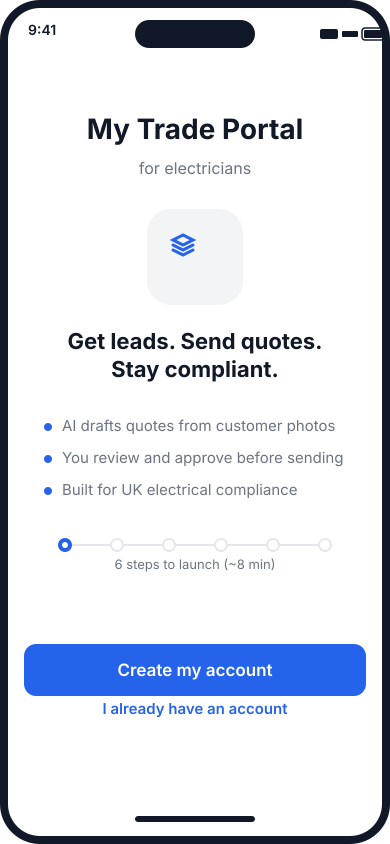

---

### A2 — Account creation

**Goal:** identity + auth with minimal friction.

**Fields**
- Full name
- Work email (login; verification email sent)
- Mobile (E.164)
- Password (strength meter)
- Role in business
- Apple / Google SSO option (secondary)

If role != owner, show inline explainer: “You’ll be able to invite the owner later — some compliance steps may need them.”

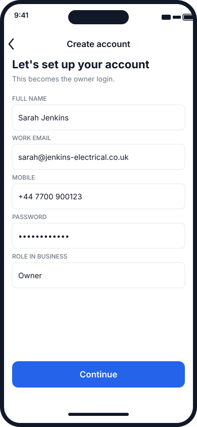

---

### A3 — Business identity

**Fields**
- Trading name
- Business structure (sole trader / Ltd / LLP / partnership)
- Legal entity name (conditional)
- Companies House number (auto-verify for Ltd/LLP)
- Year established
- Website / Facebook page

CH match pre-fills legal name and registered office; failure flags `manual_review`.

### A4 — Address & service area

- Trading address (postcode → address picker)
- Registered office (conditional, pre-filled)
- Service area mode: radius vs postcode list
- Radius slider with map preview
- Nations served (drives compliance copy)

### A5 — Tax & VAT

- VAT registered yes/no
- VAT number with checksum
- VAT scheme (standard / flat rate)
- Default VAT rate note (electrician confirms per line)

### A6 — Compliance & credentials (trust gate)

**Goal:** verify the business is legitimate. This is the platform differentiator.

**Fields / cards**
- Competent Person Scheme + membership number
- BS 7671 certificate upload
- 2391 inspection & testing qualification (conditional)
- Public liability insurer, policy number, cover level, expiry date, policy upload
- Optional PI, ECS/JIB, DBS

Badges:
- Verified (green check)
- Pending
- Manual review
- Self-declared

`none_yet` branch: business can continue but is tagged `provisional`; customer-facing profile and auto-send locked until CPS added.

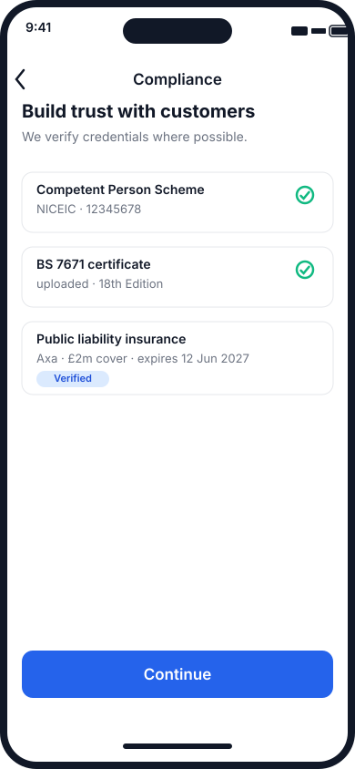

### A7 — Team & capacity *(deferrable)*

- Number of engineers / vans
- Team invites
- Engineer grades (drives per-grade rates)

### A8 — Services offered *(launch gate)*

Multi-toggle category cards:
`ev_charger · consumer_unit · full_rewire · partial_rewire · eicr · additional_points · outdoor_power · fault_finding · smart_home · lighting_design · data_networking · emergency_callout · other`

Per-category follow-up chips (e.g. landlord EICR, OZEV grant, 24/7 emergency).

### A9 — Pricing setup *(deferrable, but required before first AI quote)*

Guided wizard with market-benchmark defaults:
- Labour model per category
- Hourly / day rates
- Call-out fee + minimum charge
- Materials markup %
- Wholesalers
- Per-category base price
- Emergency multiplier
- Travel pricing rule

### A10 — Quote defaults & terms *(deferrable)*

- Quote validity period
- Deposit policy
- Payment terms
- Finance options
- Solicitor-reviewed T&Cs template picker
- Reference scheme
- Certifications issued

### A11 — Branding *(deferrable)*

- Logo upload (auto-suggest from website/Facebook)
- Brand colour with contrast check
- Email signature
- Quote PDF template picker with live preview

### A12 — Payments & integrations *(deferrable)*

- Stripe / GoCardless OAuth
- Bank details fallback
- Xero / QuickBooks / FreeAgent OAuth
- Google / Outlook calendar connect
- WhatsApp Business opt-in

### A13 — Existing data import *(deferrable)*

- Customer CSV import with column mapper
- Active quotes import (legacy flag)
- “Start fresh” shortcut

### A14 — Review & launch

- Checklist panel: ✅ launch-gate items / ⏳ deferred items with one-click resume
- Compliance summary card
- “See your customer quote form” preview
- Go-live CTA → `status=active`

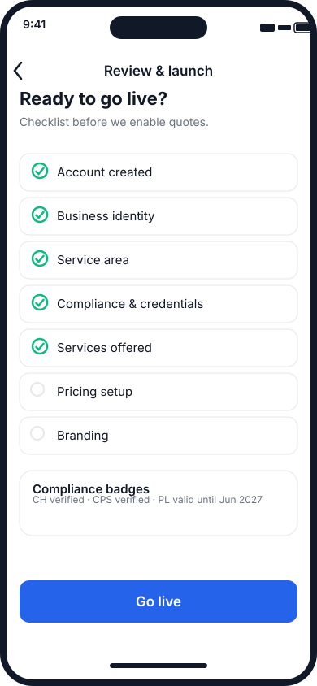

---

## 4. Tradesperson dashboard

Once the business is active, the app opens to the dashboard.

**Tabs**
1. **Leads** — new quote requests, triage notifications, emergency call-backs.
2. **Quotes** — draft, sent, accepted, expired.
3. **Calendar** — availability, booked jobs, customer-preferred dates.
4. **Settings** — profile, branding, pricing, team, integrations.

**Default tab rules**
- If the business has **no leads**, the app opens on **Quotes** so the electrician sees drafts/sent quotes immediately.
- Once a lead arrives, the default becomes **Leads** and a badge appears on the tab.
- A deep link or push notification can override the default tab (e.g. tap an emergency push → Leads, tap a quote-approved push → Quotes).

**Home screen elements**
- Business name + profile avatar.
- Post-launch setup checklist banner with progress bar.
- KPI stat cards: New leads, Drafts to review, Sent this week.
- Quote request list cards showing job type, postcode, urgency, AI-estimated range, status badge.

Status badges:
- `New` — untouched lead
- `Flagged` — safety review / site visit
- `Draft` — AI line items awaiting approval

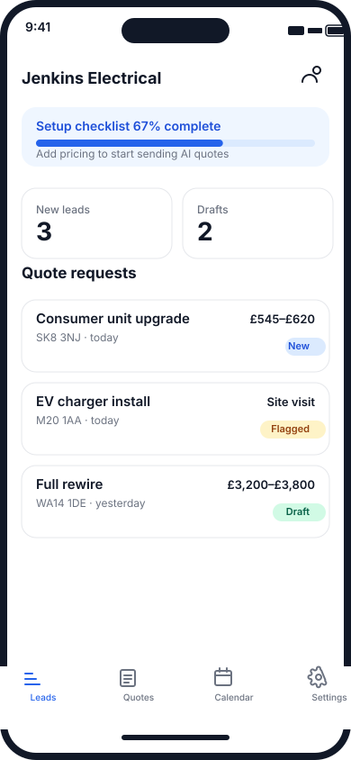

### 4.1 Review & edit AI quote (single screen)

Tapping a quote request with a draft opens a single mobile-optimized edit screen. The electrician can review every AI-generated line item inline, adjust description, quantity, and unit price, add/remove lines, and see totals update in real time.

**Screen elements**
- Job summary card: job type, address, property profile, AI confidence badge.
- **Pricing-model toggle** (segmented control) at the top of the editor:
  - **Time & materials** — day-rate/hourly labour + explicit material costs + call-out (default for larger or undefined jobs).
  - **Per point** — fixed unit price per outlet, circuit, or item (preferred for socket/light/additional-point work).
- Editable line-item cards stacked vertically:
  - Kind badge (`LABOUR`, `MATERIALS`, `CALL-OUT`)
  - Description text field
  - Qty + unit inline editor
  - Unit price inline editor
  - Line total (auto-calculated)
  - `AI` badge on unedited lines; badge clears when the user edits a line.
- “+ Add line item” button for extras not captured by the AI.
- Assumptions card (yellow) listing what the AI had to assume; user can confirm or correct.
- Totals card: subtotal, VAT, total inc VAT.
- Bottom CTAs: primary **“Approve & send”**, secondary **“Request site visit instead”**.

**Interaction notes**
- Tapping a value opens the native number/decimal keyboard for quantities and prices.
- Swiping a line reveals delete.
- Switching the pricing model re-renders the line items using the business’s matching rate card (`pricing_rates` per job type) while preserving the user’s manual edits.
- Edited lines flip `ai_generated=false` in the data model and record `edited_by`.
- If confidence is < 0.60 or the user taps “Request site visit”, no quote is sent; a site-visit checklist is pre-filled instead.

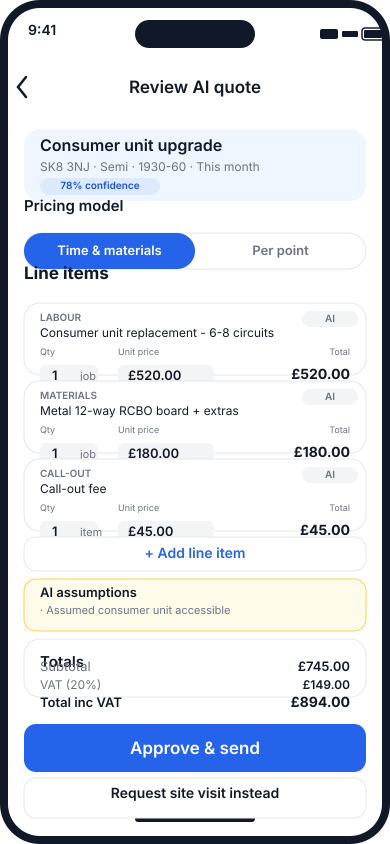

### 4.2 Calendar of bookings

The **Calendar** tab is the electrician’s daily schedule. It is designed for one-thumb navigation while on site or in the van.

**Screen elements**
- Month/year header.
- Horizontal week strip: 7 day cells; selected date highlighted in primary.
- Selected date label.
- Stacked booking cards for the selected day:
  - Time range pill.
  - Job title.
  - Customer name.
  - Address.
  - Assigned engineer avatar (initials).
  - Status indicator on the left edge (confirmed / tentative / completed).
- Floating action button to add a manual booking.
- Persistent bottom tab navigator.

**Interaction notes**
- Tap a day to see its bookings.
- Tap a booking card → job detail screen.
- Pull down to refresh from the server.
- Long-press a booking → quick actions (reassign, call customer, navigate).

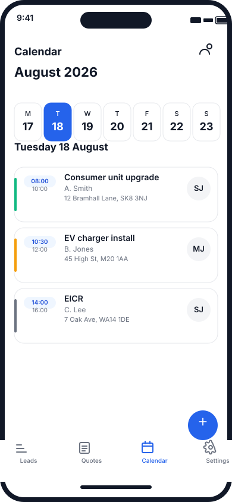

### 4.3 Job detail & assignment

Tapping a booking or quote-to-job conversion opens the job detail screen. This is where the electrician can call the customer, get directions, and assign or reassign the work.

**Screen elements**
- Job title and status badge.
- Date + time block.
- Customer card (name, phone).
- Address card with a **Navigate** button that opens Apple Maps with the destination pre-filled.
- **Assigned to** row with avatar, name, and a chevron to open the team picker.
- Job notes (auto-copied from accepted quote + customer messages).
- Quick action buttons: **Call**, **Message**.
- Primary CTA: **Start job** (or **Mark complete** once started).

**Interaction notes**
- Team picker lists active business users/ engineers; selecting one updates the `jobs.assigned_user_id` and triggers a push/SMS to the new assignee.
- **Navigate** passes the address to `MKMapItem` / `maps://` so the electrician gets turn-by-turn directions without retyping.
- Call/Message use the stored customer phone and preferred channel.

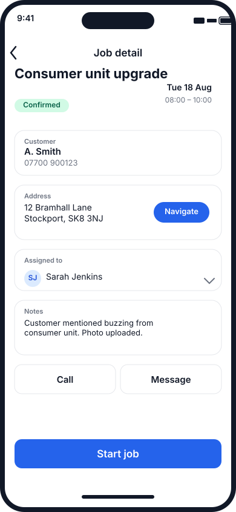

### 4.4 Forward messages to quote draft (iOS Share Extension)

Electricians often receive quote requests via WhatsApp, SMS, Facebook Messenger, or Instagram. The iOS **Share Extension / App Intent** lets them forward any message text (and attached photos) directly into My Trade Portal, which creates a draft `quote_request`.

**Screen elements**
- Source app indicator (e.g. “From WhatsApp”).
- Original message bubble.
- Extracted details form:
  - Customer name (auto-extracted from contact or message)
  - Phone / mobile
  - Address (postcode-parsed)
  - Job category chips
  - Notes from the original message
- **Create draft quote request** CTA.

**Interaction notes**
- The extension runs before authentication: if the user is logged in to the app, it defaults to their business; otherwise it prompts for business login.
- It uses on-device text parsing + a lightweight LLM extraction to populate the fields; the electrician corrects any mistakes before saving.
- Photos attached to the shared message are uploaded as `media_assets` and fed to the AI interpreter.
- After creation, the app opens the new draft in the **Review AI quote** screen (4.1).

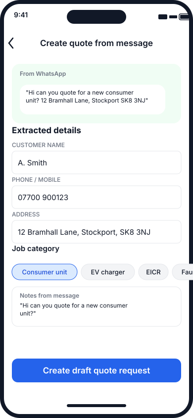

---

## 5. Customer quote capture (C1–C10)

### C1 — Entry & postcode

- **Entry point:** customer scans the electrician’s QR code (primary), taps a universal link, or opens the web form.
- Postcode input (pre-filled if extracted from QR/link).
- Instant service-area check.
- EPC register lookup fires in background.
- If outside area: polite decline + referral option.
- If EPC found: “We’ve found your property details — just confirm a few things”.

**QR code design:** each business gets a branded QR code containing `https://<business>.mytradeportal.co.uk/quote`. Scanning the code pre-fills the business slug and opens the branded quote form directly.

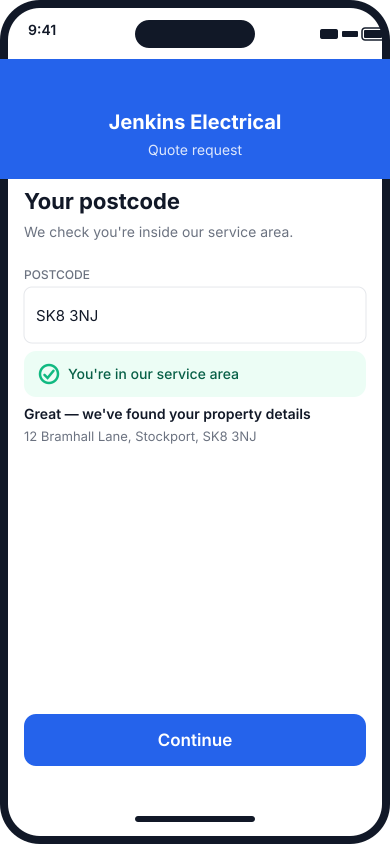

### C2 — Contact

- Name, mobile, email
- Preferred contact method
- Best time to call (if phone)
- **Account creation:** if the customer is new, this screen also sets a password (or uses Apple/Google sign-in) so they can track quotes and save properties.

Captured before property details so abandoned partial leads are still contactable. The account is lightweight — it only needs contact details + auth credentials.

### C3 — Property profile

**The AI’s risk model lives here.** Friendly, non-technical copy.

- Property type cards
- Property age band (pre-filled from EPC or visual picker)
- Bedrooms / reception rooms steppers
- Floors
- Tenure (owner occupier, tenant, landlord, housing association)
- Flat access details (conditional)
- Parking for a van
- Consumer unit photo upload with guided overlay
- Fuse board style visual picker
- Known electrical issues

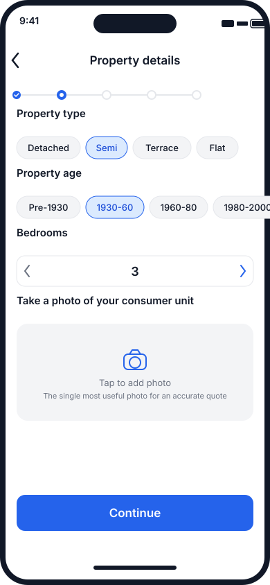

### C4 — Job category picker

Tiles limited to categories the business enabled (A8). “Something else” always available → `other` branch (always human-reviewed).

### C5 — Dynamic job questionnaire

Branch-specific cards per job type:
- **EV charger** — vehicle, parking, distance, main fuse, tenure/grant eligibility
- **Consumer unit** — circuit count, reason, faults, occupation
- **Rewire** — scope, occupied, decoration tolerance, flooring, loft access
- **EICR** — requester, tenanted, circuits, remedials option
- **Additional points / outdoor / fault finding / smart home / other**

Each branch ends with free-text “anything else we should know?”.

### C6 — Media capture

- In-app camera with guide overlays and example thumbnails
- Consumer unit photo (required if skipped earlier)
- Branch-required photos
- Optional 60s video walkthrough
- Document upload (previous EICR, plans)
- Offline queue + compression

### C7 — Timing, urgency & triage

- When needed: emergency_today / this_week / this_month / flexible / just_researching
- Preferred dates with real calendar slots if connected

**Triage rules**
- Red flags (burning smell, shocks, water on electrics) → emergency call-back, no AI quote
- `emergency_today` → call-back route with SLA
- Repeated tripping / partial power loss → priority call-back, AI draft flagged `safety_review`
- Everything else → standard AI quote

**Emergency CTA**
- **Call now** — opens the native dialer with the business’s number pre-filled.
- **Text us** — opens Messages with a pre-filled SMS to the business.
- A push notification is also sent to the business immediately.

### C8 — Budget & context

- Budget band (not shown to AI as a target)
- How did you hear
- Insurance claim work yes/no

### C9 — Consents & submit

- T&Cs / privacy acknowledgement (versioned, with IP/timestamp)
- Service contact permission
- Marketing opt-in (unticked, granular)
- Landlord-permission confirmation (conditional)

### C10 — Confirmation

- Honest expectation: “Jenkins Electrical will review your details and send your quote — usually within {X hours}.”
- Submission summary + photos received
- “Track your quote” CTA
- Referral nudge

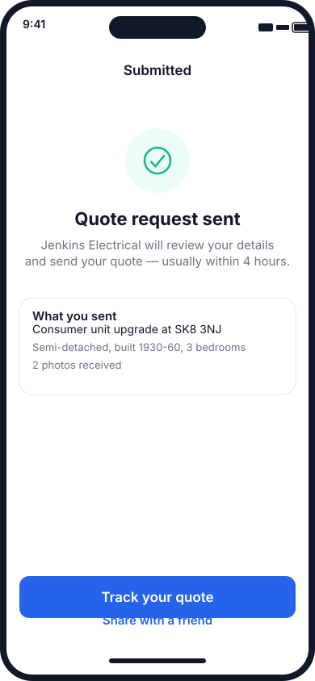

---

## 6. Customer dashboard

After a quote request is submitted, the customer sees their own dashboard.

**Tabs**
1. **My quotes** — request status and received quotes.
2. **Messages** — chat/SMS thread with the electrician.
3. **Profile** — contact preferences, properties, consent history.

**Quote card**
- Job title, business name, address
- Status badge (e.g. “Quote sent”)
- Price incl. VAT + validity date
- Progress checklist: Quote sent → You accept → Job booked
- Accept / Decline / Ask a question CTAs

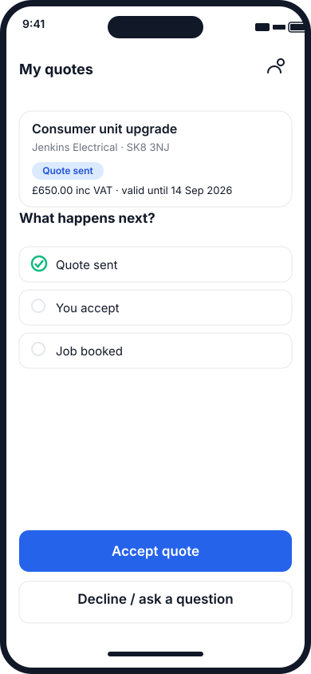

---

## 7. White-label / branding rules

- The binary ships with a default neutral brand (“My Trade Portal”) and a fallback colour palette.
- On app launch, the app downloads the business config: `logo_url`, `primary_colour`, `business_name`, `job_categories`, `template_id`.
- Config is cached locally and refreshed on app foreground.
- **Light mode only at launch.** Dark mode is deferred to a later release.
- The App Store review must see that all downloaded content is branding/config, not executable code. No remote JS bundles.
- If the business has no logo, initials fallback is generated locally.

---

## 8. Regenerating the mocks

The SVG mocks are generated by a small Python script so they stay in sync with the design tokens.

```bash
python scripts/generate_design_mocks.py
```

Generated outputs land in `docs/design/mocks/`. PNG previews are produced by macOS Quick Look and live in `docs/design/mocks/previews/`.

## 9. Mock asset index

| File | Screen | Profile | Milestone relevance |
|---|---|---|---|
| `business_welcome.svg` | A1 Welcome | Trade | Marketable prototype |
| `business_account.svg` | A2 Account creation | Trade | Marketable prototype |
| `business_compliance.svg` | A6 Compliance | Trade | Marketable prototype |
| `business_launch.svg` | A14 Review & launch | Trade | Marketable prototype |
| `trade_dashboard.svg` | Dashboard home | Trade | Marketable prototype |
| `quote_edit.svg` | Review & edit AI quote | Trade | Marketable prototype |
| `trade_calendar.svg` | Calendar of bookings | Trade | Marketable prototype |
| `job_detail.svg` | Job detail & assignment | Trade | Marketable prototype |
| `share_to_quote.svg` | Forward message to quote draft | Trade | Marketable prototype |
| `customer_entry.svg` | C1 Entry & postcode | Customer | Marketable prototype |
| `customer_property.svg` | C3 Property profile | Customer | Marketable prototype |
| `customer_confirmation.svg` | C10 Confirmation | Customer | Marketable prototype |
| `customer_dashboard.svg` | My quotes | Customer | Marketable prototype |

---

## 10. Design decisions

| # | Question | Decision | Implication |
|---|---|---|---|
| 1 | Trade dashboard default tab when no leads | **Quotes** | New electricians see their own draft/sent quotes immediately; the app switches to **Leads** as the default once a lead arrives, and shows a badge on the Leads tab. |
| 2 | Customer account creation | **Customers create an account** | The quote form creates a lightweight customer account (email + password or Apple/Google sign-in) during the contact step (C2). This enables the customer dashboard, saved properties, and repeat quotes without re-entering details. |
| 3 | Dark mode at launch | **Light mode only** | Simplifies the design system and white-label colour checks at launch. Dark mode is a post-MVP enhancement. |
| 4 | Emergency call-back CTA | **Dialer or SMS option** | The emergency screen presents two primary actions: **Call now** (opens native dialer) and **Text us** (pre-filled SMS). Push notification is sent to the business in parallel. No in-app VOIP at MVP. |
| 5 | Quote-request entry points | **QR code first** | The primary customer entry is a business-specific QR code (e.g., on the electrician’s van, card, or invoice). Universal links and web forms are secondary; App Store organic discovery is out of scope for MVP. |
