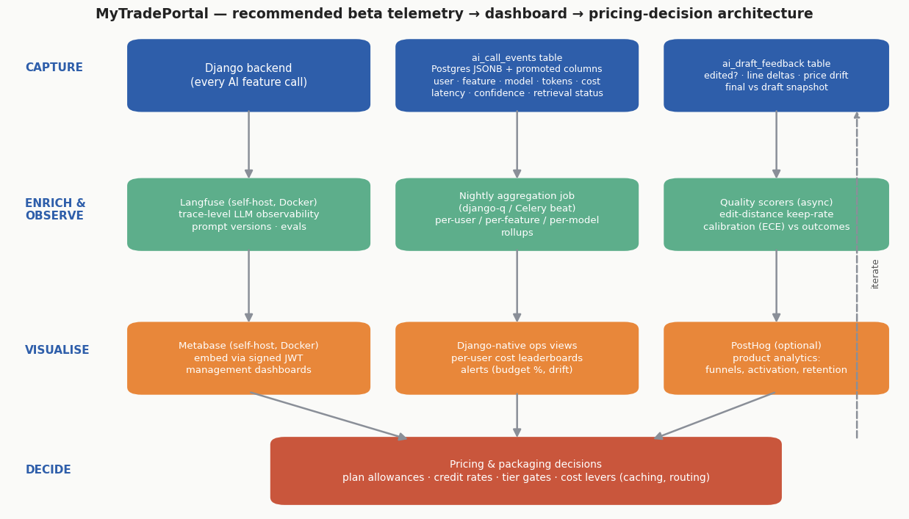
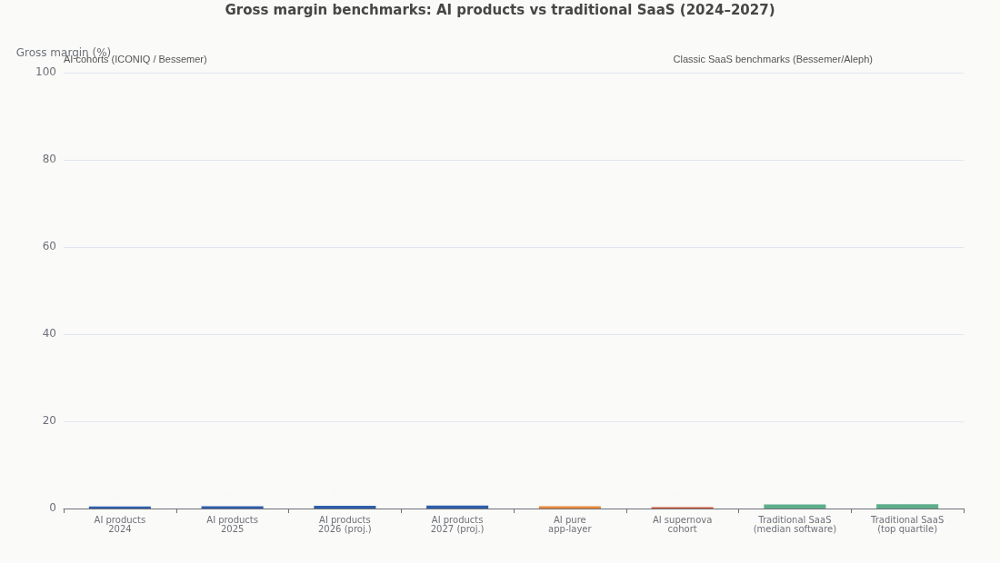
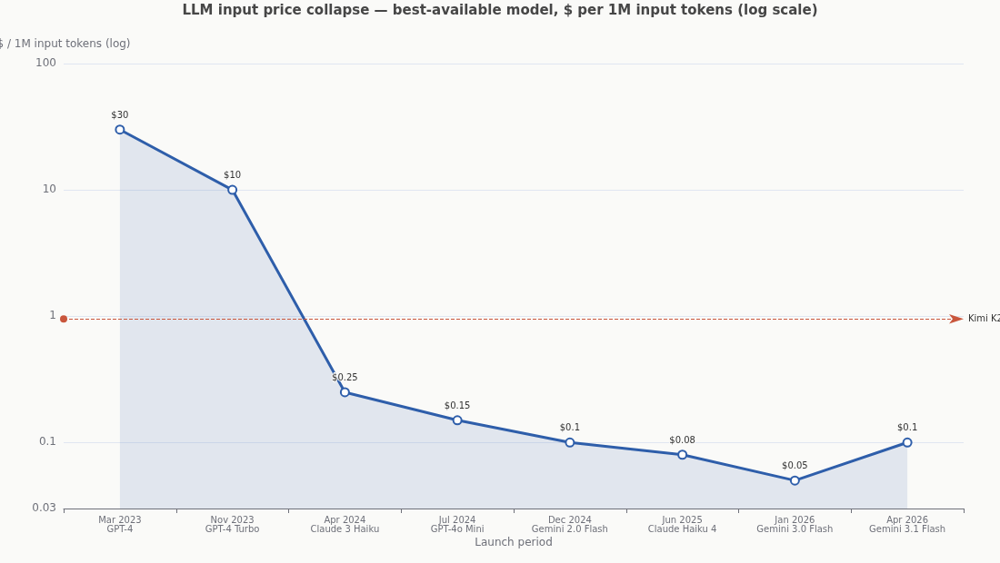
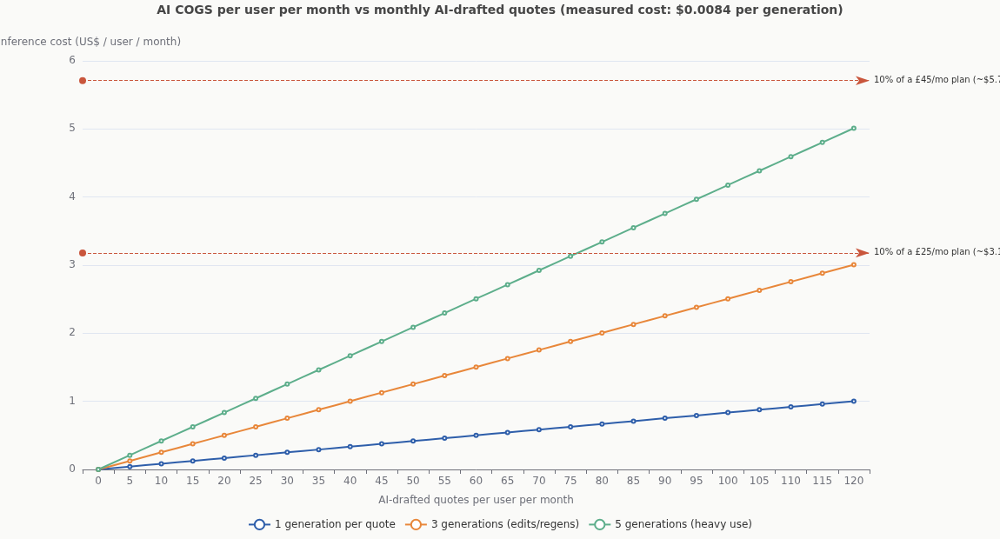
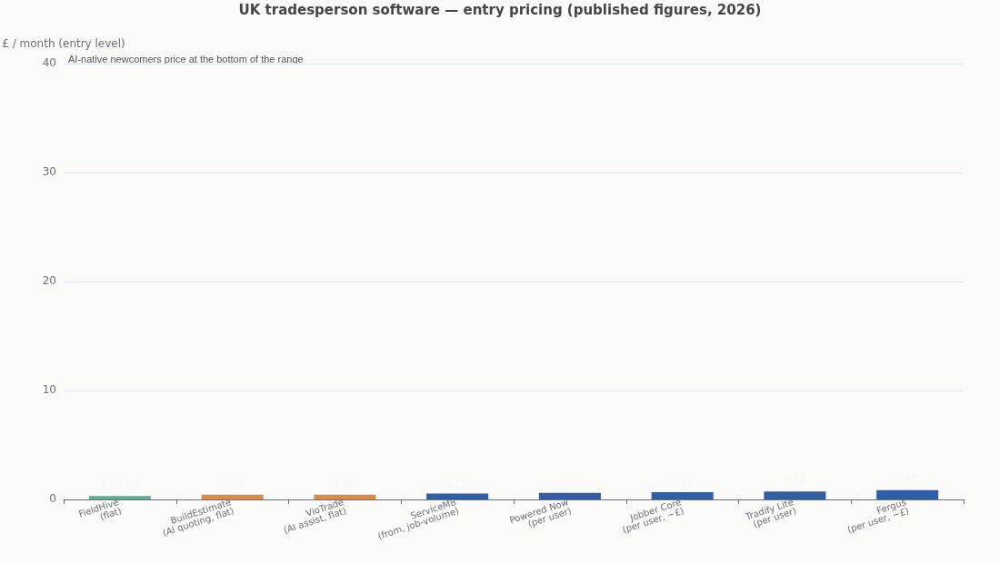
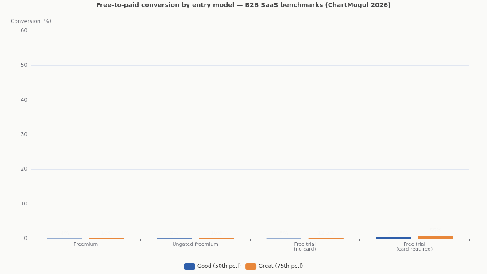

# From Beta Telemetry to Launch Pricing: An AI Cost, Accuracy and Monetisation Playbook for MyTradePortal

*Deep research report — prepared September 2026. Covers LLM cost and quality observability practice, Django-native dashboard architecture, AI unit economics, and pricing/packaging strategy for an AI-heavy tradesperson SaaS entering beta.*

---

## Executive Summary

MyTradePortal's instinct is correct: the AI usage cost is the most dangerous number in an AI-native SaaS precisely because it is invisible until it is large. The research base for this report — spanning LLM observability vendors, venture-capital pricing playbooks, SaaS benchmarking datasets and your own logged payload — converges on five findings that should shape the beta.

**First, your telemetry foundation is unusually good but incomplete in specific, fixable ways.** You already log per-generation token counts, estimated cost, confidence, completeness, retrieval status, latency and a feedback object — more than most beta products capture. The gaps are structural rather than incremental: events are not attributed to a user, feature, organisation or prompt version; the feedback object (`edited: false`) is too coarse to measure quality; and nothing yet links AI output to business outcomes (quote sent, quote won, invoice paid). Cost observability practice treats **per-user, per-feature, per-tenant cost attribution** as the foundational move that everything else builds on ([NeuralTrust](https://neuraltrust.ai/blog/llm-cost-reduction-guide), [Finout](https://www.finout.io/blog/using-llm-observability-to-cut-costs-and-improve-performance)).

**Second, the economics currently favour you — but the sample payload reveals why they may not stay that way.** Your logged generation cost **$0.0084 per quote draft** (754 prompt + 3,160 completion tokens on Kimi K2.6). Even a heavy user producing 40 quotes a month with three generations each costs you about **$1.00/month in inference** — roughly 3% of a £25 subscription. That is healthy. The warning signs are elsewhere in the same JSON: a **completion-to-prompt token ratio of 4.2:1** (output is the expensive direction), an **88-second generation time** (a UX and retry-multiplier risk), `retrieval_status: "no_index"` (your RAG layer is not yet absorbing cost or improving accuracy), and confidence of 0.38 with completeness of 0.2 — metrics that will only become decision-grade once calibrated against what users actually do with the drafts.

**Third, the industry has priced this problem.** AI products average roughly **52% gross margin in 2026**, up from 41% in 2024, against 80%+ for classic SaaS, and inference alone consumes about **23% of revenue** at scaling AI B2B companies ([ICONIQ via CloudZero](https://www.cloudzero.com/blog/ai-gross-margin/), [SoftwareSeni](https://www.softwareseni.com/why-ai-gross-margins-are-so-much-lower-than-saas-and-what-that-means-for-your-business/)). The metric your CFO-function should track from day one of beta is the **Inference Efficiency Ratio (AI revenue ÷ AI inference cost)** — warning below 5:1, target 8:1, healthy 10:1+ for an AI-infused SaaS like yours ([TheSaaSCFO](https://www.thesaascfo.com/how-to-calculate-the-inference-efficiency-ratio/)).

**Fourth, dashboards on Django are a solved problem with a clear recommended pattern.** Skip the boilerplate admin themes (the app-generator repo you found is a gallery of paid starter templates, not an analytics layer). The pattern that fits your stage is: **your existing Postgres JSONB events + a nightly rollup job + Metabase (self-hosted, embedded via signed JWT) for management dashboards + Langfuse (self-hosted) for trace-level LLM debugging + optional PostHog for product analytics**. All three are free to self-host, Docker-deployable beside your Django app, and query your existing Postgres directly.

**Fifth, pricing should be hybrid — and the beta's job is to set its dials.** The market has converged on a **base subscription + included AI allowance + paid overage/credits** structure: 43% of SaaS companies already run hybrid pricing, projected to reach 61% by end of 2026 ([NXCode](https://www.nxcode.io/resources/news/saas-pricing-strategy-guide-2026)). Your competitors cluster at £15–£40/user/month, with AI-native newcomers (BuildEstimate, VioTrade) anchoring the bottom at £20 flat ([FieldHive](https://www.fieldhive.com/alternatives/servicem8-alternatives), [BuildEstimate](https://build-estimate.app/), [VioTrade](https://www.viotrade.co.uk/features/quoting-software)). The recommended shape for launch: a per-user base price in the £25–£35 band with a generous included AI allowance sized from beta p95 usage, metered overage priced at 5–10× your measured cost per AI action, and outcome-linked premium features held in reserve until your accuracy data justifies them.

---

## 1. Reading Your Current Telemetry: What the Sample Payload Already Says

Before prescribing anything, it is worth mining the JSON you already capture, because it contains both good news and the seeds of your future pricing model. The payload records one AI-assisted quote generation: a RAG-augmented draft for a consumer-unit replacement, with usage metadata, quality signals and a feedback object. Each field maps to a decision you will need to make in the next six months, and several fields reveal design choices that will compound — positively or negatively — as volume grows.

### 1.1 The cost anatomy of one quote

The logged `llm_usage` block shows **754 prompt tokens and 3,160 completion tokens** producing an estimated cost of **$0.008352**. That figure is consistent with Kimi K2.6's published pricing of roughly **$0.95 per million input tokens and $4.00 per million output tokens** — at those rates your exact token counts imply $0.0134, so your logged estimate appears to reflect either a cheaper provider route (OpenRouter blends have listed K2.6 around $0.74/$4.66, and third-party hosts like Parasail have offered $0.60/$2.80) or cached-input discounting on part of the prompt ([BenchLM](https://benchlm.ai/moonshot/api-pricing), [DeepInfra](https://deepinfra.com/blog/kimi-k2.6-pricing-guide-deployment-tradeoffs)). Either way, two structural facts stand out. **Output tokens dominate the bill**: 3,160 completion tokens are 4.2× the prompt size, and at any price list, output tokens cost 3–4× input tokens per unit — meaning roughly 80–90% of this generation's cost is the model *writing*, not reading. This is normal for document-generation workloads and it tells you where optimisation leverage lives: constraining and structuring output (tighter JSON schemas, shorter assumption lists, capped notes) is worth more than trimming your prompts.

The second structural fact is the **88.15-second generation time**. That is a very long tail latency for an interactive drafting flow, and it matters to cost, not just UX: users who wait 88 seconds regenerate, refresh, or abandon and retry — each of which multiplies your per-quote cost without producing a corresponding unit of value. Long generations also inflate timeout-driven retries at the infrastructure layer. Latency percentiles (p50/p95/p99) per feature should therefore sit next to cost on every dashboard you build, because in AI products latency is a cost multiplier as much as a quality metric. Industry monitoring guidance explicitly pairs token-efficiency tracking with anomaly alerting on latency spikes for exactly this reason ([Braintrust](https://www.braintrust.dev/articles/best-llm-monitoring-tools-2026)).

### 1.2 The quality signals you're capturing — and their limits

Your payload carries three quality-adjacent signals: `confidence: 0.38`, `completeness: 0.2` and the `ai_feedback` object (`edited: false`, `price_drift_pct: 0`, `line_count_delta: 0`). The intent is right — confidence and edit-behaviour are the two pillars of AI draft quality measurement — but each signal has a known failure mode you should design around during beta. A self-reported confidence score from an LLM is not an empirical probability: production research consistently finds LLMs are systematically **overconfident**, with Expected Calibration Error between **0.05 and 0.20** for production-grade models, meaning a model expressing 0.9 confidence may be right only 70–85% of the time on a given task ([Tianpan](https://tianpan.co/blog/2026-04-20-llm-calibration-production-overconfidence), [Medium/DS Collective](https://medium.com/data-science-collective/calibration-in-production-ml-why-confidence-scores-lie-03f646796a35)). Your 0.38 becomes meaningful only when correlated with observed outcomes — which is precisely what your feedback object is for, making the link between the two the most important join in your beta dataset.

The feedback object, meanwhile, is currently too coarse to do its job. `edited: false` with zero price drift and zero line-count delta tells you the user accepted this draft untouched — a genuinely useful "keep-rate" signal — but a boolean plus two deltas cannot distinguish *rubber-stamping a mediocre draft* from *genuinely good output*, and it collapses all editing behaviour into three numbers. The established metric here is **edit distance / post-edit distance (PED): the proportion of the AI draft that survives to the final version**, which "correlates with real productivity far better than draft count, because a draft nobody trusts is negative work" ([LLMCMS](https://www.llmcms.org/guides/top-5-metrics-to-measure-ai-s-real-impact-on-content-production-and-quality), [ACRP](https://acrpnet.org/2026/04/14/measuring-quality-in-the-age-of-ai-why-regulatory-writing-needs-a-true-standard)). For a structured document like a quote, this is cheap to compute properly: store the final sent version, diff line items (added, removed, price-changed, quantity-changed, description-rewritten), and you get a keep-rate per line item, per feature, per user — the single most honest accuracy proxy available without human labelling, and the metric that tells you whether your AI is saving time or manufacturing review work.

### 1.3 What is missing entirely

The gaps in the current schema are consistent and predictable: **identity, causality and outcome**. There is no `user_id`, `organisation_id`, `feature` tag, `prompt_version` or `session/trace id`, which means you cannot yet answer the questions pricing depends on — *what does a user cost per month? which feature burns the most tokens? did prompt v14 make drafts better or just longer?* Observability practitioners are blunt about this: tag every request with business metadata — tenant, feature, environment, prompt version — because "without consistent tagging, costs are often visible only as a single provider bill" ([Finout](https://www.finout.io/blog/using-llm-observability-to-cut-costs-and-improve-performance)). There is also no record of regeneration chains (did this quote take one generation or four?), no cache-hit token split, and no downstream business event (quote sent, accepted, invoiced, paid). Finally, `retrieval_status: "no_index"` indicates the RAG layer returned nothing for this generation — fine as a fallback state, but worth tracking as a distribution, because your retrieval coverage rate will directly drive both accuracy and the future cost of grounding.

The table below summarises the gap analysis — what each current field buys you, and the additions that convert raw logging into a pricing-grade dataset.

| Current field | What it gives you | Missing companion | Why it matters for pricing |
|---|---|---|---|
| `model` | Cost basis | `provider`, `prompt_version` | Model/route price spreads run 5× within one vendor; versioned prompts let you attribute quality shifts ([Digital Applied](https://www.digitalapplied.com/blog/ai-unit-economics-pricing-margins-services-2026-framework)) |
| `prompt_tokens` / `completion_tokens` | Token accounting | `cached_input_tokens` | Cached input bills at ~0.1× base rate — your true cost can diverge 40–90% from naive estimates ([Morph](https://www.morphllm.com/llm-cost-optimization)) |
| `est_cost_usd` | Per-call cost | `user_id`, `org_id`, `feature` | Per-user/per-feature COGS is the unit-economics primitive; untagged cost is invisible cost |
| `generation_seconds` | Latency | `status` (success/timeout/retry), `attempt_no` | Regeneration chains multiply cost per delivered quote; 88s invites retries |
| `confidence` | Self-reported certainty | Outcome labels (accepted, edited, won) | Confidence must be calibrated against outcomes before it can route behaviour |
| `completeness` | Coverage proxy | `retrieval_coverage` distribution | Drives both accuracy and where RAG investment pays back |
| `ai_feedback.edited` | Keep-rate (coarse) | Full draft-vs-final line-item diff | Edit distance is the standard AI-draft quality metric |
| *(absent)* | — | Quote outcome: sent / accepted / invoiced / paid | Links AI quality to revenue — the denominator of value-based pricing |

## 2. The State of Practice: LLM Cost and Quality Observability

The discipline you are asking about has consolidated, over the last two years, into a recognised practice — **LLM observability** — with settled conventions about what to capture, a competitive vendor landscape, and an emerging open standard for the telemetry itself. Understanding the shape of that practice saves you from inventing it piecemeal during a beta where engineering time is your scarcest resource. The short version: log everything at the call level, attribute it to business entities, evaluate quality asynchronously, and let the open standards carry your data model so you are never locked to one vendor's schema.

### 2.1 What the practice says to capture

The consensus checklist across vendor and practitioner guidance is stable. Capture **full request/response cycles** — inputs, outputs, model parameters, intermediate steps and errors — with unique identifiers for sessions, traces and generations, tagged with user IDs, feature names, environment and experiment/prompt versions ([Maxim](https://www.getmaxim.ai/articles/llm-observability-best-practices-for-2025/), [Braintrust](https://www.braintrust.dev/articles/best-llm-monitoring-tools-2026)). Monitor continuously on four axes: **token usage and cost per request, latency and throughput, automated evaluation scores, and user feedback**. Treat cost as a first-class monitoring concern with **per-user, per-tenant and per-feature budgets** carrying soft alerts and hard limits — the canonical disaster story is a runaway prompt burning thousands of dollars overnight, and the standard defence is alerting at 50%, 80% and 100% of budget ([OpenObserve](https://openobserve.ai/blog/llm-monitoring-best-practices/), [Braintrust](https://www.braintrust.dev/articles/best-llm-monitoring-tools-2026)). Two further practices deserve emphasis for your case: **separate logging from evaluation** (log synchronously, score quality asynchronously so evaluation never blocks a user request), and **monitor full chains, not just LLM calls** — your RAG retrieval, line-item parsing and price-lookup steps are all failure and cost points in their own right.

On data format, the **OpenTelemetry GenAI semantic conventions** have become the reference standard: attribute names like `gen_ai.provider.name`, `gen_ai.request.model`, `gen_ai.usage.input_tokens` and `gen_ai.usage.output_tokens` give you "enough data for cost tracking, latency monitoring, and error rate alerting" with five attributes, and every major observability vendor now ingests them ([OneUptime](https://oneuptime.com/blog/post/2026-02-06-genai-semantic-conventions-llm-monitoring/view), [dev.to](https://dev.to/x4nent/opentelemetry-genai-semantic-conventions-the-standard-for-llm-observability-1o2a)). The conventions are still marked experimental as of early 2026, but that is a reason to version your schema, not to avoid the standard — aligning your Postgres event columns with these names now means Langfuse, Helicone, Datadog or a future warehouse all read your data natively later. The practical design for a Django/Postgres shop is a wide `ai_call_events` table: JSONB for the raw payload plus **promoted columns** (indexed, queryable) for user, org, feature, model, tokens, cost, latency, status, confidence and prompt version — the same hybrid pattern Postgres teams use for any event store.

### 2.2 The tool landscape and what fits a Django beta

The vendor landscape divides into **tracing platforms** (Langfuse, LangSmith, Arize Phoenix, Braintrust), **gateway/proxy loggers** (Helicone, Portkey) and **product-analytics suites with LLM modules** (PostHog, Datadog). For a Django backend calling models via an OpenRouter-style API, the realistic shortlist is short. **Langfuse** is the default recommendation for your stage: MIT-licensed, self-hostable on Docker beside your existing stack (Postgres + ClickHouse), framework-agnostic, with tracing, prompt versioning, cost tracking, LLM-as-a-judge evaluation and user-feedback capture; the cloud free tier covers 50k units/month and paid starts around $29/month, while self-hosting is free at your volume ([BigData Boutique](https://bigdataboutique.com/blog/llm-observability-tools-compared-langfuse-vs-langsmith-vs-opik), [Confident AI](https://www.confident-ai.com/knowledge-base/compare/top-7-llm-observability-tools)). **Helicone** is the fastest possible install — repoint your API base URL through its proxy and get per-user cost dashboards in minutes — but traces at request level only, which limits agentic debugging. **LangSmith** is excellent but optimised for LangChain stacks and its per-trace pricing "can reach 5–10% of LLM API spend at high-volume deployments" — the wrong trade when your API spend is currently small ([Gupta Deepak](https://guptadeepak.com/tools/top-5-llm-observability-platforms-2026/)). **PostHog's LLM analytics** module is worth noting because it combines token/cost tracking with the product analytics (funnels, retention, session replay) you need anyway for beta, and its cloud free tier is generous at 1M events/month ([Userpilot](https://userpilot.com/blog/posthog-analytics/), [PostHog](https://posthog.com/blog/best-open-source-analytics-tools)).

A pragmatic two-layer recommendation emerges from the comparison: **Postgres events + Langfuse self-hosted for AI internals, PostHog (cloud free tier) for product behaviour**, with Metabase over Postgres for business-facing dashboards (Section 4). This costs effectively nothing at beta scale, keeps data in your infrastructure (relevant for UK trades' job and pricing data), and does not foreclose any later migration because your event schema follows the OTel conventions. The comparison table consolidates the options.

| Tool | Type | Cost model | Fit for MyTradePortal beta |
|---|---|---|---|
| **Langfuse** | Tracing + evals + prompt mgmt (OSS, MIT) | Free self-host; cloud free 50k units/mo, from ~$29/mo ([Confident AI](https://www.confident-ai.com/knowledge-base/compare/top-7-llm-observability-tools)) | **Primary choice** — self-host beside Django; deep traces, prompt versioning, cost per user |
| **Helicone** | API gateway/proxy logger | Free tier (10–100k req/mo), from ~$20–79/mo | Fastest possible start (one base-URL change); shallower, request-level only |
| **LangSmith** | Tracing, LangChain-native | $39/seat + per-trace usage | Skip unless you standardise on LangChain; per-trace pricing scales poorly |
| **Arize Phoenix** | OSS tracing + eval rigour | Free OSS | Strong eval tooling; heavier to run than Langfuse at your scale |
| **PostHog (LLM analytics)** | Product analytics + LLM module | Cloud free 1M events/mo | **Secondary choice** — funnels, activation, retention alongside token/cost dashboards |
| **Datadog LLM Obs.** | Enterprise APM add-on | $31+/host + volume | Overkill until you have enterprise infra commitments |

### 2.3 Measuring quality: keep-rate, acceptance and calibration

Three quality metrics dominate production practice, and all three are computable from data you can capture in beta. The first is the **keep-rate / edit-distance family** already discussed: diff the AI draft against what the user finally sends, per line item. The second is **acceptance-rate instrumentation** from the AI-assist world: log `suggestion_shown`, `suggestion_accepted`, `final_sent` events with stable IDs joined across systems, choose your denominator carefully (only count suggestions the user actually saw), and segment by user cohort and feature ([Typewise](https://typewise.app/blog/ai-suggestion-kpi)). Your `ai_feedback` object is a seed of this pattern; upgrading it means storing both snapshots (draft and final) rather than derived deltas, so any future metric — price drift, line survival, description rewrites — is recomputable historically. That single change (store full before/after state) is probably the highest-leverage schema improvement available to you, because every quality analysis in Section 3 depends on it and it cannot be retrofitted to data you have already discarded.

The third is **confidence calibration**, which converts your `confidence` field from decoration into infrastructure. The method: bin generations by self-reported confidence, measure actual quality in each bin (keep-rate, or human spot-checks on a sample), and compute the **Expected Calibration Error — the weighted average gap between expressed confidence and observed accuracy** ([ICLR Blogposts](https://iclr-blogposts.github.io/2025/blog/calibration/)). Production ECE for frontier models runs 0.05–0.20, and miscalibration is not random — models tend to be *most overconfident exactly where they are wrong* ([Tianpan](https://tianpan.co/blog/2026-04-20-llm-calibration-production-overconfidence)). Once calibrated (Platt or isotonic scaling over your own beta data — no model access needed), confidence becomes safe to *route* on: e.g. auto-present drafts above the calibrated 0.9 line as near-final, flag the 0.4–0.9 band for "review assumptions", and below 0.4 show the assumptions panel prominently — your payload's five-assumption list is exactly the artefact a calibrated router would surface. This is also where calibration becomes a *pricing* input: the day you can say "drafts above calibrated confidence 0.9 need editing in only X% of cases" you have the accuracy evidence to charge for automation rather than assistance, and to defend premium tiers with data rather than adjectives ([Blue Ridge Partners](https://www.blueridgepartners.com/insights/the-five-keys-to-ai-pricing/)).

---

## 3. A Metrics Framework for the Beta: Accuracy, Confidence, Cost

The beta's analytics goal is not to "collect everything" — it is to answer a specific set of pricing and product questions with statistical confidence by launch. The framework below organises metrics into four families, each tied to the decisions it feeds. Every metric is computable from Postgres events of the kind you already store, provided the Section 1.3 gaps (identity, full snapshots, outcomes) are closed. The discipline that makes this work in practice is a **metric dictionary**: one agreed definition per metric, implemented once, so the dashboard, the pricing model and the board deck never argue about what "cost per quote" means.

### 3.1 The four metric families

**Cost metrics** answer "what does it cost to serve one user well?" The primitives are cost per AI action (quote draft, drawing analysis, certificate draft), cost per user per month (p50/p95 across the cohort), and cost per *delivered* action — the crucial adjustment for regeneration chains: if 20% of quotes take three generations, delivered cost per quote is materially above single-generation cost. On top of the primitives sit two ratios that translate engineering telemetry into finance language: **AI COGS as % of subscription revenue per user**, and the **Inference Efficiency Ratio (IER) = AI-attributable revenue ÷ AI inference cost**, with warning below 5:1, a target floor of 8:1 and 10:1+ considered healthy for AI-infused SaaS ([TheSaaSCFO](https://www.thesaascfo.com/how-to-calculate-the-inference-efficiency-ratio/), [SaaSMag](https://www.saasmag.com/ai-cogs-saas-gross-margin-compression/)). Bessemer's blunt framing applies at your scale exactly as at $100M ARR: *"If the math doesn't work at 10 customers, it won't at 1,000"* — AI unit economics do not amortise with volume because the dominant cost scales with usage ([Digital Applied](https://www.digitalapplied.com/blog/ai-unit-economics-pricing-margins-services-2026-framework)).

**Accuracy metrics** answer "does the draft survive contact with the tradesperson?" Headline: **line-item keep-rate** (share of AI-generated line items sent unchanged), **price drift** (median absolute % change between draft total and sent total — you already log this), and **structural edit rate** (lines added/removed). Segment everything by trade, job type, retrieval status and confidence band, because averages will hide the story: the interesting output of beta is a matrix like "consumer-unit jobs with retrieval coverage keep 82% of lines; boiler jobs with no index keep 54%". **Confidence metrics** answer "can we trust the model's self-assessment?": ECE and Brier score over rolling windows, plus the calibration curve itself as a dashboard artefact ([ICLR Blogposts](https://iclr-blogposts.github.io/2025/blog/calibration/)). **Adoption/outcome metrics** answer "does anyone care?": AI-feature activation (share of users producing ≥1 AI draft in week 1), drafts per active user per week, draft-to-sent conversion, and ultimately quote-win rate for AI-drafted vs hand-written quotes — the outcome metric that powers value-based pricing and marketing claims alike.

| Family | Metric | Definition | Pricing decision it feeds |
|---|---|---|---|
| Cost | Cost per delivered AI action | Σ generation costs incl. retries ÷ delivered quotes | Overage/credit unit price (set at 5–10× this) |
| Cost | AI COGS per user/month (p50/p95) | Per-user monthly inference spend | Included-allowance sizing per tier (p95 of target tier) |
| Cost | IER | AI-attributable revenue ÷ inference cost | Floor test for any plan: IER ≥ 8:1 ([TheSaaSCFO](https://www.thesaascfo.com/how-to-calculate-the-inference-efficiency-ratio/)) |
| Accuracy | Line-item keep-rate | Unchanged lines ÷ total AI lines | Whether AI is headline feature or assist; tier gating |
| Accuracy | Price drift (median \|Δ%\|) | \|final − draft total\| ÷ draft total | Accuracy marketing claims; premium "reviewed" tier need |
| Confidence | ECE / calibration curve | Weighted gap between confidence and keep-rate | Auto- vs assisted-drafting thresholds; enterprise SLAs |
| Adoption | Activation, drafts/user/week, draft→sent | Standard funnel events | Trial design; where AI sits in packaging |
| Outcome | Quote win rate (AI vs manual) | Accepted ÷ sent, per cohort | Value metric for price anchoring and case studies |

### 3.2 From events to answers: the aggregation layer

Raw call-level events answer debugging questions; pricing questions need rollups. The standard pattern is a **nightly aggregation job** (Celery beat or django-q in your world) that folds yesterday's events into `user_day`, `feature_day` and `cohort_week` summary tables: tokens, cost, generations, retries, latency percentiles, keep-rates. Dashboards and budget alerts then query the rollups, not the event firehose — this keeps dashboard queries millisecond-fast and isolates analytics load from your production tables. At beta scale (thousands of events/day) this is trivially cheap; the same pattern survives to millions of events/day with only a schedule change, and if you later adopt ClickHouse (which Langfuse will already have introduced into your stack), the rollups move, not the event schema.

Two implementation details pay outsized dividends. First, **define your cost formula once, in code, from provider price lists versioned by date** — model prices move quarterly (the median frontier-model price fell from $6.00/M tokens in 2024 to $3.75 in 2026 ([AIMultiple](https://aimultiple.com/llm-pricing))), and your historical cost estimates should be recomputable when a provider re-prices or when you discover your `est_cost_usd` diverged from the invoiced rate. Reconcile estimated vs actual provider bills monthly; a persistent gap usually means unlogged retries or cache reads you are not crediting. Second, **snapshot exchange rates and VAT treatment early**: you will price in GBP, incur model costs in USD, and report to stakeholders in both — a `cost_gbp` column computed at a stored daily rate saves every future finance conversation.

---

## 4. Dashboards on Django: Architecture and Options

You referenced the app-generator `django-dashboards` repository, so it is worth being precise about what it is: a curated gallery of **paid Django boilerplate themes** (Rocket, AdminLTE, Datta Able, Berry) — pre-built admin UI templates with sample charts, not an analytics or data layer ([App-Generator](https://github.com/app-generator/django-dashboards)). Such templates can save frontend time if you hand-build every chart, but they ship no aggregation, no metric logic and no interactivity beyond demo data. For a beta whose questions will change weekly, hand-coding charts in Django templates is the highest-maintenance option on the table. The realistic options form three families: **build inside Django**, **embed a BI tool**, and **use purpose-built LLM observability** — and the right answer for your stage is a deliberate combination rather than a single winner.

### 4.1 The option families, compared

**Build inside Django.** Hand-rolled views with a JS chart library (Chart.js/ECharts), or `django-plotly-dash`, which embeds Plotly Dash apps as Django template tags with access to the current user and session, letting you write interactive dashboards in pure Python ([django-plotly-dash](https://github.com/GibbsConsulting/django-plotly-dash), [docs](https://django-plotly-dash.readthedocs.io/en/latest/introduction.html)). This gives full control and zero new services, and for one or two *operational* views — a per-user cost leaderboard, a budget-burn gauge — it is genuinely the right tool. Its weakness is exploratory work: every new question ("keep-rate by trade by confidence band, last 30 days") is a code change and a deploy. Dash-in-Django mitigates this for data-science-comfortable developers but adds a second app model and, for live updates, Channels/Redis infrastructure — real complexity for a small team ([Dash vs Django](https://dash-resources.com/dash-plotly-vs-django/)).

**Embed a BI tool.** Metabase and Apache Superset both connect read-only to your existing Postgres, give non-developers a point-and-click query builder, and embed dashboards back into your Django admin or founder dashboard via signed JWT (Metabase guest embeds, available even on the free self-hosted tier) or Superset's embedded SDK with guest tokens ([Metabase docs](https://www.metabase.com/docs/latest/embedding/introduction), [Superset docs](https://superset.apache.org/user-docs/using-superset/embedding/), [Viprasol](https://viprasol.com/blog/embedded-analytics/)). Metabase is the faster path — "BI live in days, not weeks" — and the usual choice for small teams; Superset wins on customisation, multi-tenancy and semantic-layer governance if you later expose analytics *to customers* ([Padiso](https://www.padiso.co/blog/apache-superset-vs-metabase-2026-decision-framework/)). **Purpose-built LLM observability** (Langfuse, Section 2.2) covers trace-level debugging, prompt versions and evaluation — questions BI tools cannot answer because they do not see prompt/response content. The architecture figure below shows the recommended combination; the table compares the families on the criteria that matter at your stage.

| Option | Time to first dashboard | Exploratory flexibility | LLM trace depth | Customer-facing potential | Running cost |
|---|---|---|---|---|---|
| Django templates + Chart.js | Days | Low (code per question) | None | High (full UX control) | Free |
| django-plotly-dash | Days | Medium (Python callbacks) | None | Medium | Free (+ Channels/Redis for live) |
| app-generator boilerplates | Hours (UI only) | Low | None | Medium | Paid themes; no data layer ([GitHub](https://github.com/app-generator/django-dashboards)) |
| **Metabase self-host + embed** | **1–3 days** | **High (no-code queries)** | None | Medium (signed embeds) | Free self-host ([Viprasol](https://viprasol.com/blog/embedded-analytics/)) |
| Superset self-host + embed | 3–7 days | High | None | High (RLS, white-label) | Free self-host |
| **Langfuse self-host** | ~1 day | Medium | **Full traces + evals** | None (internal tool) | Free self-host |
| PostHog cloud | Hours | High (funnels/retention) | Medium (LLM module) | None | Free to 1M events/mo ([PostHog](https://posthog.com/blog/best-open-source-analytics-tools)) |

### 4.2 The dashboard set to build for beta

Resist building a dashboard zoo. Four views cover the beta's decision needs, each mapping to a metric family in Section 3. **(1) The Money view** (Metabase, over rollups): AI spend per day, cost per delivered quote, cost per user p50/p95, AI COGS as % of MRR, IER trend — this is the view that answers "can we price at £X?" **(2) The Quality view** (Metabase): keep-rate and price-drift distributions by trade, job type and confidence band, plus the calibration curve refreshed weekly. **(3) The Trace view** (Langfuse): per-request prompt/response inspection, prompt-version comparisons, and async evaluation scores — where you debug the drafts the Quality view flags. **(4) The Adoption view** (PostHog or Metabase over product events): activation funnel (signup → first AI draft → first sent quote), weekly drafts per active user, and retention cohorts. Add budget alerts (50/80/100% of monthly AI budget to Slack/email) as the only real-time component — everything else can be daily, and "log everything immediately, evaluate asynchronously" keeps evaluation off the user request path ([Braintrust](https://www.braintrust.dev/articles/best-llm-monitoring-tools-2026)).

A note on what *not* to build in beta: customer-facing usage dashboards. Real-time usage metering shown to customers (credits remaining, burn rate) is a launch requirement if you adopt hybrid pricing, but it is a different engineering problem — entitlement enforcement in the request path, not analytics — and billing platforms are explicit that metering systems "were designed for post-usage settlement, not real-time access control" ([Stigg](https://www.stigg.io/blog-posts/generative-ai-usage-based-billing-software)). During beta, a simple monthly usage statement per account is enough; design the entitlement layer when the pricing model is decided, and consider Stripe's metered billing or its Metronome acquisition rather than hand-rolling it ([Stripe](https://stripe.com/billing/usage-based-billing), [Solvimon](https://www.solvimon.com/blog/best-usage-based-billing-2026)).

---

## 5. Unit Economics: What the Research Says and What Your Numbers Say

AI features break the assumption that made SaaS economics easy — near-zero marginal cost per user — because every generation spends real money on inference. The benchmarking literature is now consistent enough to plan against, and your own logged costs translate it into concrete per-user numbers. This section does both, and arrives at a conclusion that should shape the whole launch: **your current cost base is comfortably sustainable, but the variables that would break it — output-token inflation, regeneration behaviour, heavier AI features, and power-user concentration — are exactly the variables the beta must measure.**

### 5.1 The benchmark landscape

The headline numbers: AI products averaged roughly **45% gross margin in 2025, a projected 53% in 2026 and 59% in 2027**, against the **80%+ software median** that classic SaaS valuations are built on; the fastest-scaling "supernova" cohort runs nearer 25% and sometimes negative ([CloudZero](https://www.cloudzero.com/blog/ai-gross-margin/), [Aleph](https://www.getaleph.com/answers/saas-gross-margin-2026)). Inference alone consumes about **23% of revenue** at scaling-stage AI B2B companies — and counterintuitively *rises* with maturity (from 20% pre-launch), because successful products get used more ([SoftwareSeni](https://www.softwareseni.com/why-ai-gross-margins-are-so-much-lower-than-saas-and-what-that-means-for-your-business/)). Bessemer's playbook frames the structural point: "Every AI query incurs real compute costs. Companies see **50–60% gross margins vs. 80–90% for SaaS**" ([Digital Applied](https://www.digitalapplied.com/blog/ai-unit-economics-pricing-margins-services-2026-framework)). Within the averages, composition matters: companies combining model-layer and product-layer innovation report 53% margins while pure application-layer companies reselling a frontier API sit at 45% — the closer you are to a pass-through, the thinner you keep ([Digital Applied](https://www.digitalapplied.com/blog/ai-unit-economics-pricing-margins-services-2026-framework)).

Two counterweights keep this from being alarming. First, token prices are in historic collapse — equivalent performance has cost roughly **10× less each year**, with GPT-4-class capability falling from $30/M input tokens (March 2023) to $0.05–0.10/M for 2026 flash-class models, and the median frontier price falling from $6.00 (2024) to $3.75 (2026) ([Introl](https://introl.com/blog/inference-unit-economics-true-cost-per-million-tokens-guide), [AIMagicX](https://www.aimagicx.com/blog/llm-pricing-collapse-developer-guide-building-cheap-ai-2026), [AIMultiple](https://aimultiple.com/llm-pricing)). Your chosen model family sits in the value tier (K2.6 at ~$0.95/$4.00), which is why your per-quote cost is under a cent ([BenchLM](https://benchlm.ai/moonshot/api-pricing)). Second, margins respond to management: two-thirds of companies in ICONIQ's survey report improving per-query economics through inference-cost management and model routing ([CloudZero](https://www.cloudzero.com/blog/ai-gross-margin/)). But there is a Jevons-paradox warning worth heeding: as unit costs fall, products do *more* AI per user — early-stage SaaS gross margins still dropped nearly 10 points year-on-year as AI features spread ([Dave Friedman](https://davefriedman.substack.com/p/the-more-ai-costs-fall-the-more-youll)). Falling prices are not a substitute for metering; they are the reason usage — and therefore unmeasured cost — grows.

### 5.2 Your numbers, run through the framework

Applying the framework to your measured **$0.0084 per generation**: a typical sole trader drafting **20 quotes/month at 1 generation each costs $0.17/month**; a heavy user at 40 quotes with a 3× regeneration factor costs about **$1.00**; even an extreme 120-quote, 5-generation user costs **$5.01**. Against a £25/month plan (~$32), that worst case is ~16% of revenue in inference — uncomfortable but not fatal — and the p95 case is nearer 3%. The chart maps the full curve against the 10%-of-plan reference lines that correspond to an IER of 10:1. The strategic reading is that **quote drafting alone will not break your economics; the risks are the features around it**: drawing/photo analysis (vision tokens run 5–20× text per request), voice-note transcription, RAG indexing at scale, and future agentic multi-step flows where one user action fans out to many model calls. Each new AI feature should enter the roadmap with a measured cost-per-action from its first beta week, not an assumption.

The second reading concerns distribution rather than averages. Cost-management practitioners repeatedly find that **the top 5% of accounts drive a disproportionate share of inference spend** — in TheSaaSCFO's worked example, power-user overage alone was $10K of a $95K monthly bill ([TheSaaSCFO](https://www.thesaascfo.com/how-to-calculate-the-inference-efficiency-ratio/)). Flat-rate unlimited AI therefore writes a blank cheque against your heaviest users, which is why "avoid 'unlimited AI' in a flat plan unless you have strict fair-use controls… bundle baseline AI, monetise heavy AI" has become standard pricing advice ([Pricing I/O](https://www.pricingio.com/insights/saas-pricing-models-2026)). Your beta dashboards should report the **p50/p95/p99 split of per-user monthly AI cost from week one** — the shape of that distribution, not the mean, is what determines whether your launch pricing needs hard caps, fair-use terms or credit overages, and at what level.

---

## 6. Cost Levers: What to Pull and When

The optimisation literature is unusually aligned on both the levers and their order of application: **cache first (zero quality risk), batch second (latency trade only), route third (needs evaluation), self-host last (needs operations)** ([LeanLM](https://leanlm.ai/blog/llm-cost-optimization)). Production teams stacking these report 60–80% bill reductions; the honest caveat is that savings depend on workload shape — uniformly hard, uniformly unique prompts compress less ([GMI Cloud](https://www.gmicloud.ai/en/blog/llm-inference-cost-optimization-caching-batching-routing), [PremAI](https://www.premai.io/blog/llm-cost-optimization-8-strategies-that-cut-api-spend-by-80-2026-guide/)). For MyTradePortal specifically, the levers rank differently than the generic list because of your workload's shape: long structured outputs, repeated trade-specific context, and a user base that will ask near-identical questions about consumer units, boiler swaps and rewires thousands of times.

### 6.1 The levers, mapped to your workload

**Prompt/prefix caching** bills cached input tokens at roughly **0.1× the base rate** on Anthropic, OpenAI and Kimi-family providers (Kimi K2's cache-hit lane is $0.15/M vs $0.60/M standard) ([Morph](https://www.morphllm.com/llm-cost-optimization), [BenchLM](https://benchlm.ai/moonshot/api-pricing)). Your trade-specific system prompts, materials price-book context and few-shot exemplars are exactly the stable prefixes this rewards; structure prompts static-first and measure `cached_input_tokens` explicitly — Section 1.3 flagged this as a schema gap because uncredited cache reads make your costs look worse than they are and hide your best lever. **Semantic caching** (reusing answers for near-duplicate requests) achieves 40–70% call reduction on repetitive workloads and fits trades content unusually well — "12-way CU with SPD, 8 RCBOs" recurs constantly — but cache at the *context* level (price-book lookups, regulation snippets) rather than whole quotes, since whole-quote reuse risks sending stale prices ([LeanLM](https://leanlm.ai/blog/llm-cost-optimization)). **Batch APIs** take ~50% off latency-tolerant work (Moonshot's batch lane charges 60% of standard for K2.6): candidate uses are nightly re-estimation of drafts against updated price books and evaluation runs — not the interactive drafting flow ([BenchLM](https://benchlm.ai/moonshot/api-pricing)).

**Model routing** — sending easy tasks to cheap models and reserving frontier models for hard ones — is the single biggest lever in the literature (40–70% on mixed traffic) and your 88-second latency suggests a routing opportunity with a UX payoff too: a fast small model can produce a draft skeleton in seconds while the frontier model fills priced line items, or handle the entire generation for well-indexed, high-confidence job types ([GMI Cloud](https://www.gmicloud.ai/en/blog/llm-inference-cost-optimization-caching-batching-routing)). The same-provider price spread is 5× or more between tiers ([Digital Applied](https://www.digitalapplied.com/blog/ai-unit-economics-pricing-margins-services-2026-framework)). Routing must be validated against your own quality data — which is precisely what your keep-rate-by-confidence-band dashboard provides, closing the loop between observability and cost engineering. Finally, **output discipline** is your most idiosyncratic lever: with 3,160 completion tokens per quote at a 4.2:1 output-input ratio, capping verbosity in notes/assumptions and enforcing tight JSON schemas attacks the expensive 80–90% of your token bill directly.

| Lever | Typical saving | Quality risk | Fit for MyTradePortal | When |
|---|---|---|---|---|
| Prefix caching | 50–90% on cached tokens | None (bit-identical) | Trade system prompts, price-book context, few-shots | Now — free money |
| Output/schema discipline | 10–40% of output cost | Low | 4.2:1 output ratio makes this your #1 structural lever | Now |
| Batch API | 40–50% on eligible work | None | Nightly re-pricing, eval sweeps, report generation | Month 1–2 |
| Semantic/context caching | 40–70% fewer calls | Medium (stale prices) | Regulation snippets, price lookups — not whole quotes | Month 2–3 |
| Model routing | 40–70% on routed share | Needs eval gate | Fast-path drafts for indexed, high-confidence job types | After calibration data (month 2+) |
| Self-hosting | 60–90% at scale | Operational | K2.6 is open-weight — a real option later | Only above ~$5–10K/mo frontier spend ([LeanLM](https://leanlm.ai/blog/llm-cost-optimization)) |

### 6.2 The RAG question your payload raises

`retrieval_status: "no_index"` deserves its own paragraph because it sits at the intersection of cost, accuracy and roadmap. A working index of trade price books, regulations (BS 7671 for the electrical work in your example) and your users' historical quotes should *raise* keep-rates (grounded prices need less editing) while *adding* retrieval infrastructure cost — vector database, embeddings, re-indexing — which belongs in your AI COGS accounting as the "AI infrastructure layer" alongside inference ([TheSaaSCFO](https://www.thesaascfo.com/how-to-calculate-the-inference-efficiency-ratio/)). Track retrieval coverage as a first-class metric and compute keep-rate with and without retrieval: that delta is the empirical answer to "is our RAG investment working?" and it determines whether grounding belongs in every tier or becomes a premium feature. Grounded, current price data is also a defensible moat against the thin-wrapper margin trap — pure application-layer products average 45% margins precisely because they add nothing the model does not already know ([Digital Applied](https://www.digitalapplied.com/blog/ai-unit-economics-pricing-margins-services-2026-framework)).

---

## 7. Pricing and Packaging Strategy

Pricing AI features is the most actively debated question in SaaS right now, and the debate has produced usable answers: a converging market structure (hybrid), a set of named failure modes (bill shock, credit confusion, unlimited-AI margin bleed), and worked examples at every scale from Intercom's $0.99-per-resolution to your direct competitors' £20 flat plans. This section walks the model landscape, the cautionary tales, your competitive frame, and a concrete recommendation for MyTradePortal — including what the beta must measure to set each dial.

### 7.1 The model landscape and where the market is going

Five models cover the field. **Per-seat** is familiar and predictable but declining — IDC forecasts 70% of vendors moving away from pure per-seat by 2028 as AI agents reduce the seat-value link. **Pure usage-based** grows revenue ~8 points faster than alternatives but posts the lowest median gross margin (62%) and creates forecasting anxiety for customers. **Outcome-based** (pay per resolved ticket, per won quote) delivers the best retention — 31% higher — but demands trustworthy outcome attribution. **Credit-based** has surged 126% year-on-year as a bridge for monetising AI features, though practitioners call it "a workaround, not a long-term answer" because credits obscure value when they feel like "arcade tokens". **Hybrid** — base subscription plus usage/credit/outcome components — is where the market converges: 43% of SaaS companies today, projected 61% by end of 2026 ([NXCode](https://www.nxcode.io/resources/news/saas-pricing-strategy-guide-2026), [Pricing I/O](https://www.pricingio.com/insights/saas-pricing-models-2026), [Monetizely](https://www.getmonetizely.com/blogs/the-2026-guide-to-saas-ai-and-agentic-pricing-models)).

The selection logic reduces to one question — *what is the unit of value your customer receives?* — and a predictability test. For MyTradePortal the honest answers are: value scales with **admin work eliminated** (quotes produced, certificates drafted, invoices chased), not with seats (a sole trader) or raw tokens (meaningless to a sparky); and your buyers are SMB tradespeople who need a number they can budget — "if customers can't estimate next month's bill in under 60 seconds, your usage model will create renewal friction" ([Pricing I/O](https://www.pricingio.com/insights/saas-pricing-models-2026)). That points firmly to **hybrid with a per-user or per-business base, an included AI allowance, and metered overage** — the Supabase-style "subscription for the floor, consumption for the ceiling" pattern that most AI-era SaaS converges on ([Lago](https://getlago.com/blog/usage-based-pricing-examples)). Stripe's own guidance adds the operational requirements: real-time usage visibility, spend alerts, and clear overage rules to prevent bill shock ([Stripe](https://stripe.com/au/resources/more/usage-based-pricing-101-what-it-is-and-strategies-to-implement-it)).

### 7.2 Cautionary tale and north star: outcome pricing at Intercom

Intercom's Fin is the canonical outcome-priced AI product — **$0.99 per resolution**, charged only when the AI actually resolves a conversation, with a 50-outcome monthly minimum and no rollover ([Fin.ai](https://fin.ai/pricing), [Stripe](https://stripe.com/customers/fin-ai)). It is worth studying in both directions. As a north star, it proves customers will pay for *results* when the outcome metric is unambiguous, and its hybrid structure (per-seat helpdesk + per-outcome AI) is the market's reference architecture. As a cautionary tale, its mechanics show how outcome pricing punishes success: when a customer's resolution rate climbs from 30% to 70%, the bill more than doubles on flat traffic — "you are charged for success" — and real-world bills land 2–5× the pricing-page impression once seats and add-ons stack ([SiteGPT](https://sitegpt.ai/blog/intercom-fin-ai-review), [Macha](https://www.getmacha.com/blog/intercom-fin-pricing)). The "assumed resolution" rule (a customer who goes quiet for 24 hours counts as resolved) also shows how outcome definitions become battlegrounds.

For MyTradePortal, the lesson is sequencing, not avoidance. A per-won-quote or per-paid-invoice outcome price is theoretically attractive (it is the truest value metric in your product) but premature at launch: you do not yet have the win-rate attribution data, tradesperson outcomes depend on factors outside your control, and SMB buyers strongly prefer predictable bills. Hold outcome pricing as a **v2+ option for premium tiers** — e.g. a "quotes that win" guarantee or a success-fee add-on — to be unlocked by exactly the outcome data Section 3 tells you to capture from day one. Charging for outcomes you cannot yet measure would invert Fin's mistake: you'd inherit the attribution disputes without the data to settle them.

### 7.3 Your competitive frame

UK tradesperson software prices in a tight, well-published band — and the AI-native entrants are deliberately anchoring the bottom of it. ServiceM8 charges by **job volume** (£25–£269/month tiers with unlimited users, free under 30 jobs); Tradify, Powered Now and Fergus charge **per user** (£28–£47/user/month); Jobber prices in USD (~£31 entry); and the newest wave — FieldHive (£14.99 flat), BuildEstimate (£20/month AI quoting) and VioTrade (£20/month, AI-assisted) — prices **flat per business with AI included** ([FieldHive](https://www.fieldhive.com/alternatives/servicem8-alternatives), [ServiceM8](https://www.servicem8.com/servicem8-vs-tradify-alternative), [HeyBRB](https://heybrb.ai/blog/jobber-vs-tradify-best-for-uk-trades), [BuildEstimate](https://build-estimate.app/), [VioTrade](https://www.viotrade.co.uk/features/quoting-software), [SourceForge](https://sourceforge.net/software/compare/Fergus-vs-ServiceM8-vs-Tradify/)). Two strategic implications follow. First, **£20 is becoming the psychological anchor for AI quoting tools**, and it is almost certainly below sustainable value — those entrants are buying market share with thin-featured products at prices that leave no room for the richer portal you describe. Second, the incumbents' pricing axes (jobs, seats) leave an opening: nobody owns "pay for the admin you eliminate".

The pricing-research literature adds two method-level recommendations that fit a beta perfectly. Run **Van Westendorp price-sensitivity interviews** with beta users — four questions ("too cheap to trust", "a bargain", "getting expensive", "too expensive to consider") that map an acceptable price range and are specifically recommended for novel products without established comparables ([Lago](https://getlago.com/blog/van-westendorp-pricing-model)). And price to value with cost as the floor: quantify the ROI in the customer's terms — hours of evening admin returned, quotes sent same-day rather than next-week — because "over half the financial impact from AI repricing comes from existing customers" via upsell, and packaging AI inside Good/Better/Best tiers beats gating it as a standalone SKU ([Blue Ridge Partners](https://www.blueridgepartners.com/insights/the-five-keys-to-ai-pricing/)). A tradesperson who quotes in 5 minutes instead of 60 reclaims perhaps 8–10 evenings a month; anchoring £35/month against £400+ of recovered billable or personal time is the conversation your marketing should have.

### 7.4 Entry model: trial, freemium, or credits?

The conversion evidence is unusually clear. ChartMogul's 2026 study of 200 B2B products: **free trials are twice as common as freemium** (57% vs 26%), the median free-to-paid conversion is 8% but the distribution is bimodal, and **credit-card-required trials convert at ~30% — more than 5× card-free trials** — while freemium wins raw signup volume (9% of visitors) but converts only ~5.5% ([ChartMogul](https://chartmogul.com/reports/saas-conversion-report/)). Net of signup rates, card-required trials produce ~11 paying customers per 1,000 visitors vs ~4–5.6 for the alternatives ([PulseAhead](https://www.pulseahead.com/blog/trial-to-paid-conversion-benchmarks-in-saas)). Timing data adds an operational rule: **conversions cluster at trial expiry, and by day 14 unconverted users are effectively gone** — so time-to-first-value, not trial length, is the lever; "a 30-day trial with the same slow onboarding simply extends the period of non-use" ([PulseAhead](https://www.pulseahead.com/blog/trial-to-paid-conversion-benchmarks-in-saas)). AI-native products specifically convert at 6–8% (good) to 15–20% (great) on card-free trials ([Userpilot](https://userpilot.com/blog/saas-average-conversion-rate/)).

For MyTradePortal the recommendation is a **14-day full-feature trial, no credit card at signup but with an activation-gated extension** (extend to 30 days for users who have sent ≥3 AI-drafted quotes — engagement-triggered extensions are a documented conversion tactic), rather than freemium. Rationale: your product's value is a *workflow*, not a single tool; trades buyers evaluate in bursts around real jobs; and a permanent free tier with AI inside creates an inference-cost liability with no revenue — the exact "unlimited AI in a flat plan" anti-pattern, worse at £0. One refinement worth testing mid-beta: a **low-friction interactive demo** (ungated sample quote generation on the marketing site), since ungated experiences produce the best signup-plus-conversion combination in the ChartMogul data — 70 signups and 5.6 paying customers per 1,000 visitors — and your 88-second generation latency needs solving before that demo converts as it should ([ChartMogul](https://chartmogul.com/reports/saas-conversion-report/)).

### 7.5 Recommended packaging for launch

Synthesising the economics (Section 5), the competitive frame (7.3) and the model landscape (7.1), the recommended launch structure is a **three-tier hybrid**:

| Tier | Indicative price | Contents | Design intent |
|---|---|---|---|
| **Sole Trader** | £25/user/mo | Full portal (quotes, invoices, scheduling, CRM) + **included AI allowance** sized at beta p70 usage (e.g. ~30 AI actions/mo) | Matches Tradify Lite anchor; AI bundled, not gated ([Blue Ridge](https://www.blueridgepartners.com/insights/the-five-keys-to-ai-pricing/)) |
| **Pro** | £35–40/user/mo | Larger allowance (p95, ~80–100 actions) + priority models, drawing/photo analysis, Xero sync, templates | The recommended tier; heavy AI monetised, not capped ([Pricing I/O](https://www.pricingio.com/insights/saas-pricing-models-2026)) |
| **Team/Business** | £25–30/user/mo (3+ users, min. fee) | Shared pooled allowance, team features, reporting | Beats per-seat stacking pain; pool reflects shared job flow |
| Overage | Per-action credits at **5–10× measured cost** (e.g. 5–8p per AI quote) | Prepaid credit packs or metered overage with caps + alerts | Floor-test: IER ≥ 8:1 on every paid action ([TheSaaSCFO](https://www.thesaascfo.com/how-to-calculate-the-inference-efficiency-ratio/)) |

Three deliberate choices need stating. **Do not launch a free tier with AI included** — a "3 free quotes/month" taste inside the trial flow is fine, but permanent free AI is an unpriced COGS liability and, per the conversion data, freemium only wins where network effects or viral loops exist, which single-player admin software lacks. **Publish the overage maths**: tradespeople are price-sensitive but fairness-sensitive; "your plan includes 30 AI quotes, extra ones are 6p each" is a 60-second bill-estimate, which is the stated threshold for usage-model acceptance ([Pricing I/O](https://www.pricingio.com/insights/saas-pricing-models-2026)). **Keep every dial soft at launch**: you are setting anchors in a category being repriced quarterly, so bill monthly at first, grandfather beta users generously (founding-member pricing converts beta goodwill into testimonials and retention), and review the numbers quarterly — 60% of high-growth companies review pricing at least that often ([NXCode](https://www.nxcode.io/resources/news/saas-pricing-strategy-guide-2026)).

---

## 8. The Beta Execution Plan: Instrument, Decide, Gate

The final section converts the research into a sequenced plan. The organising idea is that **every metric exists to resolve a named pricing or product decision**, and the beta ends with a go/no-go review against explicit thresholds rather than a vibe. The 90-day shape below assumes a small team and reuses the architecture from Section 4; none of it requires new vendors or material spend.

### 8.1 Sequenced work plan

| Phase | Weeks | Instrumentation work | Analytics work | Decision output |
|---|---|---|---|---|
| **1. Foundations** | 1–2 | Add identity/feature/prompt-version tags; store full draft+final snapshots; cache-token split; `cost_gbp` column; Langfuse + Metabase deployed | Money + Trace views live; budget alerts (50/80/100%) | Cost baseline per feature; estimated-vs-actual reconciliation method |
| **2. Quality loop** | 3–6 | Line-item diff pipeline (keep-rate, price drift); async quality scorers; retrieval coverage metric | Quality view live; first calibration curve (ECE) on accumulated outcomes | Which job types are launch-ready; where RAG investment pays |
| **3. Behaviour** | 4–8 | Product events (activation funnel, draft→sent); quote outcome tracking (sent/accepted/paid); PostHog or equivalent | Adoption view; per-user cost distribution p50/p95/p99 | Trial design; allowance sizing per tier; power-user policy |
| **4. Pricing evidence** | 8–12 | Van Westendorp interviews (15–25 beta users); willingness-to-pay for drawing-analysis etc. | Full metric dictionary reviewed; IER by tier simulation | Launch price points, allowances, overage rate; go/no-go |

The discipline that makes the plan work is **closing loops weekly**: every Friday, one page — AI spend vs budget, keep-rate trend, p95 user cost, top-5 cost users, activation funnel, and one trace-level deep-dive into the week's worst drafts. This is the operating cadence the observability literature prescribes ("review flagged responses, not every response"; "establish quality baselines and detect regressions") adapted to a founder-scale team ([Braintrust](https://www.braintrust.dev/articles/best-llm-monitoring-tools-2026)). The same weekly artefact, lightly edited, becomes your investor/stakeholder update — beta telemetry presented as decision evidence is a materially stronger fundraising and board narrative than feature demos.

### 8.2 Launch decision gates

Set the gates now, while they can be objective. **Cost gate**: p95 AI cost per user ≤ 10% of intended tier price (IER ≥ 10:1 at p50) — if breached, apply Section 6 levers before launch rather than pricing higher into a £20-anchored market. **Quality gate**: line-item keep-rate ≥ 70% on your three highest-volume job types, and calibration measured (ECE known, thresholds empirically mapped) — below this, market the AI as "assist" not "automation" and price accordingly. **Latency gate**: p95 generation < 30s, because 88 seconds will suppress both activation and the ungated-demo conversion channel. **Adoption gate**: ≥ 40% of trial users produce a sent AI-drafted quote within 7 days — the activation behaviour that trial-conversion data says separates the 25%+ converters from the 2.5% tail ([PulseAhead](https://www.pulseahead.com/blog/trial-to-paid-conversion-benchmarks-in-saas)). A beta that exits through named gates turns pricing from guesswork into arithmetic — which was the point of capturing all this data in the first place.

---

## 9. Risks, Caveats and Honest Limits

**Benchmark transience.** The AI pricing and margin figures cited here (52% margins, 23% inference share, hybrid adoption rates) are 2025–2026 survey values in a market repricing quarterly; treat them as directional bands, not constants, and re-verify at launch ([CloudZero](https://www.cloudzero.com/blog/ai-gross-margin/), [SoftwareSeni](https://www.softwareseni.com/why-ai-gross-margins-are-so-much-lower-than-saas-and-what-that-means-for-your-business/)). The same applies to model prices, which have historically only fallen — but Jevons-style usage growth means total spend can rise while unit prices fall ([Dave Friedman](https://davefriedman.substack.com/p/the-more-ai-costs-fall-the-more-youll)).

**Sample-size honesty.** Several conclusions about *your* product rest on one logged generation; the £-per-user curves in Section 5.2 are scenario arithmetic from your measured unit cost, not observed distributions. The beta exists to replace those scenarios with measurements — do not finalise allowances or overage rates until p50/p95 per-user costs exist over at least 6–8 weeks of real usage. Equally, keep-rate and calibration metrics need hundreds of outcomes per segment before the matrices in Section 3 are decision-grade; small-bin calibration estimates are noisy by construction ([ICLR Blogposts](https://iclr-blogposts.github.io/2025/blog/calibration/)).

**Compliance and data notes.** You will be logging prompts that contain your customers' customer details and job pricing — personal and commercially sensitive data under UK GDPR. Self-hosting Langfuse/Metabase keeps this in your infrastructure (a genuine advantage of the recommended stack), but you still need retention limits, access controls and a privacy-notice update covering AI processing and analytics. If you adopt PostHog, its EU cloud or cookieless configuration simplifies the consent posture ([PostHog](https://posthog.com/blog/best-open-source-analytics-tools)). Finally: nothing in this report constitutes financial, legal or tax advice — VAT treatment of metered software add-ons and any consumer-facing pricing claims (accuracy, "wins more work") should be checked with your accountant and reviewed against CAP/ASA advertising guidance before launch.

---

*Report prepared from 9 research rounds across observability vendor documentation, VC pricing playbooks, SaaS benchmark datasets, competitor pricing pages and the telemetry sample provided. All scenario calculations are reproducible from the figures cited inline.*
