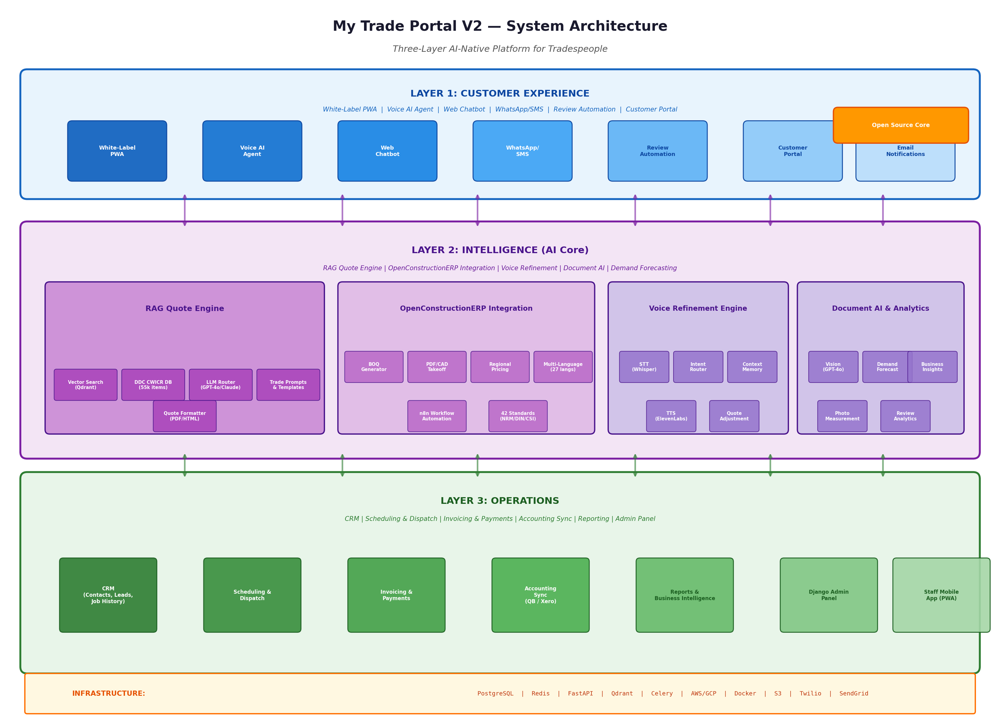

# My Trade Portal V2 — Product Specification

## AI-Native Field Service Platform for Tradespeople

**Version:** 2.0-draft
**Date:** June 2026
**Status:** Product Planning
**MVP Focus:** UK electricians

---

## 1. Executive Overview

My Trade Portal V2 is a ground-up rebuild of the original MyTradePortal.co.uk platform, transforming it from a white-label customer app service into a **comprehensive AI-native field service management platform**. While V1 provided UK tradespeople with branded customer-facing mobile apps, V2 adds a full Intelligence Layer with RAG-powered quote generation, deep integration with the open-source OpenConstructionERP estimation engine, conversational voice AI for quote refinement, and a complete Operational Layer handling CRM, scheduling, invoicing, and accounting synchronization.

The architectural philosophy centers on **three integrated layers**: the Customer Experience Layer (white-label PWA, voice AI, web chatbot, WhatsApp/SMS, review automation), the Intelligence Layer (RAG quote engine, OpenConstructionERP integration, voice refinement, document AI, demand forecasting), and the Operational Layer (CRM, scheduling, invoicing, payments, accounting sync, reporting). Each layer is independently scalable and communicates through well-defined APIs, enabling the platform to serve solo electricians and scaling electrical contractors first, with other trades added later.

A defining characteristic of V2 is its **deep integration with open-source estimation technology**. Rather than building proprietary cost databases from scratch, V2 leverages the OpenConstructionERP project's DDC CWICR (Construction Work Items, Costs & Resources) database containing 55,000+ cost items across 11 regional pricing databases and 27 languages, augmented by the platform's own trade-specific pricing data contributed by the user community. For the MVP, the platform focuses on **electrical work in the UK**, loading UK electrical cost items first and enabling electrician-specific intake flows, terminology, and validations. Additional trades and geographies will be added once the electrician use case is validated.

The voice agent quote refinement feature represents a **market-differentiating capability** not offered by competing platforms at any price point. When a customer calls to discuss a pending quote, the voice AI agent retrieves the quote context from the RAG engine, engages in natural conversation about options and adjustments, validates changes against the cost database, generates an updated quote in real time, and upon customer confirmation, saves the revised quote and books the appointment — all without human intervention for standard electrical work.

---

## 2. Architecture Overview

### 2.1 Three-Layer Architecture

My Trade Portal V2 is organized into three distinct layers, each with clear responsibilities, interfaces, and scaling characteristics. This separation enables independent development, deployment, and scaling of each layer while maintaining clean integration contracts between layers.

**Layer 1: Customer Experience** handles all touchpoints where customers interact with the trade business. Every component in this layer is white-label branded to the individual trade business, creating the perception of a custom-built application. Components include the Progressive Web App (customer-facing), Voice AI Agent (inbound calls), Web Chatbot (website widget), WhatsApp/SMS integration (messaging channels), Review Automation (Google review solicitation), and Email Notifications (transactional and marketing).

**Layer 2: Intelligence** contains all AI capabilities that differentiate the platform from basic operational tools. The RAG Quote Engine generates accurate quotes by retrieving relevant cost items from vector search and grounding LLM outputs in structured pricing data. The OpenConstructionERP Integration provides advanced estimation capabilities including BOQ generation, PDF/CAD takeoff, and regional pricing. The Voice Refinement Engine enables conversational quote adjustment through phone calls. Document AI handles image analysis for damage assessment and photo measurement. Demand Forecasting predicts busy periods to inform pricing and scheduling decisions.

**Layer 3: Operations** provides the business management backbone. CRM manages customer records, communication history, and lead tracking. Scheduling and Dispatch handle appointment booking, technician assignment, and route optimization. Invoicing and Payments generate professional invoices, process card payments, and track payment status. Accounting Sync maintains bidirectional data flow with QuickBooks Online and Xero. Reporting and Business Intelligence provide dashboards, financial summaries, and AI-generated insights. The Django Admin Panel serves as the tradesperson's command center.



### 2.2 Technology Stack

The technology stack prioritizes proven, productive frameworks with strong ecosystems and long-term viability:

| Component | Technology | Rationale |
|---|---|---|
| **API Backend** | FastAPI (Python) | High performance, async-native, auto-generated OpenAPI docs, strong AI/ML ecosystem |
| **Admin Panel** | Django + Django Admin | Mature ORM, built-in admin, rapid development, extensive package ecosystem |
| **Customer PWA** | React + Vite + PWA APIs | Modern component model, fast bundling, service workers for offline, home-screen installable |
| **Mobile App** | React Native (Expo) | Cross-platform iOS/Android, over-the-air updates, shared codebase with PWA |
| **Database** | PostgreSQL 16+ | ACID transactions, JSON support, full-text search, PostGIS for geospatial queries |
| **Vector DB** | Qdrant | Open-source, Rust-based performance, hybrid search, on-premise capable |
| **Cache / PubSub** | Redis 7+ | Session cache, rate limiting, Celery broker, real-time features |
| **Task Queue** | Celery + Redis | Async job processing, scheduled tasks, retry logic, dead letter queues |
| **Search** | PostgreSQL FTS + Qdrant hybrid | Full-text search for operational data, semantic search for cost items |
| **File Storage** | AWS S3 / MinIO | Document uploads, photo storage, quote PDFs, scalable and cost-effective |
| **Voice** | Twilio + OpenAI Whisper + ElevenLabs | Telephony infrastructure, STT accuracy, natural-sounding TTS voices |
| **LLM Router** | LiteLLM + OpenRouter | Multi-provider abstraction (OpenAI, Anthropic, Gemini), failover, cost optimization |
| **Message Queue** | Redis Streams / RabbitMQ | Event streaming between layers, webhook processing, audit logging |
| **Container** | Docker + Docker Compose | Local development, consistent environments, simplified deployment |
| **Infra (Prod)** | AWS/GCP + Terraform | Managed PostgreSQL (RDS/Cloud SQL), ECS/GKE, load balancers, CDN |

### 2.3 Deployment Architecture

The platform deploys as a **multi-tenant SaaS** where each trade business (tenant) has isolated data within shared infrastructure. This model optimizes cost per customer while maintaining data security and customization capability.

```
┌─────────────────────────────────────────────────────────────┐
│                      LOAD BALANCER (ALB)                     │
├─────────────┬─────────────────┬──────────────┬──────────────┤
│  Customer   │   Admin Panel   │   API GW     │  WebSocket   │
│     PWA     │    (Django)     │  (FastAPI)   │   (Redis)    │
│  (S3/CF)    │   (ECS/GKE)     │  (ECS/GKE)   │  (ECS/GKE)   │
├─────────────┴─────────────────┴──────────────┴──────────────┤
│                   SHARED SERVICES                            │
│  PostgreSQL (RDS) │ Redis (ElastiCache) │ Qdrant │ S3      │
├─────────────────────────────────────────────────────────────┤
│              EXTERNAL SERVICES                               │
│  Twilio │ OpenAI/Anthropic │ ElevenLabs │ QuickBooks │ Xero │
│  SendGrid │ Google APIs │ Stripe │ WhatsApp Business API    │
└─────────────────────────────────────────────────────────────┘
```

Tenant isolation is enforced at the application layer (row-level security in PostgreSQL) rather than through separate databases per tenant. This approach balances isolation guarantees with operational efficiency, allowing the platform to serve thousands of small trade businesses on shared infrastructure while keeping per-customer costs low enough to maintain the accessible pricing model that differentiates My Trade Portal from enterprise FSM platforms.

---

## 3. Layer 1: Customer Experience

### 3.1 White-Label Progressive Web App (PWA)

The customer-facing PWA is the **primary customer touchpoint** and the spiritual successor to V1's branded native apps. V2 switches from native iOS/Android apps to a PWA approach for three strategic reasons: (1) PWAs bypass App Store review cycles and fees, enabling instant updates and faster customer onboarding; (2) a single PWA codebase serves all customers across all devices, dramatically reducing development and maintenance overhead; (3) modern PWA capabilities (push notifications, home screen installation, offline functionality, camera access) close the feature gap with native apps for the use cases that matter for trade businesses.

**Core PWA Features:**
- **Home screen installation** with custom icon, splash screen, and theme colors per tenant
- **Service worker caching** for offline access to appointment details and quote history
- **Push notifications** for appointment reminders, quote updates, and technician arrival ETA
- **Quote request flow** with trade-specific intake forms, photo upload, and AI chat assistant
- **Appointment booking** with real-time availability, service selection, and address capture
- **Quote approval/rejection** with digital signature capture and payment authorization
- **Invoice viewing and payment** with card processing and receipt generation
- **Review submission** with one-tap Google review link generation post-job completion
- **Special offers browsing** with promotional pricing and limited-time deal display

**White-Label Configuration per Tenant:**
Each trade business configures their branded experience through the admin panel: business name and logo, primary/secondary brand colors, services offered with descriptions and base pricing, service area (geographic boundary), business hours and emergency availability, staff/technician profiles with photos, custom intake questions per service type, automated message templates, and special offers/promotions. The PWA dynamically loads this configuration at startup, rendering a unique experience for each business without code changes or redeployment.

**Technical Implementation:**
The PWA is built with React 19, Vite for fast development and optimized builds, and Tailwind CSS for utility-first styling that enables dynamic theming. State management uses Zustand for simplicity. API communication uses React Query for server state caching and background refetching. Push notifications implement the Web Push Protocol with VAPID keys per tenant. Photo upload uses direct-to-S3 presigned URLs with client-side compression. Offline support uses a service worker generated by Vite PWA plugin with IndexedDB for local data persistence.

### 3.2 Voice AI Agent

The Voice AI Agent handles **inbound customer phone calls** with conversational intelligence for quote inquiries, appointment booking, and general questions. It is the technical backbone for the quote refinement feature described in Section 4.4.

**Architecture Components:**
- **Twilio Programmable Voice** for telephony infrastructure (inbound number routing, call recording, transcription)
- **OpenAI Whisper API** for speech-to-text with high accuracy on conversational audio including accents and trade terminology
- **LiteLLM Router** for LLM orchestration, primarily using GPT-4o for its real-time capabilities and function calling
- **ElevenLabs API** for text-to-speech with voice cloning (optional) or selection from professional voice library
- **FastAPI WebSocket endpoint** for real-time bidirectional audio streaming during calls
- **Conversation memory** stored in Redis with PostgreSQL persistence for context across call sessions

**Call Flow:**
1. Customer calls the business phone number (Twilio number forwarding)
2. Twilio webhook triggers the Voice AI Agent FastAPI endpoint
3. Agent answers with customized greeting ("Hello, you've reached [Business Name]. I'm their AI assistant. How can I help today?")
4. Real-time streaming: customer audio → Twilio → Whisper STT → LLM intent classification → business logic → ElevenLabs TTS → Twilio audio playback
5. For quote refinement calls (detailed in Section 4.4), the agent loads pending quote context from the RAG engine
6. Conversation context maintained in Redis with TTL for multi-turn interactions
7. Call summary and transcript saved to CRM, with action items (quote updated, appointment booked) triggering operational workflows

**Configuration per Tenant:**
Trade businesses configure: agent greeting script, business hours and after-hours behavior (answer with emergency dispatch vs. take message), services the agent can discuss with pricing, escalation triggers (complex questions, customer requests human), voice personality selection, and maximum call duration.

### 3.3 Web Chatbot

The web chatbot embeds as a **widget on the trade business's existing website**, providing always-available quote request and appointment booking without requiring customers to download anything.

**Features:**
- Floating chat widget with business branding, expandable to full-screen chat interface
- Conversational quote collection with trade-specific question branching
- Photo upload for job description (consumer unit, socket additions, EV charger install, lighting circuits)
- Real-time availability checking with instant booking confirmation
- Quote delivery in chat with approve/reject/ask questions actions
- Handoff to human tradesperson with full conversation context when needed
- Persistent conversation history when customer returns to website

**Technical Implementation:**
Built as an embeddable React component distributed via CDN (`<script>` tag with `data-tenant-id` attribute). The widget connects to FastAPI WebSocket endpoints for real-time messaging. The LLM backend shares the same RAG Quote Engine as the voice agent, ensuring consistent quote quality across channels. The chatbot uses streaming LLM responses for immediate feedback, with trade-specific system prompts grounding responses in the business's actual services and pricing.

### 3.4 WhatsApp / SMS Integration

WhatsApp and SMS provide **low-friction channels** for customers who prefer messaging to calls or web interactions. The integration uses the WhatsApp Business API (via Twilio or direct Meta integration) and Twilio SMS for universal text messaging.

**Capabilities:**
- Two-way messaging for quote requests and general inquiries
- Rich media support: customers send photos of problems, AI analyzes and responds with preliminary assessments
- Appointment reminders and confirmations with one-tap reply ("Reply YES to confirm or NO to reschedule")
- Quote delivery as PDF attachments or linked web views
- Review solicitation with direct Google review link
- Automated " technician is on the way" notifications with ETA

**Message Processing Pipeline:**
Incoming messages → Twilio webhook → FastAPI endpoint → intent classification (new quote, quote follow-up, appointment query, general question) → context loading from CRM → RAG engine or operational API query → response generation → Twilio message send. All conversations are threaded and stored in the CRM for unified customer communication history.

### 3.5 Review Automation

The review automation system systematically generates **Google reviews** — the single highest-ROI marketing activity for local trade businesses — by timing solicitations perfectly and removing all friction from the review process.

**Workflow:**
1. Job marked complete in operations layer (invoice paid or cash collected)
2. 24-hour delay (allows customer to verify satisfaction)
3. Automated review request via customer's preferred channel (SMS, WhatsApp, or email)
4. Message includes direct Google review link with business Google Place ID pre-populated
5. One-tap review: customer clicks link, Google review form opens with business pre-selected
6. Positive reviews (4-5 stars) trigger thank-you message and loyalty program credit
7. Negative reviews (1-3 stars) trigger immediate alert to tradesperson for follow-up
8. Review count and average rating tracked in business intelligence dashboard

**AI Enhancement:**
The system uses demand forecasting to avoid soliciting reviews during known problem periods (e.g., after a supplier delay affected multiple jobs). It also personalizes review request timing based on customer interaction patterns — a customer who engaged heavily via chat receives a different request style than one who only booked by phone.

---

## 4. Layer 2: Intelligence

### 4.1 RAG Quote Engine

The RAG (Retrieval-Augmented Generation) Quote Engine is the **central intelligence component** of the platform, responsible for generating accurate, grounded quotes from natural language job descriptions. Unlike generic LLM quoting that risks hallucinating prices, the RAG engine retrieves actual cost items from structured databases and instructs the LLM to generate quotes using only retrieved data.

**Architecture:**

```
Job Description (text + photos)
         │
    ┌────▼────┐
    │  Query  │  ← Intent classification, entity extraction (trade type, job scope, location)
    │ Analyzer│
    └────┬────┘
         │
    ┌────▼──────────────────────────────┐
    │  Vector Search (Qdrant)           │  ← Semantic search over cost database
    │  - Trade-specific filters         │  - Hybrid: dense vectors + keyword matching
    │  - Regional pricing modifiers     │  - Top-k retrieval (k=10-20)
    │  - Historical quote similarity    │  - Metadata filtering by trade, region, date
    └────┬──────────────────────────────┘
         │ Retrieved cost items
    ┌────▼──────────────────────────────┐
    │  Prompt Builder                   │  ← Constructs LLM prompt with:
    │  - Retrieved items with prices    │  - Business pricing rules (markup, labor rates)
    │  - Business configuration         │  - Customer context (location, property type)
    │  - Quote template structure       │  - Historical quote patterns for this business
    └────┬──────────────────────────────┘
         │ Structured prompt
    ┌────▼──────────────────────────────┐
    │  LLM Router (LiteLLM)             │  ← GPT-4o / Claude 3.5 Sonnet
    │  - Function calling for           │  - JSON-mode quote generation
    │    structured output              │  - Price calculation validation
    │  - Streaming for real-time UX     │  - Confidence scoring
    └────┬──────────────────────────────┘
         │ Generated quote (JSON)
    ┌────▼──────────────────────────────┐
    │  Quote Validator                  │  ← Business rules engine
    │  - Price sanity checks            │  - Margin verification
    │  - Required line items            │  - Regulatory compliance (VAT, etc.)
    │  - Historical accuracy comparison │  - Human review flagging
    └────┬──────────────────────────────┘
         │
    ┌────▼────┐
    │  Output │  ← Formatted quote (PDF/HTML), CRM save, notification trigger
    │ Formatter
    └─────────┘
```

**Cost Database Architecture:**
The platform maintains a **tiered cost database** with three levels of pricing data. **Tier 1: DDC CWICR Integration** — the OpenConstructionERP project's open-source cost database provides 55,000+ base cost items across 11 regional markets (UK, US, DACH, France, Spain, Brazil, Russia, UAE, China, India, Canada) with 27-language support. This database is imported into Qdrant with vector embeddings for semantic search. **Tier 2: Trade-Specific Enhancements** — the platform community contributes trade-specific cost items (consumer unit upgrades, socket additions, EV charger installs, lighting circuit work, etc.) that supplement the base database. The MVP seeds this tier with UK electrical pricing. **Tier 3: Business-Specific Overrides** — each trade business can upload their own price book that overrides community pricing for items they have actual cost data on.

**Quote Generation Prompt Template:**
The LLM receives a structured prompt containing: the customer's job description (natural language), retrieved cost items from the database (with unit prices, descriptions, and codes), the business's pricing rules (hourly labor rate, markup percentage, minimum charge), customer context (property type, location, any photos), the required output format (JSON with line items, subtotals, VAT, total), and a system instruction to use ONLY the provided cost items and flag any uncertainties for human review.

**Validation and Safety:**
Every generated quote passes through a validation pipeline: price sanity checks (individual line items and totals compared against historical quotes for similar jobs), margin verification (ensuring the business's minimum margin is maintained), required line item checks (ensuring no standard inclusions are missed), and confidence scoring (quotes below 80% confidence are flagged for human review before sending to customers).

### 4.2 OpenConstructionERP Integration

The integration with OpenConstructionERP provides **advanced estimation capabilities** that go beyond the RAG Quote Engine's natural language quoting, specifically for complex jobs requiring detailed Bills of Quantities, document-based takeoff, and multi-standard compliance.

**Integration Architecture:**
The platform deploys OpenConstructionERP as a **containerized microservice** alongside the main application stack. Communication occurs via REST API calls from the FastAPI backend to the OpenConstructionERP service. The DDC CWICR cost database is shared — loaded into both PostgreSQL (for operational queries) and Qdrant (for semantic search), with OpenConstructionERP accessing the same database instance for BOQ generation and takeoff processing.

**Capabilities Exposed:**

| Feature | Description | Trigger |
|---|---|---|
| **BOQ Generation** | Detailed Bill of Quantities from job description or document | Complex jobs, construction/renovation trades |
| **PDF Takeoff** | Automatic quantity extraction from PDF drawings/specifications | Customer uploads architectural plans |
| **CAD Takeoff** | Quantity extraction from CAD/DWG files | Professional drawings provided |
| **Photo Analysis** | Visual assessment and scope estimation from customer photos | Exterior trades, damage assessment |
| **Regional Pricing** | Automatic application of correct regional labor and material rates | Based on customer postcode |
| **Multi-Standard** | Compliance with NRM 1/2 (UK), DIN 276 (Germany), CSI MasterFormat (US), etc. | Business configuration |

**Data Flow:**
When a quote request arrives that triggers OpenConstructionERP (either automatically based on complexity signals or manually selected by the tradesperson), the job description and any uploaded documents are sent to the OpenConstructionERP API. The service performs its analysis — whether BOQ generation from text, PDF takeoff, or photo analysis — and returns a structured estimate with line items, quantities, unit rates, and totals. This estimate is then ingested into the platform's quote format, where the RAG Quote Engine's validation pipeline applies business-specific pricing rules and markup. The tradesperson reviews the combined result in the admin panel before sending to the customer.

**n8n Workflow Integration:**
The platform includes optional n8n workflow automation nodes that enable power users to build custom automations: Telegram/Slack bot integration for quote generation from messaging platforms, email monitoring for automatic quote generation from inbound specification emails, CRM trigger workflows that auto-generate preliminary estimates when new projects are created, and scheduled batch processing for portfolio quoting.

### 4.3 Voice Refinement Engine

The Voice Refinement Engine enables **conversational quote adjustment** when customers call to discuss pending quotes. This is a market-differentiating capability that no competing platform offers at any price point — current alternatives either provide static quotes that require manual revision or offer only basic AI receptionists without quote-specific intelligence.

**How It Works:**
When a customer calls and the intent router identifies a quote-related query, the voice agent:

1. **Loads Quote Context** — retrieves the pending quote from PostgreSQL with full line items, customer history, and business pricing rules
2. **Engages Conversationally** — uses TTS to explain the quote breakdown in natural language ("Your consumer unit upgrade quote is £2,850 including the new 18-way dual RCD consumer unit at £480, labour for the day at £450, circuit testing and certification at £280, and materials at £380. Plus VAT that comes to £3,420 total.")
3. **Handles Adjustments** — when the customer requests changes ("Can you add an extra socket in the kitchen?" or "Can we use a different consumer unit brand?"), the agent parses the request, retrieves alternative cost items from Qdrant, recalculates the quote using the same RAG pipeline, and presents the updated total
4. **Validates Changes** — each adjustment is validated against the cost database to ensure the business doesn't inadvertently quote below cost
5. **Confirms and Saves** — when the customer confirms acceptance, the updated quote is saved, a confirmation email/SMS is sent, and an appointment booking flow is offered
6. **Escalates When Needed** — if the request exceeds the agent's authority (major scope changes, custom work not in the database), the call is flagged for human follow-up with full context

**Technical Implementation:**
The engine maintains **conversation state** across the multi-turn interaction using a state machine with the following states: `greeting → quote_presentation → awaiting_response → adjustment_parsing → recalculation → confirmation → booking_offer → completion`. Each state has defined transitions and fallback behaviors. The LLM prompt includes the full quote context, available adjustment options, business rules (minimum charges, non-negotiable items), and explicit instructions about when to escalate to human.

**Example Conversation:**
```
Agent: "Hi, this is the AI assistant for Mike's Electrical. I see you're calling about the
       quote for the consumer unit upgrade and kitchen rewiring. The total is £4,200 plus
       VAT. How can I help?"

Customer: "That seems high. Can we use a standard consumer unit instead of the smart one?"

Agent: "I can adjust that. The current quote includes a smart distribution board at £680.
       I could switch to a standard dual RCD consumer unit at £420, which would save you
       about £260. Would you like me to update the quote?"

Customer: "Yes, and can we also drop the extra outdoor socket?"

Agent: "Removing the outdoor socket would save another £180. With both changes, your new
       total would be £3,760 plus VAT. Shall I send you the updated quote?"

Customer: "Yes, that's better."

Agent: "Perfect. The updated quote has been sent to your email. Would you like to book
       the work? We have availability next Tuesday or Thursday."
```

### 4.4 Document AI

Document AI provides **computer vision capabilities** for automated assessment from customer-submitted photos and documents.

**Capabilities:**
- **Damage Assessment** — identify damage type (water, electrical, structural), estimate severity, and suggest repair scope from photos
- **Photo Measurement** — estimate dimensions from photos with known reference objects (similar to QuoteIQ's MapMeasure Pro but using GPT-4o vision)
- **Document Extraction** — parse PDF specifications, building regulations, and inspection reports for relevant quote information
- **Object Identification** — recognize fixtures, appliances, and equipment models from photos for accurate replacement quoting

**Implementation:**
Uses GPT-4o vision API for general image understanding, with custom prompt engineering for trade-specific scenarios. Images are pre-processed (resized, compressed) before API submission to manage costs. Results are cached in Redis to avoid re-processing identical images. The system includes a confidence threshold — low-confidence analyses are flagged for human review rather than being used directly in quotes.

### 4.5 Demand Forecasting

Demand forecasting uses **historical job data** to predict busy and quiet periods, enabling dynamic pricing suggestions and proactive marketing.

**Input Signals:**
- Historical appointment volume by week/month
- Quote request patterns
- Seasonal trends (fault-finding and heating-control jobs spike in winter, outdoor and EV charger work peak in summer)
- Local weather data (emergency callouts increase during cold snaps and storms)
- Customer review velocity

**Output:**
- Weekly demand predictions for the next 4-8 weeks
- Recommended special offers during predicted quiet periods
- Suggested pricing adjustments during high-demand periods
- Staffing recommendations for multi-person teams

**Implementation:**
Uses a lightweight time-series model (Prophet or simple ARIMA) trained on each business's historical data. Models are retrained weekly via Celery scheduled tasks. Predictions are surfaced in the admin dashboard and can automatically trigger review automation campaigns or special offer notifications when quiet periods are predicted.

---

## 5. Layer 3: Operations

### 5.1 CRM

The CRM module is the **central nervous system** of the operational layer, maintaining a unified view of every customer interaction across all channels.

**Core Entities:**
- **Contacts** — customers, prospects, suppliers; with full communication history, property details, and preference settings
- **Leads** — potential jobs from any channel (PWA, chatbot, voice, WhatsApp, web form); with source attribution, status tracking, and conversion history
- **Jobs** — work orders with full lifecycle tracking from quote through completion; linked to quotes, appointments, invoices, and reviews
- **Properties** — customer addresses with service history, property type, access notes, and photos
- **Communication Log** — every call, message, email, and chat automatically threaded by contact

**Key Features:**
- 360-degree customer view: all quotes, jobs, invoices, communications, and reviews in one place
- Automated lead scoring based on engagement signals (quote requests, appointment bookings, review submissions)
- Customer segmentation for targeted marketing (VIP customers, dormant customers, high-value properties)
- Duplicate detection and merge capabilities
- GDPR compliance: data export, right to erasure, consent tracking

### 5.2 Scheduling and Dispatch

The scheduling system handles **appointment booking, technician assignment, and route optimization**.

**Features:**
- **Availability Management** — configurable working hours, break times, buffer between appointments, blackout dates
- **Service Duration Profiles** — default durations per service type (e.g., "consumer unit upgrade = 1 day", "EV charger install = 4 hours"), adjustable per appointment
- **Intelligent Booking** — the web chatbot and voice agent check real-time availability before offering slots
- **Drag-and-Drop Calendar** — visual daily/weekly/monthly calendar views in the admin panel
- **Route Optimization** — sequenced daily schedules to minimize drive time (using PostGIS for geospatial calculations)
- **Automated Reminders** — configurable SMS/email reminders at 24 hours and 1 hour before appointments
- ** technician ETA** — real-time ETA notifications sent to customers when technician is en route
- **Recurring Appointments** — scheduled maintenance contracts with automatic appointment generation

**Conflict Resolution:**
The scheduling engine prevents double-booking through database-level constraints and implements waitlist management for fully-booked periods. Emergency appointments can override standard scheduling rules with explicit override tracking.

### 5.3 Invoicing and Payments

The invoicing system generates **professional invoices** and processes **card payments** through Stripe.

**Features:**
- Invoice generation from approved quotes with one click
- Automatic invoice numbering per business
- Line items from quotes with adjustable quantities and prices
- VAT/tax calculation per regional rules (UK VAT, US state tax, etc.)
- Multiple payment methods: card (Stripe), bank transfer, cash, check
- Payment tracking with automatic status updates (sent, viewed, paid, overdue)
- Overdue reminders at configurable intervals
- Deposit requests and milestone payments for large jobs
- Credit note generation for refunds and adjustments
- Invoice templates customizable per business branding

**Payment Flow:**
Invoice created → sent to customer (email/WhatsApp/SMS with link) → customer clicks payment link → Stripe Checkout (branded with business colors) → payment processed → automatic reconciliation → accounting sync triggered → thank-you message sent

### 5.4 Accounting Sync

Bidirectional synchronization with **QuickBooks Online** and **Xero** eliminates double data entry — the primary bookkeeping pain point for trade businesses.

**Synced Data:**
- Customers → Contacts (bidirectional, with conflict resolution)
- Invoices → Sales Invoices (platform to accounting, one-way with status sync)
- Payments → Bank receipts (platform to accounting)
- Products/Services → Items (bidirectional initial sync, platform updates to accounting)
- Tax rates → Tax codes (accounting to platform, initial sync)

**Sync Architecture:**
Uses OAuth 2.0 for secure API authentication with refresh token management. Celery tasks run sync jobs every 15 minutes for active businesses, with webhook subscriptions for real-time updates where supported. Failed syncs are queued for retry with exponential backoff and alerted to the business after repeated failures.

### 5.5 Reporting and Business Intelligence

**Standard Reports:**
- Revenue dashboard (daily, weekly, monthly, yearly with comparison periods)
- Quote conversion rate (requests → sent → accepted → completed)
- Customer acquisition by channel (PWA, chatbot, voice, WhatsApp, referral)
- Technician utilization (for multi-person businesses)
- Outstanding invoices and aging report
- Review tracking (count, average rating, response rate)
- Service mix analysis (which services generate most revenue)

**AI-Generated Insights:**
Using the same LLM infrastructure as the quote engine, the platform generates natural language business insights: "Your quote conversion rate dropped 15% this month. This coincides with a 20% price increase on EV charger installations. Your competitors may be undercutting you on this service." These insights are surfaced in the admin dashboard and sent as weekly summary emails.

### 5.6 Admin Panel (Django)

The admin panel is the **tradesperson's command center**, built with Django Admin for rapid development and extensive customization capability.

**Key Sections:**
- **Dashboard** — KPIs, upcoming appointments, pending quotes, overdue invoices, AI insights
- **Calendar** — drag-and-drop scheduling with day/week/month views
- **Quotes** — quote management, AI-assisted editing, customer communication history
- **Jobs** — work order tracking, technician assignment, status workflow
- **Customers** — full CRM with search, filters, and communication log
- **Invoices** — invoice creation, payment tracking, overdue management
- **Reviews** — review monitoring, response templates, alerts
- **Settings** — business configuration, branding, integrations, team management
- **AI Training** — price book management, quote review feedback for model improvement

The admin panel is implemented as a **responsive web application** that works on desktop and tablet, acknowledging that many tradespeople manage their business from a tablet in their van or kitchen table rather than a dedicated office desk.

---

## 6. Data Model

### 6.1 Core Entities

```python
# Simplified entity relationships

class Tenant(models.Model):
    """Trade business (multi-tenant isolation unit)"""
    name, slug, logo_url, primary_color, secondary_color
    google_place_id, service_area_polygon
    hourly_labor_rate, markup_percentage, minimum_charge
    qb_integration, xero_integration, stripe_account_id

class Contact(models.Model):
    """Customer or prospect"""
    tenant, first_name, last_name, phone, email
    address, postcode, property_type
    source_channel, lifetime_value, review_count
    created_at, updated_at

class Quote(models.Model):
    """Price estimate for a job"""
    tenant, contact, status(draft/sent/accepted/rejected/expired)
    line_items[JSON], subtotal, vat_amount, total
    ai_generated(boolean), ai_confidence_score
    openconstruction_erp_ref (for complex BOQ quotes)
    customer_message, internal_notes
    accepted_at, expires_at

class QuoteLineItem(models.Model):
    """Individual line on a quote"""
    quote, description, quantity, unit, unit_price
    cost_item_reference (link to DDC CWICR if applicable)
    is_ai_suggested, is_customer_requested_change

class Job(models.Model):
    """Work order"""
    tenant, contact, quote, status
    scheduled_date, scheduled_time_start, scheduled_time_end
    technician, property_address
    actual_start, actual_end, completion_notes
    photos[JSON], customer_signature_url

class Appointment(models.Model):
    """Scheduled calendar event"""
    tenant, job, contact, technician
    start_time, end_time, timezone
    service_type, property_address(geocoded)
    status(scheduled/confirmed/in_progress/completed/cancelled/no_show)
    reminder_sent_24h, reminder_sent_1h, eta_notification_sent

class Invoice(models.Model):
    """Bill for completed work"""
    tenant, job, quote, contact
    invoice_number, issue_date, due_date
    line_items[JSON], subtotal, vat_amount, total, amount_paid
    status(draft/sent/viewed/paid/overdue/cancelled)
    stripe_payment_intent_id, payment_method

class CostItem(models.Model):
    """Item from the cost database (DDC CWICR + platform additions)"""
    code, description, unit, base_unit_price
    trade_category, region, standard(NRM/DIN/CSI/etc.)
    vector_embedding (for Qdrant semantic search)
    source(ddc_cwicz/platform_community/business_specific)
    business_override_price (nullable, for business-specific pricing)

class CommunicationLog(models.Model):
    """Unified communication thread"""
    tenant, contact, channel(voice/chat/sms/whatsapp/email)
    direction(inbound/outbound), content, timestamp
    metadata[JSON]: duration, transcript_url, ai_handled, sentiment
```

### 6.2 Vector Search Schema (Qdrant)

```python
# Qdrant collection for cost item semantic search
cost_items_collection = {
    "name": "cost_items",
    "vector_size": 1536,  # OpenAI text-embedding-3-large
    "distance": "Cosine",
    "payload_schema": {
        "trade_category": "keyword",
        "region": "keyword",
        "standard": "keyword",
        "unit_price": "float",
        "source": "keyword",
        "tenant_id": "keyword",  # null for shared items, set for business overrides
    }
}
```

### 6.3 Multi-Tenant Isolation

Tenant isolation is implemented at the **application layer** using a `tenant_id` column on every tenant-scoped table, with PostgreSQL Row-Level Security (RLS) policies enforcing that queries only return rows matching the authenticated tenant. This approach provides strong isolation guarantees without the operational overhead of separate databases per tenant.

```sql
-- Example RLS policy
CREATE POLICY tenant_isolation ON quotes
    USING (tenant_id = current_setting('app.current_tenant')::UUID);
```

The `Tenant` model includes a `plan_tier` field (starter/professional/complete) that gates access to features at the application layer, and `billing_status` (active/past_due/cancelled) that controls platform access.

---

## 7. API Specification

### 7.1 REST API (FastAPI)

The FastAPI backend exposes REST endpoints organized by domain:

| Endpoint | Method | Description | Auth |
|---|---|---|---|
| `/api/v1/quotes` | POST | Generate new quote (RAG engine) | API key |
| `/api/v1/quotes/{id}` | GET | Retrieve quote with line items | API key |
| `/api/v1/quotes/{id}/refine` | POST | Refine quote via voice/chat | API key |
| `/api/v1/quotes/{id}/approve` | POST | Customer approves quote | Public (token) |
| `/api/v1/appointments` | POST | Create appointment | API key |
| `/api/v1/appointments/availability` | GET | Get available slots | Public |
| `/api/v1/contacts` | CRUD | Contact management | API key |
| `/api/v1/jobs` | CRUD | Job/work order management | API key |
| `/api/v1/invoices` | CRUD | Invoice management | API key |
| `/api/v1/invoices/{id}/pay` | POST | Process payment (Stripe) | Public (token) |
| `/api/v1/communications` | POST | Send SMS/WhatsApp/email | API key |
| `/api/v1/reviews/solicit` | POST | Trigger review request | API key |
| `/api/v1/analytics/dashboard` | GET | Business KPIs | API key |
| `/api/v1/admin/tenant` | PUT | Update tenant configuration | Admin |
| `/api/v1/admin/pricebook` | POST | Upload custom price book | Admin |
| `/api/v1/ai/document-analyze` | POST | Analyze uploaded document/photo | API key |
| `/api/v1/ai/demand-forecast` | GET | Get demand prediction | API key |

### 7.2 WebSocket Endpoints

Real-time endpoints for conversational interfaces:

| Endpoint | Purpose |
|---|---|
| `/ws/voice/{call_sid}` | Bidirectional audio streaming for voice AI calls |
| `/ws/chat/{tenant_id}` | Chatbot conversation stream |
| `/ws/admin/notifications` | Real-time admin panel notifications |

### 7.3 Webhook Endpoints

Incoming webhooks from external services:

| Endpoint | Source | Purpose |
|---|---|---|
| `/webhooks/twilio/voice` | Twilio | Inbound voice call events |
| `/webhooks/twilio/sms` | Twilio | Incoming SMS/MMS |
| `/webhooks/stripe` | Stripe | Payment events (succeeded, failed, refunded) |
| `/webhooks/qbo` | QuickBooks | Accounting sync events |
| `/webhooks/xero` | Xero | Accounting sync events |
| `/webhooks/whatsapp` | Meta/Twilio | WhatsApp message events |

### 7.4 OpenConstructionERP Integration API

Internal API between the FastAPI backend and the OpenConstructionERP microservice:

| Endpoint | Purpose |
|---|---|
| `/ocerp/v1/boq/generate` | Generate Bill of Quantities from description |
| `/ocerp/v1/takeoff/pdf` | Extract quantities from PDF drawings |
| `/ocerp/v1/takeoff/cad` | Extract quantities from CAD files |
| `/ocerp/v1/takeoff/photo` | Visual assessment from photos |
| `/ocerp/v1/price/lookup` | Regional price lookup by item code |
| `/ocerp/v1/standards/list` | Available regional standards |

---

## 8. Voice Agent Quote Refinement — Detailed Specification

### 8.1 Conversation State Machine

```python
class RefinementState(Enum):
    GREETING = "greeting"              # Initial greeting, identify caller
    QUOTE_LOADED = "quote_loaded"      # Quote context retrieved and presented
    AWAITING_RESPONSE = "awaiting"    # Waiting for customer input
    ADJUSTMENT_PARSE = "parsing"       # Parsing adjustment request
    RECALCULATION = "recalculating"    # Running RAG engine with new parameters
    PRESENT_UPDATED = "presenting"     # Presenting updated quote
    CONFIRMATION = "confirming"        # Explicit yes/no on updated quote
    BOOKING_OFFER = "booking"          # Offering appointment scheduling
    COMPLETION = "completed"           # Quote saved, follow-up actions triggered
    ESCALATION = "escalating"          # Handoff to human required

TRANSITIONS = {
    GREETING: [QUOTE_LOADED, ESCALATION],
    QUOTE_LOADED: [AWAITING_RESPONSE, ESCALATION],
    AWAITING_RESPONSE: [ADJUSTMENT_PARSE, CONFIRMATION, ESCALATION],
    ADJUSTMENT_PARSE: [RECALCULATION, AWAITING_RESPONSE],
    RECALCULATION: [PRESENT_UPDATED],
    PRESENT_UPDATED: [CONFIRMATION],
    CONFIRMATION: [BOOKING_OFFER, AWAITING_RESPONSE, COMPLETION],
    BOOKING_OFFER: [COMPLETION, AWAITING_RESPONSE],
    ESCALATION: [],  # Terminal state
    COMPLETION: [],  # Terminal state
}
```

### 8.2 Context Management

The voice agent maintains rich context throughout the conversation:

```python
@dataclass
class VoiceSessionContext:
    tenant_id: UUID
    contact_id: UUID
    quote_id: UUID
    call_sid: str

    # Quote state
    original_quote: Quote
    current_quote: Quote          # May differ after adjustments
    adjustment_history: list      # Log of all changes made

    # Conversation state
    current_state: RefinementState
    conversation_transcript: list # Full text transcript
    customer_intent: str          # Classified intent

    # Agent configuration
    max_adjustment_rounds: int = 5
    current_round: int = 0
    requires_human_approval: bool = False

    # Timing
    session_start: datetime
    last_activity: datetime
```

### 8.3 LLM Prompt for Quote Refinement

```
You are the AI voice assistant for {business_name}, a {trade_type} business.
You are on a phone call with {customer_name} discussing their pending quote.

BUSINESS RULES:
- Hourly labor rate: £{labor_rate}/hour
- Standard markup: {markup}%
- Minimum charge: £{minimum_charge}
- VAT rate: {vat_rate}%
- Must collect deposit of {deposit_percentage}% for jobs over £{deposit_threshold}

CURRENT QUOTE:
{quote_json}

ADJUSTMENT HISTORY:
{adjustment_log}

INSTRUCTIONS:
1. Be conversational, friendly, and professional. Keep responses concise (2-3 sentences spoken).
2. When presenting prices, always mention both ex-VAT and inc-VAT amounts.
3. For adjustment requests: look up alternative items in the cost database, recalculate,
   and present the impact clearly ("That change would save you £X" or "That adds £Y").
4. VALIDATE all prices against the cost database. Never quote below cost + minimum margin.
5. If the customer asks something you cannot answer or requests a change that requires
   manual estimation, offer to have {business_owner_name} call them back.
6. After confirmation, summarize the final quote and offer to book an appointment.

CURRENT CUSTOMER INPUT: "{transcribed_speech}"

Respond with JSON:
{
  "response_text": "What to say to the customer",
  "action": "present_quote|apply_adjustment|confirm_booking|escalate|...",
  "adjustment": { "type": "add_item|remove_item|change_quantity|...", ... },
  "next_state": "awaiting|confirming|booking|...",
  "confidence": 0.0-1.0
}
```

### 8.4 Safety and Guardrails

- **Price floor validation**: No quote line item can be priced below the cost database unit price plus the business's minimum margin. Violations trigger human review.
- **Maximum adjustment rounds**: Conversations are limited to 5 adjustment cycles to prevent infinite loops. After 5 rounds, the agent offers to have a human call back.
- **Confidence threshold**: LLM responses below 0.8 confidence trigger a safety response ("Let me make sure I have that right" + repeat back for confirmation).
- **Escalation triggers**: Customer explicitly requests human, job scope fundamentally changes, custom work not in database, customer expresses frustration, agent detects abusive language.
- **Call duration limit**: Maximum 10 minutes per call to manage costs. Agent politely concludes long calls with a callback offer.

---

## 9. Implementation Roadmap

### 9.1 Phase 1: Foundation (Months 1-3)

**Goal:** Deployable backend with basic quote generation and PWA, focused on UK electricians.

**Deliverables:**
- FastAPI backend with tenant isolation and authentication
- PostgreSQL schema with core entities (Tenant, Contact, Quote, Job, Invoice)
- Qdrant vector database with DDC CWICR cost items loaded
- Basic RAG Quote Engine (text input, single-turn, PDF output)
- React PWA with white-label theming, quote request, and appointment booking
- Django admin panel with quote management and customer CRM
- Twilio integration for SMS notifications
- Stripe integration for payment processing

**Milestone:** First UK electrician beta customer can receive a branded PWA link, customers can request electrical quotes through the PWA, quotes are AI-generated using UK electrical cost items, and the electrician can manage quotes in the admin panel.

### 9.2 Phase 2: Intelligence (Months 4-6)

**Goal:** Full AI capabilities and open-source estimation integration.

**Deliverables:**
- OpenConstructionERP microservice deployed and integrated
- Document AI for photo analysis and PDF takeoff
- Web chatbot widget for website embedding
- Review automation system with Google review link generation
- Demand forecasting with Prophet models
- Enhanced RAG with multi-turn conversation history and feedback loop
- Quote refinement via chat (text-based, precursor to voice)
- WhatsApp Business API integration

**Milestone:** Platform generates complex BOQ quotes from uploaded documents, chatbot handles quote requests on business websites, review automation increases Google review velocity by 3x for beta customers.

### 9.3 Phase 3: Voice (Months 7-9)

**Goal:** Voice AI agent with quote refinement — the market-differentiating feature.

**Deliverables:**
- Twilio voice infrastructure with WebSocket streaming
- Whisper STT integration with trade terminology optimization
- ElevenLabs TTS with professional voice selection
- Voice Refinement Engine with full state machine
- Real-time quote adjustment during phone calls
- Conversation memory and context management
- Call analytics and quality monitoring dashboard
- Escalation protocols and human handoff

**Milestone:** Customer can call a business number, discuss their pending electrical quote with the AI agent, request changes ("add an extra socket", "upgrade to a surge-protected consumer unit"), receive an updated quote in real-time, confirm acceptance, and book an appointment — all without human intervention.

### 9.4 Phase 4: Scale (Months 10-12)

**Goal:** Production scaling, accounting integration, and market expansion.

**Deliverables:**
- QuickBooks Online and Xero bidirectional sync
- Route optimization for multi-technician businesses
- Advanced reporting and AI-generated business insights
- React Native app (optional upgrade from PWA for high-tier customers)
- Performance optimization (caching, CDN, database indexing)
- Security hardening (penetration testing, SOC 2 preparation)
- UK market launch with regional pricing and VAT compliance
- n8n workflow automation for power users

**Milestone:** 100+ paying customers across all tiers, 10,000+ AI-generated quotes, 95%+ quote accuracy rating, accounting sync saving average customer 5+ hours/week on bookkeeping.

---

## 10. Pricing Strategy

### 10.1 Tier Structure

| Feature | Starter £49/mo | Professional £89/mo | Complete £149/mo |
|---|---|---|---|
| **Customer PWA** | Branded | Branded | Branded + Native App |
| **AI Quotes / month** | 50 | Unlimited | Unlimited |
| **RAG Quote Engine** | Basic | Advanced (multi-turn) | Advanced + Custom Training |
| **OpenConstructionERP** | — | Document takeoff (10/mo) | Unlimited takeoff + CAD |
| **Voice AI Agent** | — | Quote refinement (100 min) | Unlimited + Custom voice |
| **Web Chatbot** | — | Included | Included + Custom prompts |
| **WhatsApp/SMS** | Pay per message | 500 included | Unlimited |
| **Review Automation** | Basic | Advanced (channel routing) | Advanced + AI timing |
| **CRM Contacts** | 200 | Unlimited | Unlimited |
| **Staff Users** | 1 | 3 | Unlimited |
| **Accounting Sync** | — | QBO or Xero | Both + Advanced sync |
| **Route Optimization** | — | — | Included |
| **Support** | Email | Priority | Dedicated account manager |
| **Setup Fee** | £149 | £349 | £599 |

### 10.2 Usage-Based Pricing

- **SMS**: £0.05 per message
- **WhatsApp**: £0.03 per message (Meta pricing)
- **Voice AI**: £0.08 per minute ( aggregated LLM + TTS + STT costs)
- **Document AI**: £0.10 per image, £0.50 per PDF page
- **Additional staff users (Starter/Pro)**: £15/user/month

---

## 11. Risk Assessment

| Risk | Likelihood | Impact | Mitigation |
|---|---|---|---|
| **LLM pricing changes** | High | Medium | LiteLLM router enables provider switching; maintain fallback models |
| **LLM hallucination on prices** | Medium | High | RAG pattern with mandatory cost database validation; human review gates |
| **Voice AI quality concerns** | Medium | Medium | Professional TTS voices; clear "AI assistant" disclosure; easy human handoff |
| **OpenConstructionERP AGPL license** | Medium | Medium | Deploy as separate microservice; API communication; consult legal on boundaries |
| **Multi-tenant data isolation breach** | Low | Critical | PostgreSQL RLS; penetration testing; SOC 2 compliance program |
| **Twilio dependency / pricing** | Medium | Medium | Abstract telephony interface; alternative providers (Vonage, Plivo) |
| **Scaling vector search costs** | Medium | Medium | Qdrant self-hosting option; hybrid search to reduce vector queries |
| **Competitor feature matching** | High | Medium | Continuous AI innovation; community network effects; open-source ecosystem |

---

## 12. Appendices

### Appendix A: Open Source Components and Licensing

| Component | License | Usage |
|---|---|---|
| OpenConstructionERP | AGPL-3.0 | Estimation microservice (API integration) |
| DDC CWICR Database | CC BY 4.0 | Cost data (attribution required) |
| Qdrant | Apache 2.0 | Vector database |
| PostgreSQL | PostgreSQL License | Primary database |
| Redis | BSD 3-Clause | Cache and message broker |
| FastAPI | MIT | API framework |
| Django | BSD 3-Clause | Admin panel framework |
| React | MIT | Frontend framework |
| n8n | Sustainable Use License | Workflow automation (optional) |

### Appendix B: Cost Database Coverage

| Region | Standard | Items | Status |
|---|---|---|---|
| United Kingdom | NRM 1/2, SMM7 | 12,000+ | Primary market |
| United States | CSI MasterFormat | 15,000+ | Secondary market |
| Germany/Austria/Switzerland | DIN 276 | 8,000+ | Supported |
| France | CCTP/DPGF | 5,000+ | Supported |
| Spain | PRECIOUS | 4,000+ | Supported |
| Canada | MasterFormat CDN | 3,000+ | Supported |
| UAE | Custom | 2,000+ | Supported |
| India | CPWD | 2,000+ | Supported |
| China | GB/T 50500 | 1,500+ | Supported |
| Brazil | SINAPI | 1,500+ | Supported |
| Russia | FER/TER | 1,000+ | Supported |

### Appendix C: Voice Agent Cost Model

| Component | Unit Cost | Typical 5-min Call |
|---|---|---|
| Twilio inbound | £0.008/min | £0.04 |
| Whisper STT | £0.006/min | £0.03 |
| LLM (GPT-4o) | £0.005/min (avg) | £0.025 |
| ElevenLabs TTS | £0.015/min | £0.075 |
| Platform overhead | £0.002/min | £0.01 |
| **Total** | **~£0.036/min** | **~£0.18 per call** |

At the Professional tier's included 100 voice minutes (£0 cost to customer), actual platform cost is ~£3.60. At £89/month subscription with £30 COGS, gross margin is ~66%.

---

*End of Product Specification*
